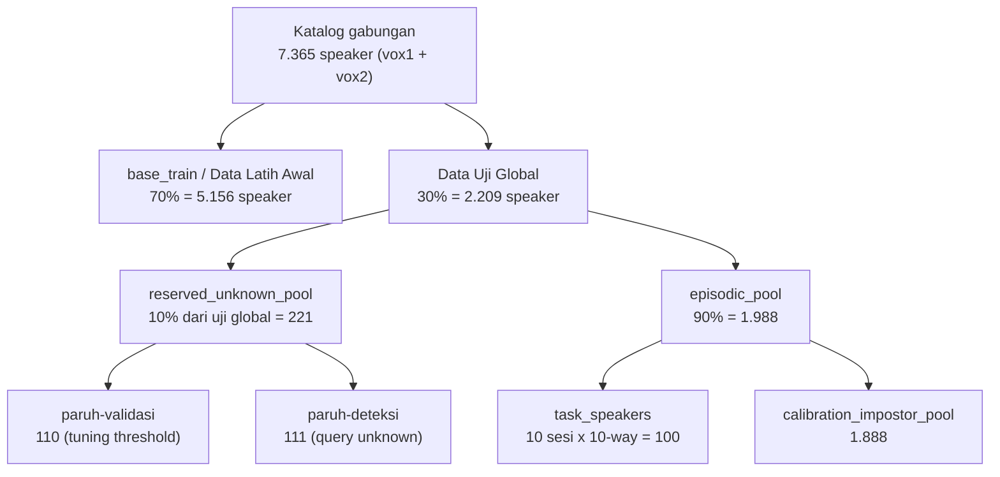

# Data: Sumber, Akuisisi, dan Skema Split

Dokumen ini menjelaskan **data apa yang dipakai**, **diambil dari link mana**, dan **bagaimana pembagian (split) datanya dilakukan** pada sistem *Incremental Open-Set Speaker Recognition*. Semua angka di sini berasal dari artefak yang di-commit di repo (`data/splits/summary.md`, `data/splits/full_split.json`, `experiments/*.json`) dan dari kode yang menghasilkannya — bukan angka yang ditulis manual.

> Dokumen pendamping: [README eksperimen](README.md) · [Experiment 1 §1 (data)](experiment-1.md) · [Experiment 3 §7 (anti-overfit split)](experiment-3.md) · [Experiment 5 §2 (audit leakage)](experiment-5.md)

---

## 1. Dataset yang digunakan

| Dataset | Jumlah speaker (metadata resmi terkini) | Format audio | Lisensi |
|---|---|---|---|
| **VoxCeleb1** | 1.251 | `.wav`, 16 kHz | CC BY 4.0 |
| **VoxCeleb2** | 6.114 | `.m4a` (AAC), 16 kHz | CC BY 4.0 |
| **Gabungan (katalog proyek)** | **7.365** | — | — |

Keduanya adalah korpus *speaker recognition in the wild* dari Oxford VGG (wawancara YouTube; noise, musik latar, kualitas kanal bervariasi) — sesuai [batasan penelitian](../README.md#batasan-penelitian) yang membatasi evaluasi pada VoxCeleb1 + VoxCeleb2 saja.

**Catatan verifikasi vs proposal Tabel 4.1** (F1-03): proposal mengutip VoxCeleb2 = 6.112 speaker (total 7.363) dari Nagrani dkk. (2018). File metadata resmi yang diunduh saat ini berisi **6.114** speaker (total **7.365**) — selisih **+2** speaker (< 0,05%) karena VGG memperbarui file metadata setelah angka tersebut dipublikasikan. Rasio split 70/30/10 dihitung dari **jumlah speaker aktual**, bukan angka historis, sehingga selisih ini tidak memengaruhi validitas skema. VoxCeleb1 cocok persis (1.251).

Verifikasi ini dilakukan otomatis oleh `src/data/voxceleb.py::summarize_catalog`, yang sengaja melaporkan hitungan aktual alih-alih memaksanya cocok dengan angka historis.

---

## 2. Sumber & link pengambilan data

Data diambil lewat **tiga jalur berbeda**, karena audio VoxCeleb tidak terdistribusi bebas sementara metadata-nya bebas.

### 2.1 Metadata speaker (bebas, tanpa kredensial)

Dipakai untuk membangun katalog speaker dan menjalankan seluruh skema split — **tanpa perlu mengunduh audio sama sekali**.

| File | URL | Ukuran | Isi |
|---|---|---|---|
| `vox1_meta.csv` | `https://www.robots.ox.ac.uk/~vgg/data/voxceleb/meta/vox1_meta.csv` | 41 KB | `VoxCeleb1 ID`, `VGGFace1 ID`, `Gender`, `Nationality`, `Set` |
| `vox2_meta.csv` | `https://www.robots.ox.ac.uk/~vgg/data/voxceleb/meta/vox2_meta.csv` | 161 KB | `VoxCeleb2 ID`, `VGGFace2 ID`, `Gender`, `Set` (tanpa nationality) |
| `vox1_iden_split.txt` | `https://mm.kaist.ac.kr/datasets/voxceleb/meta/iden_split.txt` | 4,8 MB | manifest utterance-level VoxCeleb1 (`<partisi> <speaker>/<video>/<file>`) |

Definisi URL: [`scripts/download_voxceleb.py`](../scripts/download_voxceleb.py) → `METADATA_URLS`.
Parser: [`src/data/voxceleb.py`](../src/data/voxceleb.py) (`load_vox1_meta`, `load_vox2_meta`, `load_vox1_utterance_manifest`).

Ketiga file ini **di-commit** ke repo (`data/raw/metadata/`) karena kecil — sehingga split tetap reproducible tanpa mengunduh ulang apa pun.

> `vox1_iden_split.txt` memuat partisi identifikasi resmi VGG (1=train, 2=val, 3=test). Partisi itu **berbeda dan tidak dipakai** sebagai split penelitian ini — proyek ini memakai split speaker-disjoint sendiri (§3).

### 2.2 Audio — jalur resmi (berkredensial, gated)

Arsip audio VoxCeleb didistribusikan di bawah **perjanjian akses berbasis permintaan**:

- `https://www.robots.ox.ac.uk/~vgg/data/voxceleb/`
- `https://mm.kaist.ac.kr/datasets/voxceleb/`

Ukuran: VoxCeleb1 ~40 GB, VoxCeleb2 ~180 GB (terkompresi). Setelah permintaan akses disetujui, pengguna menerima username/password (HTTP basic auth) atau pre-signed URL.

```powershell
.venv\Scripts\python.exe scripts\download_voxceleb.py --stage audio --dataset vox1 `
    --archive-url <url-yang-diberikan> --username <u> --password <p>
```

Skrip **menolak menebak URL arsip** (tidak ada URL audio yang di-hardcode) dan hanya mengunduh bila URL diberikan eksplisit — lihat `AUDIO_ARCHIVE_NOTE` di [`scripts/download_voxceleb.py`](../scripts/download_voxceleb.py).

### 2.3 Audio — jalur mirror ungated (yang benar-benar dipakai di eksperimen)

Karena kredensial VGG belum tersedia saat pengembangan, audio diambil dari mirror publik **`ProgramComputer/voxceleb` di HuggingFace Hub**, yang me-*rehost* arsip resmi yang sama, ungated, di bawah lisensi CC BY 4.0 yang sama.

Base URL: `https://huggingface.co/datasets/ProgramComputer/voxceleb/resolve/main`

| Sumber (`SOURCES` key) | Arsip | Ukuran | Isi |
|---|---|---|---|
| `vox1_dev_wav` | `vox1/vox1_dev_wav.zip` | ~32,6 GB | WAV, 838+ speaker dev VoxCeleb1 |
| `vox2_aac_1` | `vox2/vox2_aac_1.zip` | ~50,0 GB | AAC/M4A, sebagian speaker dev VoxCeleb2 |
| `vox2_aac_2` | `vox2/vox2_aac_2.zip` | ~27,5 GB | AAC/M4A, sisa speaker dev VoxCeleb2 |

**Mekanisme kunci — partial read via HTTP Range** ([`src/data/remote_zip_audio.py`](../src/data/remote_zip_audio.py)): server HF menyajikan file dengan `Accept-Ranges: bytes`, sehingga `remotezip.RemoteZip` bisa membaca *central directory* ZIP (beberapa MB di akhir file) lalu mengunduh **hanya byte-range entri yang dibutuhkan** — tanpa pernah menarik arsip 30–50 GB utuh. Indeks central directory di-cache ke `data/raw/audio/_zip_index/<source>.json`.

Throughput terukur terhadap mirror ini: **~600–650 ms per file dengan 4 worker paralel**; konkurensi lebih tinggi (8+) tidak membantu dan kadang memicu read timeout — karena itu `n_workers=4` adalah default.

### 2.4 Sampel kecil untuk pengembangan pipeline

| Sumber | Isi | Peran |
|---|---|---|
| `asahi417/voxceleb1-test-split` (HuggingFace) | 4.874 utterance / ~40 speaker — *test split* resmi VoxCeleb1 (Vox1-O) | smoke-test preprocessing/VAD/ekstraksi fitur (F2/F3) dengan audio nyata |

Diambil lewat [`scripts/fetch_sample_audio.py`](../scripts/fetch_sample_audio.py) → `data/raw/audio/vox1_sample/`. Audio ini **nyata, bukan sintetis**, tetapi hanya partisi test — **bukan pengganti** akuisisi F1-01/02 untuk run eksperimen resmi. Sebagian unit test (dari 156 test) memakainya dan otomatis di-*skip* bila belum tersedia.

### 2.5 Bobot pretrained (bukan data, tapi diunduh otomatis)

| Model | Sumber | Dimensi | Peran |
|---|---|---|---|
| ECAPA-TDNN | `speechbrain/spkrec-ecapa-voxceleb` | 192 | backbone utama (beku) |
| x-vector | `speechbrain/spkrec-xvect-voxceleb` | 512 | baseline x-vector+PLDA saja |
| Whisper encoder | `openai/whisper-base` | 512 | backbone kedua exp0–exp4 |
| ReDimNet-b2 | `torch.hub` repo IDRnD | 192 | backbone kedua exp5b (aktif) |
| WavLM base-plus | `microsoft/wavlm-base-plus` | — | kandidat exp5 (gagal gerbang) |

---

## 3. Skema pembagian data (split)

### 3.1 Prinsip

Seluruh split dilakukan **di level speaker (speaker-disjoint)**, bukan level utterance — konsekuensi langsung dari protokol open-set/FSCIL: speaker yang dipakai untuk melatih/mengkalibrasi tidak boleh muncul sebagai "speaker baru" atau "unknown" saat evaluasi. Implementasi: [`src/data/splits.py`](../src/data/splits.py).

Setiap fungsi split bersifat **deterministik terhadap seed** dan bekerja murni pada daftar speaker ID (tanpa I/O audio) — sehingga split bisa dijalankan dan diverifikasi bahkan sebelum satu byte audio pun diunduh.

### 3.2 Hierarki partisi



### 3.3 Aturan pembagian, urutan, dan seed

Split dijalankan berurutan oleh `run_full_split(catalog, seed=0, train_ratio=0.7, reserved_ratio=0.10, n_sessions=10, n_way=10)`. Setiap tahap memakai **stream RNG yang berbeda** (offset seed) agar tidak berkorelasi satu sama lain:

| # | Tahap | Fungsi | RNG | Aturan |
|---|---|---|---|---|
| 1 | Base split | `split_base` | `Random(seed)` | daftar speaker unik di-*sort* → shuffle → 70% pertama = `base_train`, sisanya = `data_uji_global` |
| 2 | Reserved pool | `allocate_reserved_pool` | `Random(seed + 1)` | `data_uji_global` di-shuffle → 10% pertama = `reserved_unknown_pool`, sisanya = `episodic_pool` |
| 3 | Sesi episodik | `build_episodic_sessions` | `Random(seed + 2)` | `episodic_pool` di-shuffle → 100 speaker pertama dipotong menjadi **10 sesi × 10 speaker**; sisanya = `calibration_impostor_pool` |
| 4 | Support/query | `assign_support_query` | `Random(seed + 3)` | per speaker: utterance di-shuffle → `k_shot` pertama = **support**, sisanya = **query** (opsional dibatasi `max_query_per_speaker`) |
| 5 | Paruh reserved (exp3) | `split_reserved_pool_halves` | `Random(seed + 3)` | `reserved_unknown_pool` di-shuffle → dibelah di titik tengah: **paruh-validasi** (tuning) & **paruh-deteksi** (metrik unknown) |

**Seed yang dipakai di seluruh eksperimen: `0`.** Sorting sebelum shuffle di setiap fungsi membuat hasil tidak bergantung pada urutan baris file metadata.

### 3.4 Hasil split aktual (seed = 0)

Sumber: [`data/splits/summary.md`](../data/splits/summary.md), dihasilkan oleh [`scripts/build_splits.py`](../scripts/build_splits.py).

| Partisi | Jumlah speaker | Peran dalam eksperimen |
|---|---|---|
| Total gabungan (vox1 + vox2) | **7.365** | 1.251 vox1 + 6.114 vox2 |
| `base_train` — Data Latih Awal (70%) | **5.156** | base training fusi + sumber pasangan *genuine* untuk kalibrasi threshold + cohort AS-Norm |
| Data Uji Global (30%) | **2.209** | — |
| ├─ `reserved_unknown_pool` (10% dari uji global) | **221** | exp1–2: cadangan tak dipakai · exp3+: dibelah jadi paruh-validasi/paruh-deteksi |
| └─ `episodic_pool` (90%) | **1.988** | — |
| &nbsp;&nbsp;&nbsp;├─ `task_speakers` (10 sesi × 10-way) | **100** | evaluasi FSCIL inkremental (speaker "baru" yang didaftarkan bertahap) |
| &nbsp;&nbsp;&nbsp;└─ `calibration_impostor_pool` | **1.888** | sumber pasangan *impostor* untuk kalibrasi threshold open-set |

Komposisi per dataset (dari [`experiments/exp5_leakage_audit.json`](../experiments/exp5_leakage_audit.json)):

| Partisi | VoxCeleb1 | VoxCeleb2 (dev) | VoxCeleb2 (test) |
|---|---|---|---|
| `base_train` (5.156) | 868 | 4.196 | 92 |
| `task_speakers` (100) | 19 | 80 | 1 |
| `reserved_unknown_pool` (221) | 41 | 173 | 7 |
| `calibration_impostor_pool` (1.888) | 323 | 1.545 | 20 |

> **Split ini sama untuk SELURUH eksperimen (1–5) — tidak ada eksperimen yang memakai pembagian data berbeda.** Nama file `exp5_leakage_audit.json` di atas hanya menandakan *kapan* audit komposisi dijalankan (Fase 0a Experiment 5, untuk memutuskan ReDimNet vs WavLM), bukan bahwa Experiment 5 punya split tersendiri. Audit itu **membaca** `full_split.json` yang sama, tidak membuat split baru — terbukti dari totalnya yang cocok persis dengan tabel di atas: 868+4.196+92 = 5.156, 19+80+1 = 100, 41+173+7 = 221, 323+1.545+20 = 1.888. Bandingkan juga dengan tabel data [Experiment 1 §1.1](experiment-1.md), yang memuat angka identik.
>
> Yang **berubah** antar-eksperimen bukan pembagiannya, melainkan **pemakaian** partisi: `reserved_unknown_pool` menganggur di exp1–2, lalu sejak exp3 dibelah jadi paruh-validasi/paruh-deteksi (§3.5) — itu pun split *turunan* deterministik dari partisi yang sama, bukan pembagian ulang katalog.
>
> Catatan angka: Experiment 5 §2 menyebut *"task_speakers 81/100 VoxCeleb2"*, sedangkan audit final di tabel ini **80** (dev) + **1** (test). Bedanya metode, bukan data — 81 berasal dari heuristik format ID (`id0xxxx` < 10001) saat perencanaan; 80/1 dari pencocokan terhadap metadata resmi VoxCeleb2 dev/test, yang memisahkan satu speaker ke partisi *test*.

Artefak split lengkap: [`data/splits/full_split.json`](../data/splits/full_split.json) (263 KB, **di-commit**) dengan kunci `seed`, `n_speakers_total/vox1/vox2`, `base_train`, `data_uji_global`, `reserved_unknown_pool`, `episodic_pool`, `episodic_sessions`, `task_speakers`, `calibration_impostor_pool`, `calibration_genuine_source_speakers`.

### 3.5 `reserved_unknown_pool` — kenapa ada, untuk mencapai apa

`reserved_unknown_pool` adalah **partisi**, bukan fungsi; ia dihasilkan oleh `allocate_reserved_pool` (tahap 2 di tabel §3.3) yang menyisihkan 10% dari Data Uji Global — **221 speaker** — *sebelum* sesi episodik diambil.

**Masalah yang dipecahkannya.** Klaim inti tesis ini adalah sistem **open-set**: sistem harus mampu **menolak** pembicara yang tidak terdaftar, bukan memaksakannya ke kelas terdekat. Untuk mengukur kemampuan itu dibutuhkan query dari pembicara yang **benar-benar tidak dikenal sistem**. Persoalannya, setelah split §3.4 dibuat, tidak ada satu pun partisi lain yang memenuhi syarat itu:

| Partisi | Kenapa TIDAK bisa jadi sumber query *unknown* |
|---|---|
| `base_train` (5.156) | data latih & sumber pasangan *genuine* kalibrasi — sistem justru dibangun dari sini |
| `task_speakers` (100) | **semuanya di-*enroll* secara bertahap** sepanjang 10 sesi FSCIL; setelah sesi terakhir tidak ada satu pun yang tersisa sebagai unknown |
| `calibration_impostor_pool` (1.888) | sudah dipakai untuk **menentukan threshold**; memakainya lagi untuk mengukur deteksi = menguji di atas data yang dipakai menyetel — angka EER/AUROC-nya dijamin optimistis |

Karena itu kolam khusus harus **disisihkan lebih dulu dan tidak pernah disentuh**. Yang dicapai:

1. **Metrik deteksi open-set jadi mungkin diukur secara sah** — EER, AUROC, dan TAR@FAR dihitung terhadap pembicara yang tak pernah dilihat sistem dalam bentuk apa pun (bukan saat training, bukan saat enrollment, bukan saat kalibrasi threshold). Inilah yang membuat angka exp3b (EER 0.111 / AUROC 0.952) dan exp5b (EER 0.075 / AUROC 0.972) bisa dipertahankan.
2. **Disjointness by construction, bukan by filtering.** Karena kolam ini dipotong pada tahap 2 — *sebelum* `build_episodic_sessions` mengambil 100 task speaker pada tahap 3 — tidak mungkin ada speaker yang bocor dari sisi mana pun. Tidak ada penyaringan susulan yang bisa lupa dijalankan.
3. **Kapabilitas yang tidak dimiliki baseline jadi terukur.** Baseline closed-set (ECAPA standar, ProtoNet, x-vector+PLDA) tidak punya mekanisme penolakan sama sekali; tanpa kolam unknown, keunggulan sistem usulan di dimensi ini tidak akan pernah muncul sebagai angka.

Pada Experiment 1–2 kolam ini memang belum terpakai (dicatat "cadangan, tak dipakai") — deteksi unknown baru dilaporkan mulai Experiment 3. Kolam tetap disisihkan sejak awal justru supaya **tidak perlu mengubah split** ketika kebutuhan itu muncul; kalau ia baru dibuat di exp3, seluruh angka exp1–2 tidak lagi sebanding.

### 3.6 `split_reserved_pool_halves` — kenapa kolam itu masih dibelah lagi

Sejak Experiment 3, `reserved_unknown_pool` dibelah dua secara deterministik dan **speaker-disjoint** oleh `split_reserved_pool_halves` (tahap 5 di tabel §3.3):

| Paruh | Jumlah | Peran |
|---|---|---|
| **paruh-validasi** | 110 speaker | membangun task FSCIL validasi tempat hyperparameter di-*sweep* lalu **dikunci** |
| **paruh-deteksi** | 111 speaker | **hanya** sumber query *unknown* untuk metrik deteksi yang dilaporkan; tak pernah disentuh proses tuning |

**Masalah yang dipecahkannya.** Experiment 3 memperkenalkan knob yang harus dipilih nilainya: `target_frr` (0.01/0.05/0.10/0.15), parameter AS-Norm (ukuran cohort, `top_k`), dan sejak Experiment 5 juga bobot fusi `w`. Nilai-nilai itu harus dipilih **di suatu tempat**, dan setiap pilihan tempat punya konsekuensi:

- Menyetel di **`task_speakers`** → menyetel di atas test set closed-set yang dilaporkan. Akurasi 0.865/0.908 jadi tidak sah.
- Menyetel di **seluruh `reserved_unknown_pool`** → menyetel di atas speaker yang sama yang nanti dipakai melaporkan EER/AUROC. Angka deteksi jadi optimistis; knob-nya persis knob yang mengatur trade-off deteksi, jadi kebocorannya langsung, bukan halus.

Membelah kolam menyelesaikan keduanya sekaligus. Yang dicapai:

1. **Hyperparameter dipilih dan dikunci di data yang berbeda dari data pelaporan.** Sweep exp3 (`scripts/exp3_validation_sweep.py`) mengunci `asnorm cohort=300, top_k=200, target_frr=0.05` murni dari paruh-validasi; sweep exp5 (`scripts/exp5_validation_sweep.py`) mengunci `w=0.3` dengan cara yang sama. Run resmi dijalankan **satu kali** per tag setelah nilai terkunci — bukan dipilih belakangan dari beberapa run.
2. **Metrik deteksi yang dilaporkan tetap bersih.** `scripts/run_full_evaluation.py` sengaja hanya mengambil paruh kedua (`_, detection_speakers = split_reserved_pool_halves(...)`) — paruh-validasi secara struktural tidak bisa masuk ke angka akhir.
3. **Batas antar-paruh tidak bisa melenceng.** Enam pemanggil (`exp3_validation_sweep`, `exp4_complementarity_asnorm`, `exp5_validation_sweep`, `exp5_wavlm_layer_sweep`, `run_full_evaluation`, dan test) semuanya memanggil **fungsi yang sama** alih-alih menurunkan pembelahan sendiri-sendiri. Kalau tiap skrip membelah dengan caranya masing-masing, satu perbedaan seed atau urutan saja sudah cukup membuat paruh-deteksi bocor ke sweep tanpa ada yang menyadari.

**Ringkasnya:** `reserved_unknown_pool` menjawab *"dari mana query unknown yang sah?"*, sedangkan `split_reserved_pool_halves` menjawab *"di mana hyperparameter boleh disetel supaya query unknown itu tetap sah?"*. Keduanya bersama membentuk pertahanan tiga lapis — tuning di paruh-validasi, pelaporan closed-set di `task_speakers`, pelaporan deteksi di paruh-deteksi — dan ketiganya speaker-disjoint.

**Realisasi di run resmi.** Dari 221 speaker reserved, **214 punya audio** yang berhasil diunduh; pada run resmi **106 speaker paruh-deteksi × 5 utterance = 530 query unknown** di-skor **setelah sesi FSCIL terakhir**, lewat jalur bebas-efek-samping `score()` sehingga query unknown tidak pernah meng-update database speaker.

**Harga yang dibayar** (dicatat jujur, bukan disembunyikan): membelah kolam memangkas tiap paruh jadi ~110 speaker, dan karena audio reserved hanya diunduh 5 utterance/speaker (cap §4.1), task FSCIL validasi terpaksa memakai `n_query=4` alih-alih 5 — satu utterance untuk support, empat untuk query. Ini satu-satunya deviasi protokol antara task validasi dan run resmi.

### 3.7 Pembagian support/query di dalam satu task

`assign_support_query(utterance_manifest, speaker_ids, k_shot=1, seed=0, max_query_per_speaker=None)`:

- **Support set**: `k_shot` utterance per speaker → data enrollment/adaptasi. Nilai yang dipakai: **k = 1** (one-shot, sesuai judul tesis).
- **Query set**: sisa utterance speaker tersebut (opsional dibatasi). Nilai yang dipakai pada run resmi: **n_query = 5**.
- Speaker dengan `< k_shot + 1` utterance ditolak (`ValueError`) — menjamin query set tidak pernah kosong.

Konfigurasi episodik run resmi: **10 sesi × 10-way, 1-shot, 5 query, 5 repetisi seed [0..4]** (target proposal 10 repetisi; dikurangi agar run selesai dalam satu sesi kerja).

### 3.8 Skema kalibrasi threshold

`build_calibration_scheme(base_train, calibration_impostor_pool)` mengunci **speaker mana yang boleh mengisi peran apa** saat membangun pasangan genuine/impostor untuk kalibrasi EER:

| Peran | Sumber speaker |
|---|---|
| Pasangan *genuine* | `base_train` (Data Latih Awal) |
| Pasangan *impostor* | `calibration_impostor_pool` (sisa Data Uji Global di luar sesi episodik & reserved pool) |

Konstruksi pasangan jarak-embedding sendiri terjadi di hilir (F5-06/07) setelah backbone+fusion ada; dataclass ini hanya memfiksasi keanggotaan speaker, sehingga keputusan itu dibuat **sekali, di satu tempat**, dan terbukti disjoint terhadap task/reserved pool.

> **Perbaikan pasca code-review:** cohort AS-Norm dan sampel genuine kalibrasi sempat dibangun dari kolam speaker yang sama (berpotensi membiaskan threshold). Sudah diperbaiki — cohort AS-Norm kini 300 utterance `base_train` non-task (round-robin antar-speaker), terpisah dari sampel genuine.

---

## 4. Cakupan audio yang benar-benar diunduh

Split di atas didefinisikan atas **7.365 speaker penuh**, tapi mengunduh audio untuk semuanya berarti ratusan GB. Karena itu audio diambil **ter-cap per speaker**, hanya untuk partisi yang benar-benar dibutuhkan harness.

### 4.1 Cap per partisi

| Skrip | Partisi target | Cap utterance/speaker | Tujuan direktori |
|---|---|---|---|
| [`fetch_capped_base_train_audio.py`](../scripts/fetch_capped_base_train_audio.py) | `base_train` (5.156: 868 vox1 + 4.288 vox2) | **14** | `data/raw/audio/base_train_capped/` |
| [`fetch_capped_eval_audio.py`](../scripts/fetch_capped_eval_audio.py) | `task_speakers` (100) | **10** | `data/raw/audio/eval_capped/` |
| ↑ | `reserved_unknown_pool` (221) | **5** | ↑ |
| ↑ | sampel `calibration_impostor_pool` (**300** dari 1.888, `Random(0).sample`) | **3** | ↑ |
| [`fetch_sample_audio.py`](../scripts/fetch_sample_audio.py) | sampel dev VoxCeleb1 | 5 (default) | `data/raw/audio/vox1_sample/` |

Sizing `cap=14` untuk base_train menargetkan **~19,2 GB** total (≈ "1/4 data train", sesuai budget disk ~20 GB). Estimasi waktu realistis pada mirror HF: porsi vox1 (~838 speaker, ~11,7k file) ≈ **2 jam**; porsi vox2 (~4.288 speaker, ~60k file) ≈ **10+ jam** — dijalankan sebagai job terpisah.

Setiap unduhan menulis manifest CSV (`source, speaker_id, entry_name, path, n_bytes`) dan **resumable**: file yang sudah ada di disk dan tidak kosong dilewati. Manifest dibangun ulang dari pemindaian direktori di akhir run (idempoten & self-healing — hasil pelajaran dari manifest yang sempat rusak karena sinkronisasi OneDrive selama run multi-jam).

### 4.2 Cakupan yang terealisasi pada run resmi

Angka aktual dari log run Experiment 5b ([`experiments/exp5_official_log.txt`](../experiments/exp5_official_log.txt)) — harness hanya memakai utterance yang **sudah ter-cache embedding-nya** dan speaker dengan ≥ `k_shot + n_query` utterance:

| Item | Nilai pada run resmi |
|---|---|
| Base train (indeks ter-cache) | **71 speaker, 993 utterance** |
| Task speaker dengan audio real | **99 / 100** di **10 / 10** sesi |
| Calibration impostor tersedia | **295** speaker |
| Query unknown (paruh-deteksi) | **106 speaker, 530 query** |
| Repetisi (N_REPS) | **5** (target proposal: 10) |

> **Ini keterbatasan skala yang harus disebut eksplisit di tesis**: base training berjalan pada 71 speaker ter-cache, bukan 5.156. Semua mekanisme (kalibrasi EER, harness FSCIL 10 sesi, uji signifikansi) berjalan asli di atas audio VoxCeleb nyata — yang berkurang adalah cakupan, bukan validitas jalur eksekusi. Temuan Experiment 1 ("pada skala base training kecil, fine-tuning episodik merusak embedding pretrained") justru merupakan konsekuensi langsung dari skala ini.

### 4.3 Apa yang di-commit dan apa yang tidak

| Path | Di-commit? | Alasan |
|---|---|---|
| `data/raw/metadata/` | ✅ ya | kecil (~5 MB), membuat split reproducible tanpa unduhan apa pun |
| `data/splits/` (`full_split.json`, `summary.md`) | ✅ ya | artefak split — inti reproducibility |
| `data/raw/audio/` | ❌ tidak | puluhan GB |
| `data/cache/embeddings/` | ❌ tidak | puluhan GB |

Lihat `.gitignore`.

---

## 5. Audit kebocoran (leakage) data

Dua jenis leakage berbeda diaudit dalam proyek ini.

### 5.1 Leakage antar-partisi (dijamin nol, secara programatik)

`run_full_split` memanggil `assert_disjoint` sebelum mengembalikan hasil, memverifikasi bahwa `base_train`, `reserved_unknown_pool`, `task_speakers`, dan `calibration_impostor_pool` **saling disjoint**; pelanggaran memicu `SpeakerOverlapError`. Selain itu:

- `build_speaker_catalog` menolak katalog bila ada speaker ID yang muncul di **kedua** VoxCeleb1 dan VoxCeleb2, atau duplikat dalam katalog gabungan.
- `tests/test_data_splits.py` (F1-10, *blocking*) memverifikasi ulang keduanya di CI/test suite.

`assert_disjoint` sengaja dijadikan **satu-satunya definisi "apa yang dihitung sebagai leakage"**, dipakai bersama oleh kode produksi dan test.

### 5.2 Leakage pretraining backbone ↔ speaker evaluasi (nyata, diungkap)

Ini temuan Experiment 5 yang **wajib dilaporkan di tesis**. Mayoritas speaker evaluasi berasal dari VoxCeleb2, sementara hampir semua model speaker pretrained (WeSpeaker, 3D-Speaker, ReDimNet, dan ECAPA SpeechBrain sendiri) dilatih pada **VoxCeleb2-dev** — artinya backbone kemungkinan besar **pernah melihat sebagian besar speaker evaluasi saat pretraining**.

Hasil audit per-speaker terhadap metadata resmi VoxCeleb2 dev/test ([`experiments/exp5_leakage_audit.json`](../experiments/exp5_leakage_audit.json)):

| Partisi | Total | Ada di VoxCeleb2-**dev** | VoxCeleb2-test | VoxCeleb1 |
|---|---|---|---|---|
| `task_speakers` | 100 | **80 (80%)** | 1 | 19 |
| `reserved_unknown_pool` | 221 | **173 (78%)** | 7 | 41 |
| `calibration_impostor_pool` | 1.888 | **1.545 (82%)** | 20 | 323 |
| `base_train` | 5.156 | **4.196 (81%)** | 92 | 868 |

**Implikasi & posisi yang diambil:**

1. Angka absolut (akurasi 0,908) **tidak boleh diklaim sebagai generalisasi ke speaker yang benar-benar belum pernah dilihat model mana pun** — ada kemungkinan optimistic bias dari pretraining.
2. **Perbandingan internal tetap adil**: ECAPA (sistem dasar), ReDimNet (backbone kedua), dan seluruh baseline mengalami kondisi leakage yang sama, sehingga selisih antar-konfigurasi (A3 vs A1, usulan vs baseline) tetap bermakna.
3. Kandidat **WavLM base-plus praktis bebas isu ini** (pretraining Libri-Light/GigaSpeech/VoxPopuli, tanpa VoxCeleb) dan sempat dipertimbangkan sebagai backbone #1 justru demi *defensibility* — namun gagal gerbang performa (0,29 « 0,70) karena SSL beku butuh head terlatih, yang dilarang batasan "bebas pelatihan" tesis ini. Kegagalan itu terdokumentasi sebagai *negative result*.

---

## 6. Reproduksi split dari nol

```powershell
# 1. Unduh metadata (kecil, tanpa kredensial)
.venv\Scripts\python.exe scripts\download_voxceleb.py --stage metadata

# 2. Bangun & verifikasi split speaker-disjoint (seed default = 0)
.venv\Scripts\python.exe scripts\build_splits.py --seed 0
#    -> data/splits/full_split.json
#    -> data/splits/summary.md

# 3. (Opsional, jam-an) unduh audio ter-cap dari mirror ungated
.venv\Scripts\python.exe scripts\fetch_sample_audio.py                     # sampel dev, menit-an
.venv\Scripts\python.exe scripts\fetch_capped_eval_audio.py                # partisi evaluasi
.venv\Scripts\python.exe scripts\fetch_capped_base_train_audio.py --dataset vox1 --cap 14 --n-workers 4
.venv\Scripts\python.exe scripts\fetch_capped_base_train_audio.py --dataset vox2 --cap 14 --n-workers 4

# 4. Verifikasi jaminan disjointness
.venv\Scripts\python.exe -m pytest tests/test_data_splits.py -q
```

Langkah 1–2 cukup untuk mereproduksi **seluruh definisi split** — dan keduanya sudah ter-commit sebagai artefak, sehingga bahkan langkah ini pun opsional untuk sekadar memverifikasi angka.

---

## 7. Ringkasan keterbatasan data

| # | Keterbatasan | Dampak | Status |
|---|---|---|---|
| 1 | Base training hanya 71 speaker ter-cache dari 5.156 yang didefinisikan | akurasi absolut & kesimpulan tentang fine-tuning episodik terikat pada skala kecil ini | diungkap eksplisit di tiap dokumen eksperimen |
| 2 | 80% speaker evaluasi ada di VoxCeleb2-dev, data pretraining backbone | risiko optimistic bias pada angka absolut | diaudit & dilaporkan (§5.2); perbandingan internal tetap adil |
| 3 | N_REPS = 5, bukan 10 seperti target proposal | interval kepercayaan lebih lebar | dicatat; uji signifikansi tetap dijalankan (paired t-test + Bonferroni) |
| 4 | `n_query=4` pada task validasi exp3 (bukan 5) | deviasi protokol minor | dicatat jujur; konsekuensi cap 5 utterance/speaker di reserved pool |
| 5 | 1 dari 100 task speaker tanpa audio; 214 dari 221 reserved speaker punya audio | cakupan evaluasi 99/100 | dilaporkan per run |
| 6 | Audio diambil dari mirror pihak ketiga, bukan jalur kredensial VGG | integritas bergantung pada mirror | mirror me-rehost arsip resmi yang sama, lisensi CC BY 4.0 identik |

---

## 8. Referensi berkas terkait

| Berkas | Isi |
|---|---|
| [`src/data/voxceleb.py`](../src/data/voxceleb.py) | parser metadata resmi + pembangunan katalog gabungan |
| [`src/data/splits.py`](../src/data/splits.py) | seluruh logika split (base, reserved, episodik, support/query, kalibrasi, paruh reserved) |
| [`src/data/remote_zip_audio.py`](../src/data/remote_zip_audio.py) | ekstraksi ter-cap dari ZIP remote via HTTP Range |
| [`scripts/download_voxceleb.py`](../scripts/download_voxceleb.py) | akuisisi metadata (bebas) & audio (berkredensial) |
| [`scripts/build_splits.py`](../scripts/build_splits.py) | menjalankan & mem-persist split |
| [`scripts/fetch_capped_*.py`](../scripts/) | akuisisi audio ter-cap per partisi |
| [`data/splits/full_split.json`](../data/splits/full_split.json) | definisi split lengkap (speaker ID) |
| [`data/splits/summary.md`](../data/splits/summary.md) | ringkasan split (F1-11) |
| [`experiments/exp5_leakage_audit.json`](../experiments/exp5_leakage_audit.json) | hasil audit leakage VoxCeleb2-dev |
| `tests/test_data_splits.py` | test blocking untuk jaminan disjointness |
