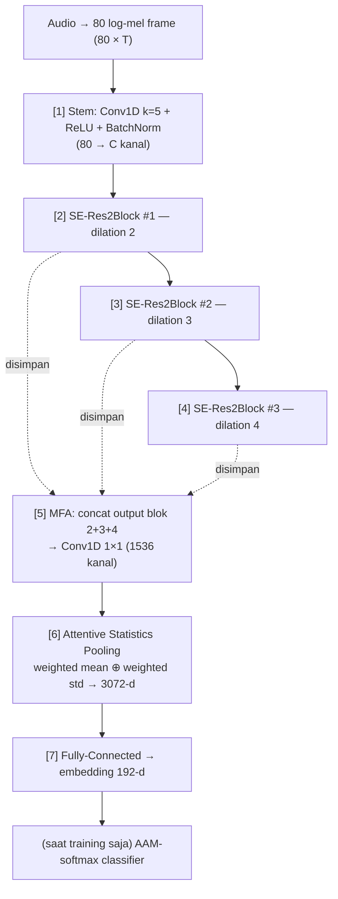

# ECAPA-TDNN — Penjelasan Lengkap Arsitektur (untuk Pembelajar Baru)

**Referensi utama:** Desplanques, B., Thienpondt, J., & Demuynck, K. (2020). *ECAPA-TDNN: Emphasized Channel Attention, Propagation and Aggregation in TDNN Based Speaker Verification*. Interspeech 2020. [arXiv:2005.07143](https://arxiv.org/abs/2005.07143)
**Checkpoint yang dipakai proyek ini:** [`speechbrain/spkrec-ecapa-voxceleb`](https://huggingface.co/speechbrain/spkrec-ecapa-voxceleb) (beku/frozen, output 192-d) — lihat `src/models/ecapa.py` dan [laporan lengkap eksperimen](laporan-lengkap-eksperimen.html).

---

## 1. Apa yang dilakukan ECAPA-TDNN?

ECAPA-TDNN adalah **ekstraktor speaker embedding**: jaringan saraf yang mengubah rekaman suara berdurasi bebas menjadi **satu vektor berukuran tetap (192 dimensi)** yang merangkum *identitas suara* pembicaranya.

Sifat yang diinginkan dari vektor ini:

- Dua rekaman dari **orang yang sama** → vektornya **berdekatan** (jarak cosine kecil).
- Rekaman dari **orang berbeda** → vektornya **berjauhan**.

Karena identitas dipadatkan menjadi geometri vektor, seluruh sistem pengenalan pembicara di proyek ini cukup bekerja dengan **membandingkan jarak** — tanpa perlu melatih classifier per pembicara. Inilah yang memungkinkan enrollment 1-shot: satu utterance → satu vektor → satu *prototype*.

Nama **ECAPA** adalah singkatan kontribusi barunya — **E**mphasized **C**hannel **A**ttention, **P**ropagation and **A**ggregation — yang dibangun di atas fondasi **TDNN** (Time Delay Neural Network) warisan arsitektur x-vector (Snyder dkk., 2018).

---

## 2. Fondasi: input jaringan dan apa itu TDNN

### 2.1 Dari audio menjadi barisan frame

Jaringan tidak membaca gelombang suara mentah. Audio 16 kHz diubah dulu menjadi **log-mel filterbank**: setiap ~10 ms (dengan jendela 25 ms) diambil **80 angka** yang menggambarkan energi suara pada 80 pita frekuensi yang meniru kepekaan telinga manusia. Hasilnya sebuah matriks:

```
input = 80 × T        (T = jumlah frame; audio 3 detik → T ≈ 300)
```

Bayangkan ini sebagai "gambar" spektrum: sumbu vertikal = frekuensi (80 baris), sumbu horizontal = waktu.

### 2.2 TDNN = konvolusi 1-D sepanjang waktu

**TDNN** pada dasarnya adalah **konvolusi satu dimensi di sumbu waktu**. Setiap neuron tidak melihat satu frame saja, melainkan beberapa frame sekaligus (misalnya frame *t−2 … t+2*), sehingga jaringan menangkap pola yang membentang dalam waktu — transisi bunyi, tekstur suara, ritme.

Dua istilah yang perlu dikenal:

| Istilah | Arti | Analogi |
|---|---|---|
| **Kernel / context** | berapa frame yang dilihat sekaligus | lebar "jendela baca" |
| **Dilation** | melompati frame (mis. *t−4, t−2, t, t+2, t+4*) | membaca dengan spasi renggang → jangkauan lebih lebar tanpa menambah parameter |

Semakin dalam lapisannya (dan semakin besar dilation-nya), semakin lebar **receptive field**-nya — neuron di lapisan dalam "melihat" rentang waktu yang makin panjang.

---

## 3. Peta besar arsitektur ECAPA-TDNN



Dihitung sebagai blok makro: **1 stem + 3 blok SE-Res2 + 1 agregasi (MFA) + 1 pooling atensi + 1 FC ≈ 7 tahap**. Tiap SE-Res2Block sendiri berisi beberapa sub-lapisan (dijelaskan di §4). `C` adalah lebar kanal — makalah menguji C=512 dan C=1024; checkpoint SpeechBrain yang dipakai proyek ini memakai **C=1024**.

Tahap [1]–[4] bekerja **frame-level** (output masih barisan sepanjang T); tahap [6] adalah titik krusial yang meringkas barisan itu menjadi **satu vektor utterance-level**; tahap [7] memampatkannya ke 192-d.

---

## 4. Isi perut SE-Res2Block (jantung ECAPA)

Setiap blok [2]–[4] tersusun sebagai berikut:

```
input ─→ Conv1×1 ─→ Res2Net dilated conv ─→ Conv1×1 ─→ SE block ─→ (+) ─→ output
   └──────────────────────── residual/skip ─────────────────────────┘
```

### 4.1 Res2Net — konvolusi multi-skala

Kanal fitur dibagi menjadi **8 kelompok** (scale *s*=8). Kelompok pertama diteruskan begitu saja; kelompok kedua dikonvolusi; hasilnya **ditambahkan** ke kelompok ketiga sebelum dikonvolusi lagi; begitu seterusnya berantai:

```
x1 ────────────────────────────→ y1
x2 ──conv──────────────────────→ y2
x3 + y2 ──conv─────────────────→ y3
x4 + y3 ──conv─────────────────→ y4
...                               (lalu semua y digabung kembali)
```

Efeknya: **dalam satu blok**, jalur-jalur berbeda memiliki receptive field berbeda — sebagian "membaca kata" (rentang pendek), sebagian "membaca kalimat" (rentang panjang). Ciri identitas suara memang muncul di banyak skala waktu sekaligus: warna suara (timbre) bersifat sesaat, sedangkan gaya artikulasi membentang lebih panjang.

### 4.2 Squeeze-and-Excitation (SE) — atensi per-kanal

Anggap C=1024 kanal sebagai 1.024 **detektor ciri suara** yang berbeda. Tidak semua detektor relevan untuk setiap rekaman (rekaman ber-noise, mikrofon berbeda, dsb.). SE block bekerja tiga langkah:

1. **Squeeze** — rata-ratakan tiap kanal sepanjang seluruh waktu → satu angka per kanal (ringkasan global rekaman *ini*).
2. **Excitation** — lewatkan ringkasan itu ke dua lapisan kecil (bottleneck) berujung sigmoid → skor 0–1 per kanal.
3. **Re-scale** — kalikan tiap kanal dengan skornya: kanal informatif "dikeraskan", kanal tak relevan "dikecilkan".

Inilah **Channel Attention** pada nama ECAPA — dan kata *Emphasized* merujuk pada fakta bahwa atensi ini dihitung dari **konteks global satu rekaman penuh**, sehingga penekanannya adaptif per rekaman.

### 4.3 Koneksi residual

Input blok ditambahkan langsung ke output (*skip connection*, gaya ResNet), supaya gradien mengalir lancar saat pelatihan dan informasi lapisan awal tidak hilang di lapisan dalam.

---

## 5. "Propagation and Aggregation" — dua ide di hilir

### 5.1 MFA (Multi-layer Feature Aggregation) — tahap [5]

Arsitektur x-vector klasik hanya memakai output lapisan terakhir. ECAPA menyimpan output **ketiga** SE-Res2Block lalu menggabungkannya (concatenate) sebelum diproses Conv1×1 menjadi 1.536 kanal. Alasannya sederhana: bukti identitas pembicara tersebar di berbagai kedalaman jaringan — fitur "dangkal" dan "dalam" sama-sama berguna, jadi keduanya dibawa ke tahap peringkasan.

### 5.2 Attentive Statistics Pooling (ASP) — tahap [6]

Ini jembatan dari *barisan frame* (1536 × T) menjadi *satu vektor utterance*:

- **x-vector lama:** rata-rata + simpangan baku polos semua frame — setiap frame dianggap sama penting.
- **ECAPA:** sebuah jaringan atensi kecil (yang juga melihat konteks global rekaman) memberi **bobot pada tiap frame per tiap kanal**: frame vokal yang jernih diberi bobot besar; jeda, desis, atau bagian ber-noise diberi bobot kecil. Lalu dihitung:

```
μ̃ = Σ_t α_t · h_t                       (weighted mean)
σ̃ = sqrt( Σ_t α_t · h_t² − μ̃² )        (weighted std)
output pooling = [ μ̃ ; σ̃ ]  →  2 × 1536 = 3072 dimensi
```

Menyertakan simpangan baku (bukan hanya rata-rata) menangkap *variabilitas* suara seseorang — juga ciri identitas. Hasil 3072-d ini lalu dipampatkan lapisan FC menjadi **embedding final 192-d**.

---

## 6. Bagaimana ECAPA dilatih (dan kenapa jarak cosine bermakna)

Saat pelatihan, di atas embedding 192-d dipasang classifier **AAM-softmax** (Additive Angular Margin, "ArcFace"): softmax biasa yang ditambah **margin sudut** — model dipaksa tidak hanya menebak pembicara dengan benar, tetapi benar dengan *jarak sudut aman* dari kelas lain. Akibatnya embedding antar-pembicara tersebar berjauhan **secara sudut**, dan itulah yang membuat **jarak cosine** menjadi ukuran kemiripan yang sahih saat inferensi (classifier-nya sendiri dibuang setelah pelatihan).

Checkpoint `speechbrain/spkrec-ecapa-voxceleb` dilatih pada **VoxCeleb1+2** (±7.000 pembicara, jutaan utterance) dengan augmentasi berat: noise MUSAN, reverb (RIR), dan SpecAugment — sehingga tahan terhadap kondisi akustik liar. Ukuran model: makalah melaporkan ±6,2 juta parameter (C=512) dan ±14,7 juta (C=1024); implementasi SpeechBrain yang dipakai berada di kisaran belasan–dua puluhan juta parameter. Performa acuan makalah: perbaikan EER relatif ±19% atas baseline kuat di VoxCeleb (EER < 1% pada Vox1-O untuk C=1024).

---

## 7. Ringkasan komponen dalam satu tabel

| # | Komponen | Fungsi dalam satu kalimat |
|---|---|---|
| 1 | Log-mel filterbank (80-d) | representasi spektrum per-10 ms yang meniru pendengaran manusia |
| 2 | Stem Conv1D (k=5) | pencampuran awal antar pita frekuensi |
| 3 | TDNN / dilated Conv1D | membaca pola sepanjang waktu dengan jangkauan bertingkat |
| 4 | Res2Net (s=8) | multi-skala waktu di dalam satu blok (kata ↔ kalimat) |
| 5 | SE block | "tombol volume" adaptif per detektor ciri, per rekaman |
| 6 | Residual/skip | menjaga gradien & informasi lapisan awal |
| 7 | MFA | menggabungkan bukti dari semua kedalaman (3 blok) |
| 8 | ASP | merangkum rekaman dengan menimbang frame paling informatif (mean+std berbobot) |
| 9 | FC 192-d | memampatkan menjadi sidik-suara final |
| 10 | AAM-softmax *(training saja)* | memaksa geometri sudut → jarak cosine bermakna |

**Satu kalimat intuisi:** *ECAPA membaca spektrum suara frame demi frame dengan konvolusi berjangkauan waktu bertingkat (TDNN + Res2Net), terus-menerus menyetel "tombol volume" tiap detektor ciri sesuai rekamannya (SE), mengumpulkan bukti dari semua kedalaman (MFA), lalu merangkum seluruh rekaman dengan menimbang frame-frame paling informatif (ASP) menjadi satu sidik-suara 192 angka.*

---

## 8. Bagaimana ECAPA-TDNN Diimplementasikan pada Penelitian Ini

Satu prinsip berlaku di seluruh penelitian: **bobot ECAPA tidak pernah diubah satu bit pun** — model selalu dimuat sebagai ekstraktor beku. Yang berevolusi antar eksperimen adalah **apa yang dilakukan terhadap embedding 192-d keluarannya**: diproyeksikan dan dilatih (exp0, gagal), dipertahankan apa adanya (exp1), dipakai di ruang natifnya (exp2), dinormalisasi jaraknya (exp3), diukur plafonnya (exp4), lalu difusikan di level z-score dengan backbone lain (exp5).

### 8.1 Lapisan implementasi dasar (sama untuk semua eksperimen)

**Pemuatan model** (`src/models/ecapa.py`): checkpoint `speechbrain/spkrec-ecapa-voxceleb` dimuat sekali sebagai *singleton* lewat `EncoderClassifier.from_hparams(...)` SpeechBrain, langsung dalam mode inferensi. Waveform hasil preprocessing (mode `ecapa_inference`: 16 kHz mono, panjang asli; sliding-window 30 detik hanya untuk audio sangat panjang) diberikan **mentah** ke `model.encode_batch(...)` — log-mel 80-d dihitung oleh pipeline internal SpeechBrain sendiri, sengaja tidak diimplementasi ulang agar tidak ada ketidakcocokan sekecil apa pun dengan fitur yang dilihat bobot pretrained saat dilatih.

**Pasca-proses**: output `[1, 1, 192]` di-squeeze lalu **di-L2-normalisasi** (`emb / ‖emb‖₂`) — sehingga jarak Euclidean antar embedding menjadi monoton terhadap jarak cosine. Untuk audio multi-window, embedding tiap window dirata-rata lalu direnormalisasi.

**Cache** (`src/features/cache.py`): embedding tiap utterance disimpan sekali ke `data/cache/embeddings/ecapa/sha1(path).npy`. Seluruh eksperimen berikutnya membaca cache ini — itulah sebabnya run resmi lengkap (7 konfigurasi × 5 seed) selesai dalam ±5 menit.

**Bentuk data yang mengalir ke pemodelan** (`src/prototypical/data.py`): embedding ECAPA selalu dibawa sebagai **paruh pertama** vektor gabungan mentah `[ecapa (192) ; backbone-kedua]` per utterance, lalu dipisah kembali (`split_raw_embedding`) tepat sebelum masuk modul fusi. Konvensi ini tidak berubah dari Experiment 0 sampai 5 — yang berganti hanya isi paruh kedua (Whisper 512-d → ReDimNet 192-d) dan modul fusinya.

### 8.2 Experiment 0 (`baseline_v0`) — ECAPA diproyeksikan dan "dirusak" (0.235)

```
ecapa 192-d ──► proj_ecapa: Linear 192→256 (INIT ACAK, DILATIH 500 episode) ──► gated fusion ──► prototype
```

Embedding ECAPA dilewatkan proyeksi linear acak yang dilatih episodik (prototypical loss) bersama gate fusi. Dengan hanya **71 pembicara** di data latih dasar, proyeksi ini *undertrained*: diagnosis (`scripts/diagnose_accuracy_gap.py`) menunjukkan akurasi arm ECAPA-saja **runtuh dari ~79% (ECAPA mentah) menjadi ~16% (setelah proyeksi)** — ruang embedding yang dilatih pada jutaan utterance dihancurkan oleh lapisan kecil yang dilatih pada ratusan. Inilah akar akurasi 0.235.

### 8.3 Experiment 1 (`exp1_frozen_residual`) — ECAPA diselamatkan dengan inisialisasi residual (0.731)

```
ecapa 192-d ──► proj_ecapa = IDENTITAS parsial (192 dim pertama; sisanya nol), BEKU
gate bias = +4  →  g = σ(4) ≈ 0,982  →  e_fusion ≈ ê_ecapa (Whisper hanya residu ±2%)
```

Dua perubahan pada perlakuan ECAPA (`GatedAttentionFusion._apply_residual_init`):
1. `proj_ecapa` diinisialisasi sebagai **matriks identitas parsial** — 192 dimensi pertama output fusi membawa vektor ECAPA **apa adanya**;
2. gate dibuat konstan-dominan ECAPA (bias +4), lalu **seluruh lapisan dibekukan (0 episode)** — sweep membuktikan setiap episode pelatihan menurunkan akurasi secara monoton.

Hasil: sistem secara efektif menjadi *nearest-prototype di ruang ECAPA asli* + threshold EER + continual update. Kualitas ECAPA pretrained menjadi **batas bawah yang dijamin**, bukan sesuatu yang dipertaruhkan.

### 8.4 Experiment 2a (`exp2a_scorefusion_L4`) — ECAPA di ruang natif, fusi pindah ke level skor (0.733)

```
skor(query, speaker) = 0,4 · d_cosine-ECAPA + 0,6 · d_cosine-Whisper-L4
implementasi: embedding = [√0,4·ê_ecapa ; √0,6·ê_whisper]   (ScoreFusionEmbed, bebas-parameter)
```

Proyeksi dibuang sama sekali: ECAPA dipakai di **ruang natif 192-d** (hanya L2-norm), dan kontribusinya diatur bobot skor tetap w=0,4. Trik implementasinya: konkatenasi berbobot dua vektor unit membuat jarak Euclidean kuadrat tepat sama dengan fusi skor berbobot — sehingga seluruh mesin prototype/threshold berjalan tanpa perubahan. Bagi ECAPA sendiri hasilnya netral (0.733 ≈ 0.731); nilai eksperimen ini ada pada diagnosis threshold (P4/P5) yang memicu Experiment 3.

### 8.5 Experiment 3 (`exp3b_asnorm`) — jarak ECAPA dinormalisasi AS-Norm (0.865)

Arsitektur ECAPA-nya identik dengan Experiment 1 (residual, beku). Yang berubah adalah **perlakuan terhadap jarak**:

```
z(q,p) = ½[ (d(q,p) − μ_topK(q→cohort))/σ_topK(q→cohort) + (d(q,p) − μ_topK(p→cohort))/σ_topK(p→cohort) ]
```

- **Cohort** = 300 utterance `base_train` (round-robin antar pembicara) yang di-embed lewat jalur ECAPA yang sama; top-K = 200.
- Threshold dipindah ke titik operasi **target-FRR 5%** dan dikalibrasi **per-konfigurasi** (arm A1 ECAPA-saja mendapat cohort + threshold-nya sendiri — perbaikan bug P4 dari Experiment 2).
- **Mengapa ini menaikkan ECAPA +0.13?** Pada 1-shot, sebagian prototype ECAPA menjadi "hub" — secara sistematis lebih dekat ke banyak query (bias per-kelas). Term sisi-prototype pada AS-Norm menormalkan bias itu, sehingga **argmin berubah** dan identifikasi (bukan hanya penolakan) membaik: 0.732 → 0.865.

### 8.6 Experiment 4 (analisis) — ruang ECAPA sebagai acuan pengukuran plafon

Tanpa perubahan produksi. Dalam analisis, ECAPA dipakai di **ruang natif** (L2-norm 192-d, bukan proyeksi gated — karena proyeksi acak diketahui merusak ruang, pengukuran harus adil) dengan AS-Norm cohort-nya sendiri. Perannya menjadi *acuan*: plafon oracle ECAPA∪Whisper hanya +0.0225, dan setiap campuran skor Whisper terbukti menurunkan akurasi di bawah ECAPA-saja → fusi Whisper ditutup, kriteria backbone kedua dirumuskan.

### 8.7 Experiment 5b (`exp5b_redimnet_fusion`) — ECAPA sebagai satu dari dua ruang skor (0.908)

```
embedding  = [ ê_ecapa (192) ; ê_redimnet (192) ]        (concat bebas-parameter, 384-d)
skor(q,p)  = 0,3 · z_ecapa(q,p) + 0,7 · z_redimnet(q,p)  (DualASNorm; tiap ruang di-AS-Norm sendiri,
                                                          cohort utterance yang sama, c300/k200)
```

Peran final ECAPA:
- **Paruh pertama** vektor concat; jaraknya dihitung dan di-z-normalisasi **di ruangnya sendiri** (`DualASNorm` memecah di dimensi 192), baru dijumlahkan berbobot dengan ruang ReDimNet. Bobot 0,3 dikunci lewat sweep validasi.
- **Arm ablasi lewat bobot normalizer**: A1 (ECAPA-saja) = bobot 1,0; A2 = 0,0; A3 = 0,3 — satu embedder untuk semua arm, ablasi murni di normalizer.
- **Continual update** (running average) bekerja pada vektor concat — rata-rata paruh ECAPA tetaplah rata-rata embedding ECAPA, jadi semantik prototype per-ruang terjaga.
- **Kontribusinya terukur**: fusi menambah +0.042 di atas arm ECAPA-saja (0.866 → 0.908, p=0.0041) dan menurunkan EER deteksi −0.036 (bootstrap CI signifikan) — kontras arsitektur TDNN-1D (ECAPA) vs reshape-1D↔2D (ReDimNet) membuat pola error keduanya berbeda, dan di situlah nilai fusinya.

### 8.8 Peran pendukung: ECAPA di baseline

- **Baseline "ECAPA standar" (closed-set)**: `SingleBackboneSystem` memakai embedding ECAPA yang sama persis (cache yang sama) tanpa fusi/normalisasi — pembanding utama proposal (0.788).
- **Baseline ProtoNet vanilla**: sengaja *mengulangi kesalahan* Experiment 0 (proyeksi acak dilatih 500 episode di atas ECAPA) sebagai titik referensi lemah (0.402) — bukti bahwa temuan exp1 bukan artefak.

### Ringkasan evolusi perlakuan ECAPA

| Eksperimen | Ruang ECAPA yang dipakai | Dilatih? | Normalisasi skor | Hasil usulan |
|---|---|---|---|---|
| 0 | proyeksi acak 192→256 | ya (500 ep) ❌ | — | 0.235 |
| 1 | identitas residual (≈ natif), via gated beku | tidak | — | 0.731 |
| 2a | natif (L2-norm), bobot skor 0,4 | tidak | — | 0.733 |
| 3b | identitas residual (≈ natif) | tidak | AS-Norm 1-ruang | 0.865 |
| 4 | natif (analisis) | tidak | AS-Norm per-ruang (uji) | — |
| 5b | natif, paruh concat, bobot z-score 0,3 | tidak | **DualASNorm dua-ruang** | **0.908** |

## 9. Bacaan lanjutan

1. Desplanques dkk. (2020) — makalah ECAPA-TDNN: [arXiv:2005.07143](https://arxiv.org/abs/2005.07143)
2. Snyder dkk. (2018) — x-vector, leluhur arsitekturnya
3. Hu dkk. (2018) — Squeeze-and-Excitation Networks: [arXiv:1709.01507](https://arxiv.org/abs/1709.01507)
4. Gao dkk. (2019) — Res2Net: [arXiv:1904.01169](https://arxiv.org/abs/1904.01169)
5. Deng dkk. (2019) — ArcFace/AAM-softmax: [arXiv:1801.07698](https://arxiv.org/abs/1801.07698)
6. Okabe dkk. (2018) — Attentive Statistics Pooling: [arXiv:1803.10963](https://arxiv.org/abs/1803.10963)

---

*Materi landasan teori · terkait: [laporan-lengkap-eksperimen.html](laporan-lengkap-eksperimen.html) · [experiment-1.md](experiment-1.md) (diagram fusi & pipeline) · [experiment-5.md](experiment-5.md) (ReDimNet & fusi dua-ruang) · [README.md](README.md).*
