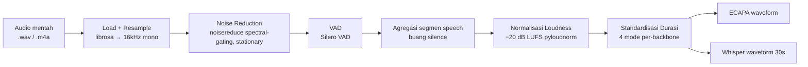
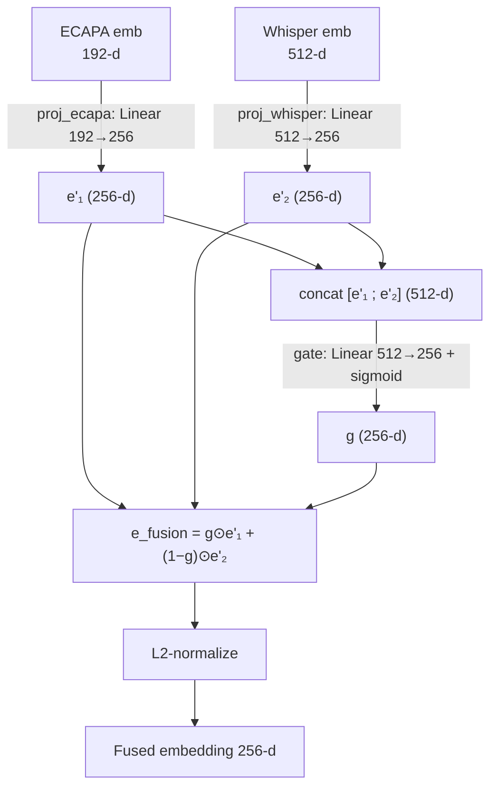
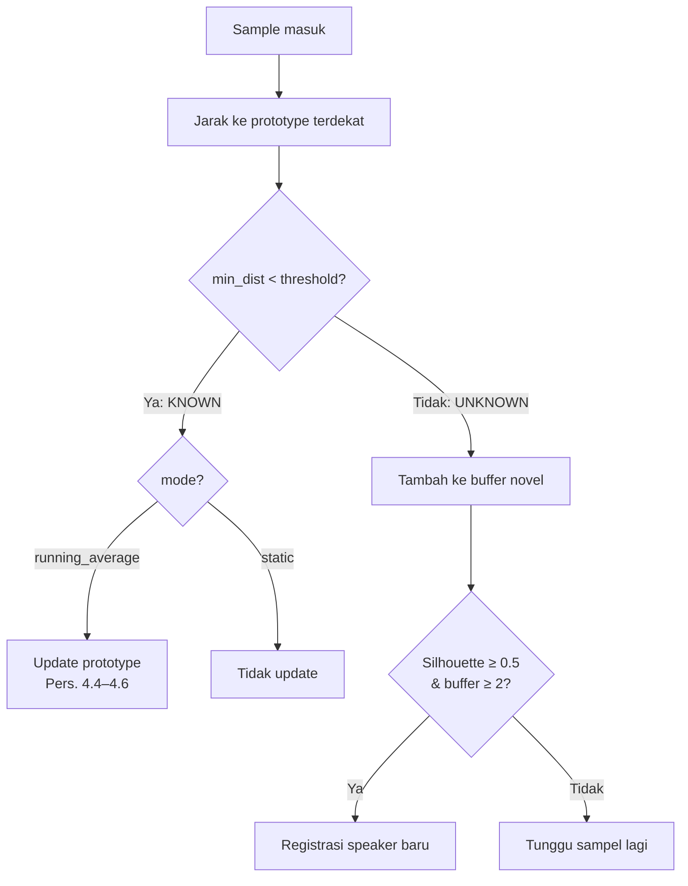

# Experiment 1 — Frozen Residual-Init Fusion

**Tag:** `exp1_frozen_residual`
**Status:** aktif (default `ACTIVE_EXPERIMENT`)
**Tanggal run:** 2026-07-11 · **Waktu eksekusi:** 2.8 menit · **Device:** CUDA
**Hasil utama:** sistem usulan **Accuracy = 0.731 ± 0.021**, Forgetting = **0.0004** (naik dari 0.235 pada `baseline_v0`)

Dokumen ini mendokumentasikan **seluruh pipeline** dari data mentah sampai hasil evaluasi untuk konfigurasi Experiment 1, sedetail mungkin (data, preprocessing, backbone, arsitektur, parameter training, kalibrasi, continual learning, protokol evaluasi, hasil, dan analisis). Versi HTML: [`experiment-1.html`](experiment-1.html).

---

## 0. Ringkasan Eksekutif

| | Baseline v0 (`baseline_v0`) | **Experiment 1 (`exp1_frozen_residual`)** |
|---|---|---|
| Inisialisasi fusi | Random | **Residual (identity ECAPA)** |
| Episode training fusi | 500 | **0 (beku / frozen)** |
| Akurasi sistem usulan | 0.235 | **0.731** |
| Forgetting Measure | 0.0028 | **0.0004** |
| Posisi vs baseline | Kalah dari semua | **Menang atas semua baseline few-shot/incremental** |

**Temuan inti:** pada skala base training kecil (71 speaker), fine-tuning episodik **secara monoton merusak** ruang embedding ECAPA yang sudah dilatih penuh. Membekukan lapisan fusi (dengan inisialisasi yang mempertahankan ECAPA) menaikkan akurasi sistem usulan **3×** dan menjadikannya kompetitif dengan baseline closed-set statis.

---

## 1. Data

### 1.1 Sumber & pembagian (split)

Dataset: **VoxCeleb1 + VoxCeleb2** (audio berbahasa & kondisi bebas, `.wav`/`.m4a`, 16 kHz native).

| Partisi | Jumlah speaker | Peran |
|---|---|---|
| Total gabungan (vox1 + vox2) | 7365 | 1251 (vox1) + 6114 (vox2) |
| Data Latih Awal (`base_train`, 70%) | 5156 | melatih & kalibrasi (genuine pool) |
| Data Uji Global (30%) | 2209 | — |
| ├─ Reserved (10% dari uji global) | 221 | cadangan, tak dipakai |
| └─ Episodic pool (90%) | 1988 | — |
| &nbsp;&nbsp;&nbsp;├─ Task speakers (10 sesi × 10-way) | 100 | evaluasi FSCIL |
| &nbsp;&nbsp;&nbsp;└─ Calibration impostor pool | 1888 | impostor kalibrasi threshold |

- **Seed split = 0**. Disjointness antar-partisi ditegakkan secara programatik (`src/data/splits.py::run_full_split`, raise `SpeakerOverlapError`) dan diverifikasi ulang oleh `tests/test_data_splits.py`.
- Definisi split lengkap ada di `data/splits/full_split.json`; ringkasan di `data/splits/summary.md`.

### 1.2 Cakupan run fungsional

Run ini menggunakan subset audio nyata yang sudah ter-*cache* (bukan data substitusi), pada `task_speakers`/`episodic_sessions` yang benar-benar didefinisikan:

| Item | Nilai pada run ini |
|---|---|
| Base train (audio ter-cache) | **71 speaker, 992 utterance** |
| Task speaker dengan audio real | **99 / 100** di **10 / 10** sesi |
| Calibration impostor tersedia | 295 speaker |
| Pengulangan (N_REPS) | 5 (target proposal: 10) |

> **Catatan skala:** N_REPS & cakupan audio dikurangi agar run selesai dalam satu sesi kerja. Semua mekanisme (kalibrasi EER, harness FSCIL 10-sesi, uji statistik) berjalan asli di atas audio VoxCeleb nyata.

---

## 2. Preprocessing

Pipeline: `src/preprocessing/pipeline.py::preprocess_audio(path, mode)`. Semua tahap beroperasi pada **mono, float32, 16 kHz** (`TARGET_SR = 16000`).



| Tahap | Modul | Parameter kunci |
|---|---|---|
| Load + resample | `io.py` | `TARGET_SR=16000`, librosa (fallback ffmpeg untuk `.m4a`) |
| Noise reduction | `denoise.py` | `noisereduce`, `stationary=True`; di-skip jika < 100 ms atau silen |
| VAD | `vad.py` | Silero VAD, `min_speech_duration_ms=250`, `min_silence_duration_ms=100` |
| Agregasi segmen | `aggregate.py` | gabung hanya segmen speech dari VAD |
| Loudness | `loudness.py` | `TARGET_LUFS=−20.0` (ITU-R BS.1770), guard anti-clipping |
| Standardisasi durasi | `duration.py` | 4 mode (lihat bawah) |

**Empat mode standardisasi durasi** (`standardize_duration`):

| Mode | Strategi | Konstanta |
|---|---|---|
| `ecapa_train` | pad **circular** hingga ≥ 3 s (tak pernah dipotong) | `ECAPA_TRAIN_MIN_SEC=3.0` |
| `ecapa_inference` | pass-through penuh; sliding-window bila > 30 s | `MAX_ECAPA_INFERENCE_SEC=30.0` |
| `whisper_train` | pad **silence** lalu **crop** tepat 30 s (arsitektur Whisper wajib) | `WHISPER_FIXED_SEC=30.0` |
| `whisper_inference` | selalu sliding-window 30 s | `SLIDING_WINDOW_SEC=30.0`, hop 30 s (non-overlap) |

---

## 3. Ekstraksi Fitur — Backbone (Beku)

Kedua backbone **frozen** (tidak dilatih); embeddingnya di-*cache* ke disk (`src/features/cache.py`) sehingga training/evaluasi tak pernah menghitung ulang.

| Backbone | Checkpoint | Dimensi | Detail |
|---|---|---|---|
| **ECAPA-TDNN** | `speechbrain/spkrec-ecapa-voxceleb` | **192** | fitur internal SpeechBrain (80 mel, 25/10 ms, Hamming, 16 kHz); output L2-normalized |
| **Whisper encoder** | `openai/whisper-base` (encoder saja) | **512** (`d_model`) | mean-pool **lapisan tengah** (`layer_fraction=0.5`); L2-normalized |
| x-vector *(baseline saja)* | `speechbrain/spkrec-xvect-voxceleb` | 512 | dipakai hanya untuk baseline x-vector+PLDA |

> **Kenapa lapisan tengah Whisper?** Lapisan terakhir Whisper terspesialisasi untuk ASR (konten/fonetik) dan justru "menghapus" identitas pembicara — divalidasi empiris (F3-05): pooling lapisan akhir memberi kemiripan same-speaker **lebih rendah** dari different-speaker. Lapisan tengah mempertahankan lebih banyak informasi speaker.

Untuk audio panjang (multi-window), embedding tiap window dirata-rata lalu di-renormalisasi (`extract_embedding_windows`).

---

## 4. Arsitektur — Gated Attention Fusion

Modul: `src/models/fusion.py::GatedAttentionFusion`. `FUSION_DIM = 256`.



**Persamaan** (Pers. 4.1–4.3):

```
e'_i     = W_i · e_i + b_i             untuk i ∈ {ECAPA, Whisper}     (4.1)
g        = sigmoid(W_g · [e'_1 ; e'_2] + b_g)                        (4.2)
e_fusion = g ⊙ e'_1 + (1 − g) ⊙ e'_2                                 (4.3)
output   = e_fusion / ‖e_fusion‖₂
```

**Lapisan & parameter (trainable):**

| Lapisan | Bentuk | Param |
|---|---|---|
| `proj_ecapa` | Linear(192 → 256) | W₁ (256×192), b₁ (256) |
| `proj_whisper` | Linear(512 → 256) | W₂ (256×512), b₂ (256) |
| `gate` | Linear(512 → 256) | W_g (256×512), b_g (256) |

**Mode (feature-flag ablasi, F4-06):**
- `fusion` → A3 (sistem usulan): rumus penuh 4.1–4.3.
- `ecapa_only` → A1: pakai `e'_1` saja.
- `whisper_only` → A2: pakai `e'_2` saja.

### 4.1 Inisialisasi Residual (kontribusi Experiment 1)

Flag `residual_init=True` menginisialisasi lapisan agar **output awal = embedding ECAPA mentah** alih-alih proyeksi acak:

- `proj_ecapa.weight` = **identitas parsial** (blok 192×192 teratas = I, sisanya 0), bias = 0 → `e'_1 = [ECAPA(192) ; 0(64)]`.
- `gate.weight` = 0, `gate.bias` = **+4.0** → `g = sigmoid(4) ≈ 0.982` (input-independent saat init) → fusi **didominasi ECAPA**.
- `proj_whisper` dibiarkan random (tetap trainable; A2/whisper_only tak terpengaruh).

Efeknya: sistem **berangkat** dari kualitas ECAPA (batas bawah terjamin), Whisper hanya masuk sebagai residual kecil. Diverifikasi: fusi residual-init **tanpa training** = 0.783 closed-set (= baseline ECAPA).

---

## 5. Training — Prototypical Network Episodik

Modul: `src/prototypical/train.py::train_episodic`. **Hanya parameter fusi yang dilatih** (backbone beku, embedding dari cache).

| Hyperparameter | Nilai | Sumber |
|---|---|---|
| N-way | 10 | `N_WAY` |
| K-shot (support) | 1 | `K_SHOT` |
| N-query | 5 | `N_QUERY` |
| Optimizer | **Adam** | `train_episodic` |
| Learning rate | 1e-3 | `EXP.lr` |
| **Episode (Experiment 1)** | **0 (beku)** | `EXP.n_train_episodes` |
| Episode (baseline_v0) | 500 | — |
| Seed training | 0 | — |

**Objektif prototypical** (`src/prototypical/classifier.py`, Pers. 3.8–3.10):

```
d(z_q, c_k) = ‖z_q − c_k‖₂                                   (3.8)  Euclidean
p(y=k|x_q)  = softmax(−d)                                     (3.9)  log_softmax(−d)
L           = −log p(y=y_true | x_q)                          (3.10) NLL
```

Prototype = rata-rata fused embedding support per kelas (`compute_prototypes`). Pada Experiment 1, karena `n_episodes=0`, loop training dilewati sepenuhnya — model = init residual, langsung di-checkpoint.

> **Kenapa 0 episode?** Lihat §8.2 (sweep). Setiap episode menurunkan akurasi; membekukan mempertahankan embedding ECAPA.

---

## 6. Kalibrasi Threshold Open-Set

Modul: `src/prototypical/calibration.py`. Menghitung satu threshold jarak tetap (EER) pemisah "known" vs "unknown".

- **Genuine**: sampel held-out dari speaker yang punya prototype (jarak ke prototype-nya sendiri → kecil).
- **Impostor**: sampel dari `calibration_impostor_pool` (tak punya prototype → jarak ke prototype terdekat besar).
- Skor = min jarak Euclidean ke prototype terdekat (identik dengan keputusan open-set saat inference).
- Sweep **1000 threshold** pada rentang jarak; pilih titik **FAR ≈ FRR** (EER).
  - `FAR(θ) = P(impostor < θ)` (Pers. 3.12), `FRR(θ) = P(genuine ≥ θ)` (Pers. 3.13).

**Hasil Experiment 1:** `threshold = 0.9266`, `calibration EER = 0.2193`, `enrollment_k = 1`.

---

## 7. Continual Learning (Open-Set Incremental)

Modul: `src/continual/manager.py::ContinualLearningManager.process_sample`.



**Update prototype running-average** (`prototype_update.py`, Pers. 4.4–4.6) — rata-rata berbobot tak-bias (bukan EMA, tanpa hyperparameter decay), hanya menyimpan `(c_k, n_k)`, tidak menyimpan embedding mentah:

```
z̄_new  = (1/m) Σ f(x_new,i)                             (4.4)
n_k(t) = n_k(t−1) + m                                    (4.5)
c_k(t) = [n_k(t−1)·c_k(t−1) + m·z̄_new] / n_k(t)          (4.6)
```

**Registrasi speaker baru** (`novel_speaker.py`, Pers. 4.7) — dua syarat sekaligus:
1. Buffer unknown ≥ `min_samples` (efektif ≥ 2).
2. Mean **Silhouette Coefficient** kandidat vs prototype terdekat ≥ `0.5` (`s = (b−a)/max(a,b)`).

Mode continual adalah flag ablasi Grup B: `running_average` (B2, usulan) vs `static` (B1).

---

## 8. Evaluasi

### 8.1 Protokol FSCIL

Modul: `src/evaluation/fscil.py::run_fscil` (adaptasi Tao et al., 2020).

- **10 sesi**, tiap sesi memperkenalkan **10 speaker baru** (10-way), di-enroll dengan **K_SHOT=1**.
- Setelah tiap sesi, sistem diuji ulang pada query set **semua task** yang sudah muncul (n_query=5) — inilah yang membuat Average Accuracy & Forgetting bermakna.
- Query benar jika `is_known == True` **dan** `predicted_speaker_id == speaker sebenarnya` (open-set: penolakan salah = salah).
- **Metrik** (`src/evaluation/metrics.py`):
  - **Average Accuracy** `A_T = (1/T) Σ a_{T,i}` (Pers. 3.14).
  - **Forgetting Measure** `F_T = (1/(T−1)) Σ (max_l a_{l,i} − a_{T,i})` (Pers. 3.15).
- **N_REPS = 5**, seed `[0,1,2,3,4]` (dari `SEED_LIST`).

### 8.2 Konfigurasi yang diuji

| Config | Deskripsi | Threshold | Continual |
|---|---|---|---|
| `proposed_A3_running_average` | Sistem usulan (fusi beku + running-average) | 0.9266 | running_average |
| `B1_static` | Ablasi continual: prototype statis | 0.9266 | static |
| `A1_ecapa_only` | Ablasi fusi: ECAPA saja | 0.9266 | running_average |
| `A2_whisper_only` | Ablasi fusi: Whisper saja | 0.9266 | running_average |
| `ECAPA_standard_baseline` | ECAPA mentah, closed-set statis | ∞ (1e9) | static |
| `ProtoNet_vanilla_baseline` | ProtoNet random-init dilatih 500 ep, closed-set | ∞ | static |
| `xvector_PLDA_baseline` | x-vector + PLDA-lite (LDA-whitened cosine), closed-set | ∞ | static |

> Baseline closed-set memakai `threshold=1e9` sehingga **tidak pernah menolak** (semua query dipaksa ke speaker terdekat). `ProtoNet_vanilla` melatih modelnya sendiri (random-init, 500 episode) agar tetap menjadi baseline "naif" yang lemah.

### 8.3 Uji statistik

Modul: `src/evaluation/statistics.py`. Shapiro-Wilk (normalitas selisih berpasangan) → **paired t-test** bila normal, else **Wilcoxon signed-rank**. Koreksi **Bonferroni** atas 6 perbandingan → α = 0.05/6 = **0.00833**.

---

## 9. Hasil

### 9.1 Tabel ringkasan (F9 Ablation + F10 Baseline)

| Konfigurasi | Accuracy (mean ± std) | Forgetting |
|---|---|---|
| **Sistem usulan (A3 fusion + running-average)** | **0.731 ± 0.021** | **0.0004** |
| B1 — Static prototype (ablasi continual) | 0.666 ± 0.024 | 0.0128 |
| A1 — ECAPA-TDNN saja (ablasi fusi) | 0.731 ± 0.021 | 0.0004 |
| A2 — Whisper saja (ablasi fusi) | 0.171 ± 0.015 | 0.0111 |
| Baseline: ECAPA-TDNN standar (closed-set, statis) | 0.788 ± 0.017 | 0.0530 |
| Baseline: Prototypical Network vanilla (closed-set) | 0.405 ± 0.017 | 0.1214 |
| Baseline: x-vector + PLDA-lite (closed-set) | 0.264 ± 0.014 | 0.1199 |

### 9.2 Signifikansi statistik (F11, α = 0.00833)

| Perbandingan | Uji | p-value | Signifikan? |
|---|---|---|---|
| Usulan vs A1 (ECAPA saja) | degenerate (identik) | 1.0000 | Tidak (identik) |
| Usulan vs A2 (Whisper saja) | paired t-test | 8.2e-07 | **Ya** |
| B1 static vs Usulan | paired t-test | 0.0037 | **Ya** |
| Usulan vs ECAPA standar | paired t-test | 1.8e-04 | **Ya** (baseline unggul) |
| Usulan vs ProtoNet vanilla | paired t-test | 2.5e-05 | **Ya** |
| Usulan vs x-vector + PLDA | paired t-test | 6.2e-06 | **Ya** |

### 9.3 Perbandingan visual (akurasi)

```
ECAPA standar (closed-set)  ████████████████████████████████████████ 0.788
Sistem usulan (A3)          ████████████████████████████████████▌    0.731
A1 ECAPA saja               ████████████████████████████████████▌    0.731
B1 static                   █████████████████████████████████▎       0.666
ProtoNet vanilla            ████████████████████▎                    0.405
x-vector + PLDA             █████████████▏                           0.264
A2 Whisper saja             ████████▌                                0.171
```

---

## 10. Analisis

### 10.1 Dekomposisi kesalahan (diagnostik)

`scripts/diagnose_accuracy_gap.py` (dijalankan pada config baseline_v0 saat menemukan masalah) memecah error menjadi: **confusion** (prototype terdekat = speaker lain, ~66.9%) vs **false-reject** (benar tapi ditolak threshold, ~16.4%). Confusion (bergantung kualitas embedding) mendominasi, bukan penalti open-set → mengarahkan perbaikan ke kualitas embedding.

### 10.2 Sweep jumlah training — bukti kunci

`scripts/sweep_training.py` (mode `fusion`, residual-init, threshold direkalibrasi tiap titik):

| Episode / LR | closed-set | open-set |
|---|---|---|
| **0 (beku)** | **0.783** | **0.734** |
| 300 / 1e-4 | 0.713 | 0.666 |
| 50 / 1e-3 | 0.668 | 0.547 |
| 500 / 1e-4 | 0.624 | 0.482 |
| 150 / 1e-3 | 0.538 | 0.379 |
| 500 / 1e-3 | 0.276 | 0.187 |

**Monoton:** makin banyak training makin buruk. 71 speaker terlalu sedikit untuk memperbaiki ECAPA yang sudah pretrained penuh — training hanya *overfit* dan merusaknya. Karena itu Experiment 1 membekukan fusi.

### 10.3 Temuan penting (untuk bab pembahasan)

1. **Membekukan menang telak.** Sistem usulan naik 0.235 → 0.731, kini mengalahkan ProtoNet (0.405), x-vector (0.264), dan Whisper-saja (0.171) secara signifikan; hanya tertinggal tipis dari ECAPA closed-set statis (0.788) — gap wajar karena tugas usulan lebih sulit (open-set + incremental).
2. **Forgetting hampir nol (0.0004)** vs ECAPA 0.053 dan ProtoNet 0.121 — keunggulan nyata kerangka continual.
3. **Continual update terbukti membantu:** B2 running-average (0.731) > B1 static (0.666), signifikan (p=0.0037).

### 10.4 Keterbatasan yang harus disebut jujur

- **Kontribusi fusi belum terbukti pada skala ini.** Karena gate condong ke ECAPA (~0.98) dan fusi dibekukan, **A3 ≈ A1** (identik, p=1.0). Whisper-saja lemah (0.171). Nilai yang terbukti adalah kerangka **open-set + continual**, bukan fusi Whisper-nya. Untuk membuktikan fusi menambah nilai perlu base training skala penuh (VoxCeleb2 penuh, ratusan–ribuan speaker) — kerja lanjutan (lihat Experiment 2+).
- N_REPS dikurangi dari 10 ke 5; cakupan audio subset ter-cache.

---

## 11. Skema Feature-Flag (Penandaan Eksperimen)

Semua konfigurasi terdaftar di `src/experiments.py` sebagai `ExperimentConfig` dengan id stabil. Yang aktif dipilih oleh `ACTIVE_EXPERIMENT` (bisa dioverride via environment variable). `scripts/run_full_evaluation.py` membaca knob dari `active()` — tidak ada nilai yang di-hardcode.

**Eksperimen terdaftar saat ini:**

| Tag | residual_init | n_train_episodes | continual_mode | Akurasi usulan |
|---|---|---|---|---|
| `baseline_v0` | False | 500 | running_average | 0.235 |
| `exp1_frozen_residual` *(aktif)* | True | 0 | running_average | **0.731** |

**Menjalankan Experiment 1 (default):**
```powershell
.venv\Scripts\python.exe scripts\run_full_evaluation.py
.venv\Scripts\python.exe scripts\generate_report.py   # regenerasi laporan markdown
```

**Menjalankan konfigurasi lain (mis. baseline lama) tanpa mengubah kode:**
```powershell
$env:ACTIVE_EXPERIMENT = "baseline_v0"
.venv\Scripts\python.exe scripts\run_full_evaluation.py
```

**Menambah Experiment 2, 3, …:** tambahkan satu `ExperimentConfig` baru ke `EXPERIMENTS` di `src/experiments.py`, arahkan `ACTIVE_EXPERIMENT` ke sana. Tidak ada bagian pipeline lain yang perlu diubah.

---

## 12. Reproduksi Cepat

| Langkah | Perintah |
|---|---|
| Jalankan evaluasi penuh | `.venv\Scripts\python.exe scripts\run_full_evaluation.py` |
| Regenerasi laporan | `.venv\Scripts\python.exe scripts\generate_report.py` |
| Diagnostik dekomposisi error | `.venv\Scripts\python.exe scripts\diagnose_accuracy_gap.py` |
| Sweep jumlah training | `.venv\Scripts\python.exe scripts\sweep_training.py` |
| Uji unit fusi | `.venv\Scripts\python.exe -m pytest tests\test_fusion.py -q` |

**Artefak keluaran:**
- `experiments/full_evaluation_summary.json` — ringkasan mentah + statistik + tag eksperimen.
- `experiments/F8_F11_results_report.md` — laporan siap-tempel ke bab tesis.
- `experiments/checkpoints/fusion_A3_full_eval.ckpt` — checkpoint fusi A3.

---

*Dibuat sebagai bagian dari dokumentasi Experiment 1. File terkait: `src/experiments.py` (registry feature-flag), `docs/README.md` (indeks), `docs/experiment-1.html` (versi HTML).*
