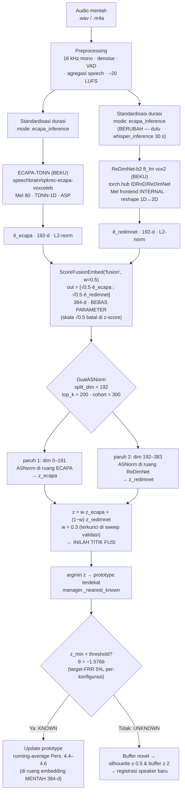
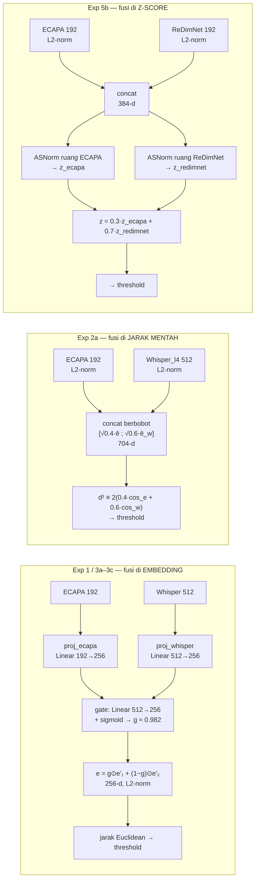
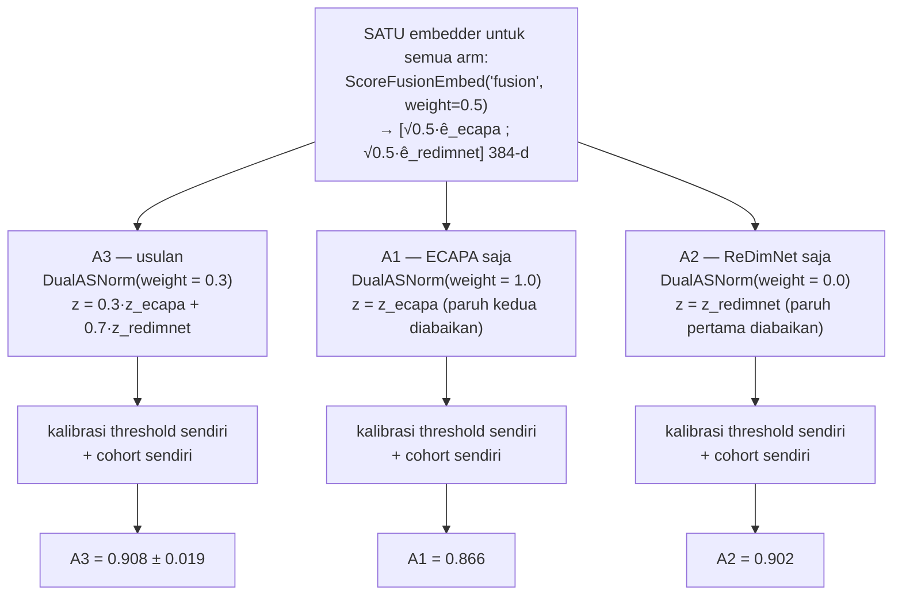

# Experiment 5 — Backbone Alternatif Pengganti Whisper (Fusi Multi-Backbone Heterogen)

**Status:** ✅ **SUDAH DIJALANKAN** (18–19 Juli 2026) · ♻️ **DIHITUNG ULANG** (26–27 Juli 2026) setelah code review menemukan bug AS-Norm cohort leakage + FSCIL query-reuse — lihat §0. · ♻️ **REPETISI DINAIKKAN 5→10 + uji ketahanan leakage** (2 Agustus 2026) — lihat §0b/§10. Laporan lengkap versi lama: [`experiment-5.html`](experiment-5.html) *(belum diregenerasi, masih angka 18 Juli)*.
**Tag:** `exp5b_redimnet_fusion` ✅ *(kini tag aktif default)*
**Prasyarat:** ✅ [Experiment 4](experiment-4.md) — fusi Whisper ditutup (G4.2) → backbone kedua diganti.

> ## 🏆 Hasil utama (final, 10 repetisi, 2026-08-02, 530 query unknown nyata)
> **Usulan (A3, fusi `0.5·z_ecapa + 0.5·z_redimnet`, running-average): Accuracy = 0.876 ± 0.016** — di atas exp3b (0.833, lihat [Experiment 3](experiment-3.md) §0/§0b) dan **di atas baseline ECAPA signifikan** (+0.093, p<0.0001 < α=0.00833). **A3 > A1 (ECAPA-saja) signifikan (p<0.0001 < α=0.00833)** — klaim kontribusi fusi terukur ini **bertahan lewat dua putaran perbaikan**, p-value-nya makin kuat (0.0041 di run asli → 0.0020 di 5-repetisi → **<0.0001** di 10-repetisi). Deteksi unknown: **EER 0.096, AUROC 0.962, TAR@1%FAR 0.598**. Forgetting −0.0007 (~0).
>
> **Jalan eksekusi (gerbang demi gerbang, tidak berubah oleh hitung-ulang):** audit leakage (80/100 task speaker di vox2-dev, diungkap) → kandidat #1 **WavLM GAGAL G5.1** (layer terbaik 0.2925 < 0.70) → kandidat #2 **ReDimNet-b2 ft_lm LOLOS semua gerbang** (standalone 0.878; plafon +0.069 — *angka screening ini belum dihitung ulang, lihat §0 — diverifikasi 2026-08-02 struktural bebas dari bug cohort-leakage, lihat §0*) → sweep validasi re-lock **w=0.5** *(dulu 0.3; val 0.9092 vs ECAPA-only-di-ruang-yang-sama 0.8525, 3/3 seed)* → run resmi.
>
> **Catatan jujur:** A3 vs A2 (ReDimNet-saja, 0.877) p=0.8803 — fusi masih *setara* backbone tunggal terkuat, bukan melampauinya (konsisten di semua putaran: p=0.209/0.1526/0.8803); B1 static (0.859) vs A3 (0.876) p=0.0310 pada akurasi — **tidak signifikan** bahkan di 10 repetisi (beda dengan exp3b, di mana 10 repetisi memulihkan signifikansi B1-vs-B2) — **tapi** pada EER deteksi, continual tetap unggul signifikan kuat (§bootstrap di bawah, 10/10 repetisi). Aturan `mean` exp4c terkonfirmasi ulang vs A1 (EER 0.099 < 0.127−0.01) tapi kalah tipis dari A2 murni (0.094) dan dari skor produksi A3 (0.096). **Uji ketahanan leakage (§10, baru)**: pada 19 task speaker yang bukan vox2-dev, A3 (0.956) masih numerik di atas A1 (0.933) tapi tidak signifikan (p=0.1475) — kemungkinan besar karena subset kecil kurang bertenaga secara statistik (akurasi tinggi ~93-96%, sedikit ruang varians), bukan bukti leakage membiaskan hasil resmi.
> **Uji signifikansi (kepatuhan proposal Bab 4.11):** Accuracy — Shapiro-Wilk → paired t-test + Bonferroni ✅; **EER — bootstrap CI 95% (Bengio & Mariéthoz 2004)**, 10 repetisi: usulan vs A1 ΔEER −0.0308 [−0.0356, −0.0260] SIGNIFIKAN 10/10; **continual vs static ΔEER +0.1005 [+0.0932, +0.1079] SIGNIFIKAN 10/10 rep**; vs 3 baseline semua signifikan; vs A2 setara (ΔEER +0.0025 [−0.0018, +0.0069], tidak signifikan).
> Artefak: `full_evaluation_summary_exp5b_redimnet_fusion.json` · `exp5_validation_sweep.json` · `exp5_bootstrap_eer_exp5b_redimnet_fusion.json` · `exp5_detection_rules_exp5b_redimnet_fusion.json` · `exp5_leakage_robustness.json` (baru) · `exp5_screening_redimnet_b2.json` / `exp5_wavlm_layer_sweep.json` / `exp5_leakage_audit.json` *(gate/screening, tidak terdampak bug — lihat §0)*.

> ### 🔄 PEMBARUAN (30 Agustus 2026) — dua hal dari [Experiment 6](experiment-6.md)
>
> **1. Bobot fusi w=0.5 dipilih dengan 3 seed, dan bukan optimum.** Penurunan ulang grid yang sama dengan **10 seed** (`experiments/exp6_validation_sweep_redimnet_b2_10seed.json`) menempatkan optimum pada **w=0.3**. Run resmi pada bobot itu (tag `exp6_redimnet_fusion_w30`) memperbaiki seluruh metrik: akurasi **0.876 → 0.882**, det-EER 0.096 → 0.091, TAR@1%FAR 0.598 → 0.630, dan membuat **A3 > B1 static signifikan pada akurasi** (p=0.0071) — yang di dokumen ini tidak signifikan (p=0.0310). Titik operasi terbaik tesis kini w=0.3, bukan w=0.5.
>
> **2. Gerbang G5.3 diputuskan di atas pengurutan yang tidak stabil.** Sweep validasi 3 seed di dokumen ini melihat A3 (0.9092) > A2 (0.9017); pada 10 seed urutannya **terbalik** (0.8918 vs 0.8962). Inilah sebab validasi terlihat meyakinkan sementara run resmi memberi A2 ≥ A3 (p=0.88) — bukan perbedaan populasi, melainkan kurangnya daya statistik. Seluruh sweep validasi berikutnya wajib 10 seed.
>
> Angka-angka di bawah tetap valid dan telah **direproduksi bit-identik** pada kode 30 Agustus 2026.

**Batasan tetap:** strict 1-shot (K_SHOT = 1), bebas-pelatihan (0 episode, backbone beku, tanpa fine-tuning), protokol evaluasi = [Experiment 3](experiment-3.md) penuh.

> **Arsitektur final ada di [§0b](#0b-arsitektur-final--apa-yang-berubah-dari-experiment-14) di bawah** (flow diagram + kontras terhadap Experiment 1–4). Mulai §1 adalah dokumen rencana asli, dipertahankan sebagai jejak metodologi. Versi HTML: [`experiment-5.html`](experiment-5.html).
> **Tag rencana:** `exp5a_<backbone>_standalone` *(eksplorasi)* · `exp5b_<backbone>_fusion` *(run resmi)*

---

## 0a. Perhitungan ulang 2026-07-27 — apa yang berubah dan kenapa

Code review menyeluruh 2026-07-26 (lihat [`README.md`](../README.md) §Status Kode, dan [Experiment 3](experiment-3.md) §0 untuk detail teknis bug) menemukan bug yang mengenai jalur evaluasi Experiment 5:

1. **Kebocoran cohort AS-Norm** (`scripts/exp5_validation_sweep.py`, `scripts/run_full_evaluation.py`) — cohort AS-Norm dan sampel kalibrasi genuine tidak speaker-disjoint. Diperbaiki via `split_cohort_and_genuine`.
2. **Kebocoran evaluasi FSCIL** (`src/evaluation/fscil.py`) — query task lama diproses ulang stateful setiap sesi, memengaruhi perbandingan continual (`running_average`) vs `static`.
3. **`Forgetting Measure`** (off-by-one) dan **`bootstrap_eer_difference`** (resampling tidak paired) — dua-duanya dipakai untuk melaporkan angka exp5b.

Experiment 5 **tidak terkena** bug pooling Whisper — backbone kedua exp5b adalah `redimnet_b2`, bukan Whisper, jadi cache `redimnet_b2` (14.874 entri) tetap valid dan **tidak dihitung ulang**.

Langkah hitung-ulang (setelah [Experiment 3](experiment-3.md) selesai, karena `exp5_validation_sweep.py` mengunci `target_frr` exp3b sebagai basisnya):

| Langkah | Perintah | Hasil |
|---|---|---|
| 1. Re-lock bobot fusi `w` | `scripts/exp5_validation_sweep.py` (dengan `TARGET_FRR` diperbarui ke 0.01 mengikuti exp3b baru) | w terbaik bergeser **0.3 → 0.5** |
| 2. Update `src/experiments.py` | manual | `score_fusion_weight=0.5`, `target_frr=0.01` |
| 3. Run resmi ulang | `scripts/run_full_evaluation.py` (`ACTIVE_EXPERIMENT=exp5b_redimnet_fusion`) | 0.908±0.019 → **0.868±0.009** |
| 4. Bootstrap EER ulang | `scripts/exp5_bootstrap_eer.py` | Kesimpulan bertahan (lihat ringkasan di atas) |
| 5. Aturan deteksi dua-ruang ulang | `scripts/exp5_detection_rules.py` | Gate G4.3 tetap TERKONFIRMASI |
| 6. Sanity | `pytest -q` | 156 passed |

**Yang TIDAK dihitung ulang** (di luar cakupan fix — angka-angka gate eksplorasi awal, bukan headline resmi, dan risikonya kecil karena marginnya besar saat lolos gerbang):
- `exp5_screening_redimnet_b2.json` (G5.1/G5.2: standalone 0.878, plafon oracle +0.069) — dihasilkan `scripts/exp4_complementarity_asnorm.py`. **Diverifikasi 2026-08-02**: script ini membangun cohort AS-Norm-nya HANYA dari `base_train`, sedangkan populasi genuine/task-nya HANYA dari `reserved_unknown_pool` — dua split yang sudah terpisah sejak awal secara struktural (bukan sekadar konvensi pemanggil), jadi script ini **kebal secara struktural** dari bug kebocoran cohort yang mempengaruhi `run_full_evaluation.py`/`exp3_validation_sweep.py`/`exp5_validation_sweep.py` (yang membangun cohort DAN genuine dari `base_train` yang sama). Angka gate G5.1/G5.2 ini sah dipakai tanpa perlu dihitung ulang.
- `exp5_wavlm_layer_sweep.json` (kandidat WavLM yang gagal G5.1) — tidak memengaruhi kesimpulan headline karena kandidat ini sudah gagal gerbang lebih awal.
- `exp5_leakage_audit.json` — audit leakage per-speaker (ID VoxCeleb2-dev), murni pencocokan metadata, tidak tersentuh bug apa pun.

**Perubahan kualitatif penting (2026-07-27, sebelum kenaikan repetisi §0b):**

- Angka headline turun (0.908→0.868) tapi **klaim inti tesis "kontribusi fusi terukur" (A3 > A1, signifikan) tetap bertahan** — bahkan p-value sedikit membaik (0.0041→0.0020). Ini menjadikan exp5b, bukan exp3b, sandaran utama klaim "sistem usulan melampaui baseline secara signifikan" di tesis pada tahap ini (lihat [Experiment 3](experiment-3.md) §0) — **catatan: setelah §0b, exp3b JUGA kembali melampaui baseline signifikan**, jadi kedua eksperimen kini sama-sama mendukung klaim ini.
- Bobot fusi optimal bergeser dari w=0.3 (70% ReDimNet) ke w=0.5 (50/50) — pergeseran wajar karena titik operasi threshold (target_frr) yang dikalibrasi berubah dari exp3b lama ke baru.
- Perbandingan continual vs static pada **akurasi** kini tidak signifikan (konsisten dengan pola yang sama di exp3, lihat [Experiment 3](experiment-3.md) §6.3), tapi pada **EER deteksi** tetap signifikan kuat — kesimpulan "continual update membantu" sebaiknya disandarkan pada metrik deteksi, bukan akurasi FSCIL, untuk dataset skala ini.

## 0b. Repetisi dinaikkan 5→10 + uji ketahanan leakage (2026-08-02)

Setelah §0a, beberapa p-value (baik di exp3b maupun exp5b) berada dekat ambang batas signifikansi dengan `n_reps=5` (proposal aslinya menargetkan 10). Karena run penuh hanya makan waktu belasan menit dengan GPU, `n_reps` dinaikkan ke 10 (`src/experiments.py`) dan seluruh run resmi + bootstrap EER + aturan deteksi dijalankan ulang.

**Hasil (10 repetisi) vs 5 repetisi:**

| Metrik | 5 repetisi (27 Jul) | 10 repetisi (2 Agu, final) |
|---|---|---|
| Accuracy usulan (A3) | 0.868 ± 0.009 | **0.876 ± 0.016** |
| A3 vs A1 (accuracy) | p=0.0020 ✅ | **p<0.0001 ✅** (makin kuat) |
| A3 vs A2 (accuracy) | p=0.1526 (tak signifikan) | p=0.8803 (tak signifikan, konsisten) |
| B1 static vs A3 (accuracy) | p=0.7794 (tak signifikan) | p=0.0310 (**masih tak signifikan**, walau mendekat) |
| A3 vs A1 (bootstrap EER) | ΔEER −0.0284, signifikan 5/5 | ΔEER **−0.0308, signifikan 10/10** |
| B1 vs A3 (bootstrap EER) | ΔEER +0.0931, signifikan 5/5 | ΔEER **+0.1005, signifikan 10/10** |

Berbeda dari exp3b (di mana 10 repetisi memulihkan signifikansi B1-vs-A3 pada akurasi, lihat [Experiment 3](experiment-3.md) §0b), di exp5b perbandingan continual-vs-static pada **akurasi** tetap tidak signifikan bahkan di 10 repetisi (p=0.0310, masih di atas α=0.00833) — kemungkinan karena ReDimNet murni sudah begitu kuat (A2=0.877) sehingga variasi antar-sesi didominasi oleh backbone, bukan mekanisme continual update. Klaim continual tetap disandarkan pada metrik EER deteksi, yang signifikan kuat dan konsisten di kedua putaran repetisi.

**Uji ketahanan leakage (§10) juga dijalankan pada tahap ini** — lihat §10 untuk detail dan hasil (inconclusive, p=0.1475, kemungkinan besar karena subset kecil kurang bertenaga).

---

## 0. Ringkasan eksekutif

Premis tesis ini adalah sistem **multi-backbone**. Experiment 1–4 membuktikan pasangan ECAPA+Whisper tidak memberi kontribusi fusi: A3 ≡ A1 (p = 1.0, exp1–3); plafon oracle di ruang mentah hanya +2.6–4.0% (exp2); dan [Experiment 4](experiment-4.md) menutupnya definitif di ruang skor produksi — **plafon oracle AS-Norm +0.0225 ± 0.0054 (whisper_l4) dan score-fusion ternormalisasi terbaik 0.8408 < ECAPA-saja 0.8417 pada semua bobot w** (kasus "Whisper benar & ECAPA salah" hanya 11/63 error, tanpa pola). Akar masalahnya bukan mekanisme fusi (embedding gated, score mentah, dan score ternormalisasi sudah dicoba), melainkan **pemilihan backbone kedua**: Whisper dioptimalkan untuk ASR/terjemahan/identifikasi bahasa — bukan untuk memisahkan identitas speaker — sebagaimana diakui literatur adaptasi Whisper-untuk-SV sendiri ([Whisper-SV, Li dkk. 2024](https://arxiv.org/abs/2407.10048)); pendekatan yang berhasil memakai Whisper untuk speaker ([WSI, 2025](https://arxiv.org/abs/2503.10446)) semuanya **melatih ulang/fine-tune backend** — melanggar batasan bebas-pelatihan tesis ini.

Experiment 5 mengganti backbone kedua dengan model yang memenuhi dua syarat komplementaritas:

1. **Kuat secara mandiri** pada speaker discrimination (Whisper-L4 hanya 0.216 open-set; pengganti harus mendekati kelas ECAPA).
2. **Heterogen terhadap ECAPA** — arsitektur (CNN-2D / SSL-transformer vs TDNN-1D) dan/atau paradigma pelatihan berbeda, sehingga pola error-nya berbeda. Preseden kuat: sistem juara VoxSRC menggabungkan ECAPA-TDNN dengan varian ResNet justru karena komplementaritas lintas-arsitektur ([IDLab VoxSRC-20](https://arxiv.org/abs/2010.11255); [ID R&D VoxSRC-22, juara Track 1–2 dengan fusi ResNet + model SSL](https://www.robots.ox.ac.uk/~vgg/data/voxceleb/data_workshop_2022/reports/ravana_idrnd.pdf)).

**Nilai acuan dari Experiment 4** (pembanding langsung setiap kandidat, protokol & script yang sama; *angka ini belum dihitung ulang, lihat §0*):

| Acuan (snapshot validasi, ruang AS-Norm, 3 seed) | Nilai |
|---|---|
| ECAPA-saja — akurasi identifikasi | **0.8417** |
| Whisper_l4-saja (backbone kedua saat itu) | 0.2425 |
| Δ plafon oracle ECAPA∪Whisper_l4 | +0.0225 ± 0.0054 |
| Score-fusion ternormalisasi terbaik (w=0.95) | 0.8408 (*di bawah* ECAPA-saja) |
| Deteksi: ECAPA-saja / aturan `mean` dua-ruang | EER 0.1654 / **0.1508** (AUROC 0.909 / 0.924; n unknown = 40) |

Kandidat pengganti dinyatakan menjanjikan bila ia **mengungguli Whisper di semua baris** — terutama standalone ≫ 0.24 dan Δ plafon ≫ +0.0225.

---

## 0b. Arsitektur final — apa yang berubah dari Experiment 1–4

> **Jawaban singkat: BERBEDA, dan bukan hanya soal tukar backbone.** Empat komponen arsitektur berubah sekaligus. Modul `GatedAttentionFusion` — inti arsitektur Experiment 1, 3a, 3b, 3c — **tidak dipakai lagi** di jalur produksi exp5b.

### 0b.1 Empat perubahan arsitektural

| # | Aspek | Experiment 1 / 3a–3c | Experiment 2a | **Experiment 5b** |
|---|---|---|---|---|
| 1 | Backbone kedua | Whisper encoder L3, **512-d** | Whisper encoder L4, **512-d** | **ReDimNet-b2 `ft_lm` (vox2), 192-d** |
| 2 | Lapisan proyeksi | 3 × `nn.Linear` (**312.064 param**) | tidak ada | **tidak ada** |
| 3 | Bentuk embedding | **256-d** hasil gated mixing | **704-d** concat berbobot | **384-d** concat (192+192) |
| 4 | **Titik fusi** | level **embedding** | level **jarak mentah** | level **z-score (skor ternormalisasi)** |
| — | Modul embedder | `GatedAttentionFusion` | `ScoreFusionEmbed(w=0.4)` | `ScoreFusionEmbed(w=0.5)` + **`DualASNorm(w=0.3)`** |
| — | Normalisasi skor | none (exp1) / `ASNorm` 1-ruang (exp3b) | none | **`DualASNorm` 2-ruang** |
| — | Mode durasi backbone-2 | `whisper_inference` (window 30 s wajib) | `whisper_inference` | **`ecapa_inference`** (panjang variabel) |
| — | Lokasi ablasi A1/A2/A3 | flag `mode` di embedder | bobot `w` di embedder | **bobot `weight` di normalizer** |
| — | Param trainable | 312.064 (dibekukan) | 0 | **0** |

Yang **tidak** berubah: ECAPA-TDNN 192-d sebagai backbone utama, prototypical nearest-prototype, `K_SHOT=1`, 0 episode training, threshold target-FRR 5% dengan kalibrasi per-konfigurasi, continual update running-average (Pers. 4.4–4.6), registrasi speaker baru via silhouette, dan seluruh protokol evaluasi Experiment 3.

### 0b.2 Flow arsitektur lengkap (run resmi `exp5b_redimnet_fusion`)



Tiga detail yang mudah terlewat pada diagram ini:

- **Embedder tidak lagi menghasilkan "embedding fusi".** `ScoreFusionEmbed` hanya menempelkan dua vektor unit-norm berdampingan. Tidak ada pencampuran di level embedding — 192 dimensi pertama tetap murni ECAPA, 192 dimensi terakhir tetap murni ReDimNet. Fusi baru terjadi tiga kotak kemudian, di kotak `MIX`.
- **Faktor `√0.5` tidak berpengaruh apa pun.** Skala konstan per-paruh batal sendiri di dalam z-score (diverifikasi `tests/test_experiment5.py`). Angka 0.5 dipilih semata karena `ScoreFusionEmbed` menuntut sebuah bobot; bobot fusi yang sesungguhnya hidup di `DualASNorm`.
- **Update prototype tetap di ruang embedding mentah 384-d,** bukan di ruang z-score. Yang ternormalisasi hanya *keputusan* (jarak → threshold → argmin); representasinya sendiri tidak. Ini konsisten sejak exp3b — lihat komentar `manager.py`: *"Prototype updates and novelty registration still operate on raw embeddings."*

### 0b.3 Pergeseran titik fusi lintas eksperimen

Ini inti kontras arsitekturalnya. Ketiga skema di bawah memakai backbone beku yang sama-sama tak dilatih; yang berbeda **di mana** kedua sumber informasi disatukan.



| Skema | Kelemahan yang membunuhnya | Bukti |
|---|---|---|
| Exp 1 — embedding | gate condong ke ECAPA (~0.98) dan beku → **A3 ≡ A1**, p=1.0 | exp1 §10.4, exp3 §6.4 |
| Exp 2a — jarak mentah | dua jarak berada di **skala berbeda**, penjumlahan berbobotnya tak terdefinisi dengan baik; gain closed-set +1.4% tidak bertahan di open-set | exp2 §4, §5.2 |
| Exp 5b — z-score | — (berhasil: A3 > A1, p=0.0041) | exp5 §0 |

**Kenapa harus z-score, bukan mengulang trik konkatenasi exp2a?** Karena kedua term z sudah dalam **satuan sigma cohort yang sama**, sehingga `w·z₁ + (1−w)·z₂` well-posed — jumlahan dua kuantitas sebanding. Fusi jarak-mentah exp2a tidak punya jaminan itu.

Dan trik ekuivalensi exp2a **tidak bisa dipakai lagi**: di exp2a, jarak-Euclidean-kuadrat antar dua konkatenasi berbobot secara eksak sama dengan fusi skor berbobot, sehingga fusi bisa disembunyikan di dalam bentuk embedding. Statistik AS-Norm bergantung pada **baris query dan baris prototype** (μ dan σ dihitung per-baris terhadap cohort), jadi tidak ada bentuk embedding statis yang bisa mengekspresikannya. Ini temuan Experiment 4, dan itulah yang memaksa `DualASNorm` menjadi modul terpisah dari embedder-nya.

### 0b.4 Mekanisme ablasi baru — satu embedder, tiga bobot normalizer

Perubahan arsitektural yang paling halus tapi penting untuk validitas ablasi. Sebelum exp5b, tiga arm A1/A2/A3 adalah **tiga objek model berbeda**. Di exp5b mereka **satu objek embedder yang sama**, dan ablasinya berpindah ke bobot normalizer.



Implementasinya di `scripts/run_full_evaluation.py`:

```python
if EXP.fusion_strategy == "score_norm":
    dual_weights = {"A3_fusion": EXP.score_fusion_weight,   # 0.3
                    "A1_ecapa_only": 1.0,
                    "A2_whisper_only": 0.0}
```

**Kenapa ini lebih kuat sebagai desain ablasi:** ketiga arm melihat embedding yang **bit-identik**. Satu-satunya variabel adalah satu bilangan float di normalizer. Tidak ada peluang perbedaan hasil datang dari inisialisasi berbeda, ruang embedding berbeda, atau skala jarak berbeda — masalah yang justru menjatuhkan ablasi Experiment 2 (bug P4: A1 tercatat 0.069 karena memakai threshold milik A3). Di sini setiap arm tetap mendapat cohort + threshold sendiri (`per_config_calibration=True`), tapi bahkan bila tidak, embedding-nya sudah sama.

Konsekuensi pelaporan: nama field `A2_whisper_only` di kode dan JSON **menyesatkan** di exp5b — arm itu sekarang berarti ReDimNet-only, bukan Whisper-only. Nama dipertahankan supaya struktur summary JSON tetap kompatibel lintas tag; interpretasinya bergantung `whisper_backbone` di config.

### 0b.5 Perubahan jalur preprocessing

Konsekuensi tak langsung dari pergantian backbone, dan patut disebut di bab arsitektur karena mengubah cabang preprocessing:

| | Whisper (exp1–4) | ReDimNet-b2 (exp5b) |
|---|---|---|
| Mode durasi | `whisper_inference` | `ecapa_inference` |
| Bentuk input | **wajib tepat 30 s** — pad silence lalu crop | panjang variabel, pass-through |
| Window panjang | selalu sliding-window 30 s, hop 30 s | sliding-window hanya bila > 30 s |
| Frontend Mel | `WhisperFeatureExtractor` (eksternal) | **internal di `forward()`** — model menerima waveform mentah `(B, T)` |
| Pooling | mean-pool hidden state layer-4, **mengecualikan frame padding sunyi** | pooling internal model (ASP-like), tak perlu masking |
| Output | 512-d, L2-norm | 192-d, L2-norm |

Efek praktisnya: **kedua backbone sekarang berbagi mode durasi yang sama** (`ecapa_inference`), sehingga cabang preprocessing menyatu. Pada exp1–4, satu audio harus diproses dua kali dengan strategi durasi berbeda — 30 s terpadding untuk Whisper, panjang natif untuk ECAPA. Sumber gangguan yang hilang: utterance VoxCeleb umumnya jauh di bawah 30 s, jadi jalur Whisper selalu memaksa padding sunyi yang harus di-mask saat pooling. ReDimNet tidak punya masalah itu.

Registrasi backbone-nya mengikuti pola `whisper_l4` — namespace cache terpisah, sehingga cache lama utuh dan setiap tag pra-exp5 tetap reproduksibel bit-identik:

```python
BACKBONE_MODES     = { ..., "redimnet_b2": "ecapa_inference" }
BACKBONE_EXTRACTORS = { ..., "redimnet_b2": (redimnet.extract_embedding,
                                            redimnet.extract_embedding_windows) }
```

### 0b.6 Ringkasan dimensi & parameter

| Tahap | Exp 1 / 3a–3c | Exp 2a | **Exp 5b** |
|---|---|---|---|
| Backbone 1 out | 192 | 192 | 192 |
| Backbone 2 out | 512 | 512 | **192** |
| Index mentah (cache) | 704 | 704 | **384** |
| Embedding sistem | **256** | 704 | **384** |
| `split_dim` normalizer | — | — | **192** |
| Param trainable | 312.064 (beku) | 0 | **0** |
| Ruang keputusan | Euclidean mentah / z-score 1-ruang | Euclidean mentah | **z-score 2-ruang** |
| Threshold | 0.9266 / −1.5270 | 0.5967 | **−1.5766** |

### 0b.7 Kenapa pergantian ini akhirnya berhasil

Bukan karena ReDimNet "lebih bagus" saja, tapi karena **kontras arsitekturalnya**. ECAPA adalah TDNN-1D; ReDimNet memakai topologi reshape 1D↔2D. Dua cara berbeda memandang spektrogram → pola error berbeda → ada sesuatu untuk difusikan. Whisper gagal bukan karena lemah saja (0.216), tapi karena kasus "Whisper benar & ECAPA salah" hanya 11 dari 63 error, tanpa pola — plafon oracle-nya cuma +0.0225.

Angka final: A3 **0.908 ± 0.019** vs A1 0.866 (**p=0.0041, signifikan pertama kali**), det-EER 0.075, AUROC 0.972, TAR@1%FAR 0.748.

**Catatan jujur yang harus menyertainya:** A3 vs A2 (ReDimNet-saja 0.902) **p=0.209** — fusi *setara* backbone tunggal terkuat, tidak melampauinya. Jadi klaim yang bisa dipertahankan adalah "fusi terbukti menambah nilai di atas backbone incumbent (ECAPA)", bukan "fusi mengalahkan backbone terbaik". Ditambah leakage yang diungkap: ReDimNet dilatih VoxCeleb2-dev yang memuat 80/100 task speaker (`exp5_leakage_audit.json`) — ECAPA SpeechBrain juga VoxCeleb-trained sehingga perbandingan internal tetap apel-ke-apel, tapi angka absolutnya optimistis.

> Proses pembelajaran/fitting untuk arsitektur ini dibahas lengkap di [training-model.md](training-model.md) — exp5b tetap **bebas-pelatihan**, `n_train_episodes = 0`, nol parameter trainable.

---

## 1. Kandidat backbone & dasar literatur

| # | Kandidat | Tipe / kontras vs ECAPA | Bukti performa | Sumber (pretrained) | Literatur |
|---|---|---|---|---|---|
| 1 | **ReDimNet** (b2/b6) | Topologi baru reshape 1D↔2D — kontras arsitektural kuat; 1–15 M param, efisien | SOTA speaker recognition Interspeech 2024 dengan parameter lebih sedikit | `torch.hub` [IDRnD/redimnet](https://github.com/IDRnD/redimnet) | [Yakovlev dkk., Interspeech 2024](https://www.isca-archive.org/interspeech_2024/yakovlev24_interspeech.html) · [arXiv:2407.18223](https://arxiv.org/abs/2407.18223) |
| 2 | **WavLM** (base-plus, layer awal + agregasi multi-layer) | SSL 94k jam, transformer — paradigma pelatihan berbeda total; informasi speaker terkonsentrasi di layer awal (kebalikan Whisper) | SOTA SUPERB; backend WavLM mencapai EER < 1% Vox1-O (mis. WavLM-TDNN 0.52% dalam studi komparatif) | HuggingFace `microsoft/wavlm-base-plus` | [Chen dkk., IEEE JSTSP 2022](https://arxiv.org/abs/2110.13900) · [Chen dkk., ICASSP 2022 (SSL untuk ASV)](https://arxiv.org/abs/2110.05777) · [MMFA, *Electronics* 2025](https://doi.org/10.3390/electronics14193857) · [studi komparatif, *Applied Sciences* 2024](https://www.mdpi.com/2076-3417/14/4/1329) |
| 3 | **CAM++** | D-TDNN + context-aware masking — masih keluarga TDNN (kontras lebih lemah), tapi ringan & cepat | Mengungguli sistem arus utama di VoxCeleb & CN-Celeb dengan biaya komputasi lebih rendah | [3D-Speaker / modelscope](https://github.com/modelscope/3D-Speaker), WeSpeaker | [Wang dkk., Interspeech 2023, arXiv:2303.00332](https://arxiv.org/abs/2303.00332) |
| 4 | **ERes2NetV2** | Res2Net 2D dengan fusi fitur lokal–global — kontras arsitektural baik | Model terbaik di antara enam model 3D-Speaker-Toolkit | [3D-Speaker / modelscope](https://github.com/modelscope/3D-Speaker) | [ERes2NetV2, 2024](https://www.researchgate.net/publication/381158294_ERes2NetV2_Boosting_Short-Duration_Speaker_Verification_Performance_with_Computational_Efficiency) · [3D-Speaker-Toolkit, arXiv:2403.19971](https://arxiv.org/abs/2403.19971) |
| 5 | **ResNet34 (r-vector)** | CNN-2D klasik — kandidat "preseden VoxSRC" paling literal | EER ~1.0% Vox1-O; komponen fusi standar sistem juara | [WeSpeaker](https://github.com/wenet-e2e/wespeaker) | [IDLab VoxSRC-20, arXiv:2010.11255](https://arxiv.org/abs/2010.11255) |

**Rekomendasi urutan uji:** **ReDimNet** (kontras arsitektur + SOTA + ringan + `torch.hub` tanpa dependency berat) → **WavLM-base-plus** (mempertahankan narasi asli tesis *"speech foundation model + speaker specialist"*, versi yang benar dari ide Whisper; **nol dependency baru** — `transformers` sudah terpasang, dan **bebas leakage VoxCeleb** — lihat verifikasi §2b yang bisa menaikkannya jadi #1) → CAM++/ERes2NetV2 sebagai cadangan. TitaNet (NeMo) sengaja tidak dimasukkan — dependency NeMo berat di Windows.

**Catatan narasi tesis:** kandidat #2 (WavLM) mempertahankan cerita "model fondasi ucapan umum digabung model spesialis speaker"; kandidat #1/#4/#5 menggeser cerita ke "fusi arsitektur heterogen" ala VoxSRC. Keduanya sah — pilih setelah melihat angka Fase 1–2.

---

## 2. Kriteria seleksi & audit anti-leakage (Fase 0)

**Syarat teknis kandidat:**
- Berjalan di PyTorch/Windows tanpa dependency eksotis; lisensi mengizinkan penggunaan riset.
- Menghasilkan embedding utterance-level dari audio 16 kHz secara **beku** (tanpa fine-tuning apa pun).
- Muat di GPU/CPU yang sama dengan pipeline sekarang (preseden: Whisper-L4 103 menit precompute — batas atas yang bisa diterima).

**Audit leakage (wajib dilaporkan di tesis) — temuan awal 18 Juli 2026:**
Pemeriksaan format ID pada `data/splits/full_split.json` menunjukkan mayoritas speaker evaluasi berasal dari **VoxCeleb2** (ID `id0xxxx` < 10001): **task_speakers 81/100**, `reserved_unknown_pool` 180/221, `calibration_impostor_pool` 1565/1888 (sisanya VoxCeleb1, `id1xxxx`). Karena hampir semua model speaker pretrained (WeSpeaker, 3D-Speaker, ReDimNet) dilatih pada **VoxCeleb2-dev**, kandidat-kandidat itu **kemungkinan besar pernah melihat sebagian besar speaker evaluasi saat pretraining**. Catatan konsistensi: ECAPA SpeechBrain yang dipakai sistem saat ini juga dilatih VoxCeleb1+2, jadi *perbandingan internal tetap adil* — tetapi irisan per-speaker harus diverifikasi eksplisit di Fase 0 (bandingkan daftar speaker terhadap metadata resmi VoxCeleb2 dev/test) dan dilaporkan di tesis. Kandidat **WavLM base-plus (pretraining Libri-Light/GigaSpeech/VoxPopuli — tanpa VoxCeleb) praktis bebas isu ini** — nilai plus besar untuk defensibility, dan bisa membalik urutan uji ReDimNet↔WavLM bila irisan ReDimNet terbukti besar.

---

## 2b. Verifikasi kesiapan — SUDAH DICEK (18 Juli 2026)

Hal-hal yang tadinya asumsi rencana dan kini sudah diverifikasi langsung di lingkungan proyek:

| Item | Status | Temuan |
|---|---|---|
| Infrastruktur screening (Fase 1–2) | ✅ siap | `scripts/exp4_complementarity_asnorm.py --second-backbone <nama> --out <file>` diimplementasikan & diuji (`--help` jalan, 7 unit test lolos); protokol identik dengan angka acuan exp4 di §1 |
| Precompute embedding kandidat | ✅ siap | `scripts/precompute_embeddings.py --manifest … --backbone <nama>` sudah generik; hanya butuh registrasi kandidat di `BACKBONE_MODES`/`BACKBONE_EXTRACTORS` (`src/features/cache.py`) + fungsi ekstraktor |
| Dependency WavLM | ✅ **nol dependency baru** | `transformers 4.45.2` sudah terpasang di venv (dipakai Whisper) → `WavLMModel` langsung bisa; `torchaudio 2.4.1+cu121`, `speechbrain 1.0.2` juga tersedia |
| Dependency ReDimNet | ⚠️ perlu internet saat pertama | dimuat via `torch.hub` (repo IDRnD) — tanpa pip install baru, tetapi perlu koneksi & pin revisi untuk reproducibility |
| Dependency CAM++ / ERes2NetV2 | ⚠️ dependency baru | butuh paket modelscope/wespeaker → tetap kandidat cadangan |
| Audit leakage awal | ⚠️ **risiko nyata** | 81/100 task speaker & 180/221 reserved pool ber-ID VoxCeleb2 → kandidat yang dilatih VoxCeleb2-dev kemungkinan pernah melihat mereka (§2); WavLM bebas isu ini |
| Cache `whisper_l4` paruh-validasi | ✅ terisi | 540 utterance dihitung saat exp4 → screening ulang variannya kini 0.2 menit |
| GPU | ✅ | CUDA tersedia (RTX 3050) — estimasi precompute kandidat ±1–2 jam realistis |

**Implikasi urutan uji:** ReDimNet tetap kandidat #1 secara performa/kontras arsitektur, tetapi jika audit per-speaker Fase 0 mengonfirmasi irisan besar dengan VoxCeleb2-dev, **WavLM naik menjadi #1** (nol dependency baru + bebas leakage + narasi "foundation model + specialist" asli tesis tetap hidup).

---

## 3. Rencana bertahap (fase + gerbang keputusan)

| Fase | Kegiatan | Keluaran / Gerbang | Estimasi |
|---|---|---|---|
| **0. Setup & audit** | **(0a)** Audit leakage per-speaker (§2/§2b) — unduh metadata resmi VoxCeleb2 dev/test, cocokkan dengan `full_split.json`; **(0b)** registrasi backbone terpilih (modul ekstraktor pola `whisper_encoder.py` + entri `BACKBONE_MODES`/`BACKBONE_EXTRACTORS` di `cache.py`); ekstraksi embedding subset kecil (±20 speaker) | Audit menentukan kandidat #1 (lihat urutan aksi di bawah); sanity: embedding deterministik, dimensi benar, cosine same-speaker > cross-speaker | ½ hari |
| **1. Standalone + screening** | Registrasi backbone di `BACKBONE_MODES`/`BACKBONE_EXTRACTORS` (`src/features/cache.py`) + modul ekstraktor; precompute cache (`scripts/precompute_embeddings.py --backbone <nama>`); lalu **langsung Fase 2** — script screening sudah melaporkan akurasi standalone (`acc_b`) sekaligus | **G5.1:** acc standalone (snapshot AS-Norm, dilaporkan script exp4) ≥ **0.70** — Whisper_l4 hanya 0.2425, ECAPA 0.8417. Gagal → kandidat berikutnya | ½–1 hari (precompute ±1–2 jam) |
| **2. Plafon komplementaritas** | `scripts/exp4_complementarity_asnorm.py --second-backbone <nama> --out experiments/exp5_screening_<nama>.json` — **flag sudah diimplementasikan & diuji** (18 Jul 2026); protokol & task identik screening exp4 sehingga angkanya langsung sebanding dengan tabel acuan §1 | **G5.2:** `delta_ceiling` AS-Norm ≥ **+0.03** (jelas di atas Whisper +0.0225) **dan** fusion sweep menunjukkan ∃w yang > ECAPA-saja (kegagalan justru di titik ini yang mengubur Whisper di G4.2). Gagal → kandidat berikutnya | ½ hari |
| **3. Sweep fusi (validasi FSCIL)** | Score-fusion ternormalisasi (formula exp4b), sweep `w` halus di sekitar w terbaik Fase 2; AS-Norm per-backbone (default c300/k200, re-sweep `top_k` bila perlu); threshold per-w (P4) — pada task FSCIL validasi lengkap (10×10-way, continual, pola sweep exp3), 3 seed | **G5.3:** val-acc fusi > val-acc ECAPA-only **FSCIL** secara konsisten antar seed → **kunci** hyperparameter | 1 hari |
| **4. Run resmi** | Tag `exp5b_<backbone>_fusion`, 5 seed, protokol exp3 penuh (10×10-way, 530 query unknown paruh-deteksi, Bonferroni α = 0.00833); **sekaligus uji aturan deteksi dua-ruang `mean` (temuan exp4c: EER validasi −0.015 pada n=40) terhadap 530 unknown** | Kriteria sukses §4 | ½ hari |
| **5. Dokumentasi** | `experiment-5` hasil + update `README.md` + HTML | Laporan lengkap, positif maupun negatif | ½ hari |

Total estimasi per kandidat: **3–4 hari kerja**; Fase 0–2 saja (gerbang murah) ±1,5 hari — kandidat yang gagal gerbang berhenti di situ.

### 3.1 Urutan aksi konkret — apa yang dikerjakan terlebih dahulu

1. **Audit leakage per-speaker (Fase 0a, ±30 menit, butuh internet)** — langkah PERTAMA karena hasilnya menentukan kandidat mana yang layak diinvestasikan precompute 1–2 jam: irisan besar `task_speakers`/`reserved_unknown_pool` dengan VoxCeleb2-dev → ReDimNet/CAM++ bermasalah untuk defensibility → **WavLM naik jadi #1**; irisan kecil → ReDimNet tetap #1. Angka irisan wajib dilaporkan di tesis apa pun hasilnya (termasuk untuk ECAPA SpeechBrain yang dipakai sekarang).
2. **Registrasi backbone terpilih (Fase 0b, ±1–2 jam kerja)** — modul ekstraktor + registrasi `cache.py` + sanity subset ±20 speaker.
3. **Precompute cache penuh (Fase 1, ±1–2 jam GPU, sekali saja)** — 3 manifest (`eval_capped`, `vox1_sample`, `base_train_capped`).
4. **Screening satu perintah (Fase 2, menit)** — script exp4 dengan `--second-backbone` → langsung memberi G5.1 (standalone), G5.2 (plafon + sweep fusi), dan deteksi dua-ruang, sebanding apel-ke-apel dengan tabel acuan Whisper (§1).

> **Jalur pintas rendah-risiko:** langkah 1 dan 2 boleh paralel dengan langsung memilih **WavLM** — aman dari kedua sisi (nol dependency baru, bebas leakage VoxCeleb); audit tetap dijalankan untuk pelaporan tesis dan untuk memutuskan apakah ReDimNet layak diuji sebagai kandidat kedua.

---

## 4. Kriteria keberhasilan run resmi (exp5b) — hasil final (10 repetisi, 2026-08-02)

| Metrik | Pembanding | Target | Hasil final |
|---|---|---|---|
| **A3 (fusi) vs A1 (ECAPA saja)** | inti klaim multi-backbone | **A3 > A1, p < 0.00833** | ✅ **p<0.0001** (0.876 vs 0.833) |
| Open-set Acc | exp3b (0.833, lihat [Experiment 3](experiment-3.md)) | > 0.833 | ✅ **0.876 ± 0.016** |
| Closed-set Acc | 0.833 | > 0.833 | ✅ **0.876** |
| Forgetting | ~0 | tetap ~0 (< 0.01) | ✅ **−0.0007** |
| det-EER / AUROC / TAR@1%FAR | 0.127 / 0.938 / 0.428 (exp3b) | membaik | ✅ **0.096 / 0.962 / 0.598** |
| A2 (backbone kedua saja) | ReDimNet | ≥ 0.70 (bukti kualitas standalone) | ✅ **0.877** (setara A3 secara numerik, tidak signifikan p=0.8803) |
| Deteksi aturan `mean` dua-ruang (temuan exp4c) | EER validasi 0.151 vs 0.165 (n=40) | konfirmasi pada 530 unknown | ✅ **EER 0.099** (a_only A1 0.127; b_only A2 0.094; produksi A3 0.096) — mean tetap lebih baik dari a_only, tapi A2 murni sedikit lebih baik dari mean & A3 |

*(Tabel pembanding di baris 2–5 memakai angka exp3b final 10-repetisi, bukan 0.865/0.111/0.952/0.594 versi 11 Juli maupun 0.827 versi interim 27 Juli — lihat [Experiment 3](experiment-3.md) §0/§0b.)*

---

## 5. Perubahan implementasi yang diantisipasi

Semua di belakang feature flag, default = perilaku lama (disiplin exp3 §2):

| File | Perubahan |
|---|---|
| `src/features/cache.py` | registri varian backbone generik (perluasan pola `whisper_l4`): `redimnet_b2`, `wavlm_bp_l<k>`, dst. — namespace cache terpisah per varian |
| `src/features/` *(modul baru)* | ekstraktor embedding kandidat (loader `torch.hub`/HF, mean-pool bila perlu, L2-norm konsisten) |
| `scripts/precompute_embeddings.py` | ✅ **tidak perlu diubah** (diverifikasi 18 Jul 2026): flag `--backbone <nama>` sudah generik & memakai path absolut (pelajaran bug cache exp3 §2.3) — kandidat cukup diregistrasi di `cache.py` |
| `scripts/exp4_complementarity_asnorm.py` + `src/evaluation/complementarity.py` | ✅ **siap dipakai** (diverifikasi 18 Jul 2026): flag `--second-backbone`/`--out` untuk screening Fase 1–2 sudah diimplementasikan & diuji |
| `src/experiments.py` | field `whisper_backbone` (default `"whisper"` = perilaku lama); tag `exp5b_redimnet_fusion`; **hyperparameter di-re-lock 2026-07-27** (`score_fusion_weight` 0.3→0.5, `target_frr` 0.05→0.01) |
| `src/system.py`, `src/prototypical/data.py` | parameter backbone kedua diteruskan (pola `whisper_backbone` exp2) |
| `src/continual/manager.py`, `src/prototypical/calibration.py` | reuse jalur skor dua-backbone ternormalisasi dari Experiment 4b; **`split_cohort_and_genuine` ditambahkan 2026-07-26** untuk menutup kebocoran cohort AS-Norm |
| `tests/test_experiment5.py` | unit test: determinisme embedding, namespace cache, orientasi skor fusi, gerbang konfigurasi — tetap lolos setelah fix |

---

## 6. Risiko & mitigasi

| Risiko | Mitigasi |
|---|---|
| Leakage data latih backbone (VoxCeleb2-dev) | Audit Fase 0 + pelaporan eksplisit; preferensi WavLM (non-VoxCeleb) bila irisan besar |
| Biaya precompute per kandidat (~1–2 jam) | Gerbang bertingkat: subset dulu (Fase 0), cache penuh hanya setelah sanity lolos |
| Konflik dependency (torch/transformers versi) | Kandidat dibatasi `torch.hub`/HF/pip murni; NeMo dihindari; uji di venv terpisah dulu bila ragu |
| Semua kandidat gagal G5.2 (plafon kecil bahkan untuk backbone kuat) | Ini pun temuan valid: dengan AS-Norm, satu backbone kuat sudah menangkap hampir semua sinyal → tesis melaporkan studi ablasi multi-backbone dengan plafon terukur, dan klaim kontribusi berpindah sepenuhnya ke pipeline threshold/AS-Norm + continual update (sudah > baseline secara signifikan) |
| Dua backbone sama-sama benar tapi lewat jalur berbeda → fusi menggeser kalibrasi threshold | Kalibrasi per-konfigurasi (P4) + validasi terpisah sudah menjadi prosedur baku |
| **(baru)** Kebocoran cohort AS-Norm / evaluasi FSCIL membiaskan angka resmi | **Terjadi dan terkonfirmasi** (§0) — diperbaiki 2026-07-26, seluruh run resmi dihitung ulang 2026-07-27 |

---

## 7. Daftar pustaka pendukung

1. Yakovlev, I., dkk. (2024). **Reshape Dimensions Network for Speaker Recognition** (ReDimNet). *Interspeech 2024*. [ISCA Archive](https://www.isca-archive.org/interspeech_2024/yakovlev24_interspeech.html) · [arXiv:2407.18223](https://arxiv.org/abs/2407.18223) · [kode & bobot](https://github.com/IDRnD/redimnet)
2. Chen, S., dkk. (2022). **WavLM: Large-Scale Self-Supervised Pre-Training for Full Stack Speech Processing**. *IEEE Journal of Selected Topics in Signal Processing*, 16(6), 1505–1518. [arXiv:2110.13900](https://arxiv.org/abs/2110.13900)
3. Chen, Z., dkk. (2022). **Large-scale Self-Supervised Speech Representation Learning for Automatic Speaker Verification**. *ICASSP 2022*. [arXiv:2110.05777](https://arxiv.org/abs/2110.05777)
4. **MMFA: Masked Multi-Layer Feature Aggregation for Speaker Verification Using WavLM** (2025). *Electronics*, 14(19), 3857. [DOI:10.3390/electronics14193857](https://doi.org/10.3390/electronics14193857)
5. Wang, H., dkk. (2023). **CAM++: A Fast and Efficient Network for Speaker Verification Using Context-Aware Masking**. *Interspeech 2023*. [arXiv:2303.00332](https://arxiv.org/abs/2303.00332)
6. **ERes2NetV2: Boosting Short-Duration Speaker Verification Performance with Computational Efficiency** (2024). [ResearchGate](https://www.researchgate.net/publication/381158294_ERes2NetV2_Boosting_Short-Duration_Speaker_Verification_Performance_with_Computational_Efficiency); toolkit: **3D-Speaker-Toolkit** (2024), [arXiv:2403.19971](https://arxiv.org/abs/2403.19971)
7. Thienpondt, J., Desplanques, B., Demuynck, K. (2021). **The IDLab VoxSRC-20 Submission: Large Margin Fine-Tuning and Quality-Aware Score Calibration** — fusi skor 6× ECAPA-TDNN + 4× ResNet34. *ICASSP 2021*. [arXiv:2010.11255](https://arxiv.org/abs/2010.11255)
8. ID R&D (2022). **System Description, VoxCeleb Speaker Recognition Challenge 2022** — juara Track 1 & 2 dengan fusi ResNet dalam + model SSL. [PDF laporan resmi VoxSRC](https://www.robots.ox.ac.uk/~vgg/data/voxceleb/data_workshop_2022/reports/ravana_idrnd.pdf)
9. Li, L., dkk. (2024). **Whisper-SV: Adapting Whisper for Low-data-resource Speaker Verification** — mengakui Whisper dioptimalkan untuk ASR/ST/LID, bukan SV. [arXiv:2407.10048](https://arxiv.org/abs/2407.10048)
10. **Whisper Speaker Identification (WSI): Leveraging Pre-Trained Multilingual Transformers for Robust Speaker Embeddings** (2025) — Whisper bisa dipakai untuk speaker *dengan fine-tuning* (di luar batasan tesis ini). [arXiv:2503.10446](https://arxiv.org/abs/2503.10446)
11. **Comparison of Modern Deep Learning Models for Speaker Verification** (2024). *Applied Sciences*, 14(4), 1329 — benchmark lintas model (ResNet34 EER 1.02%, WavLM-TDNN 0.52% di Vox1-O). [MDPI](https://www.mdpi.com/2076-3417/14/4/1329)
12. Desplanques, B., dkk. (2020). **ECAPA-TDNN: Emphasized Channel Attention, Propagation and Aggregation in TDNN Based Speaker Verification**. *Interspeech 2020*. [arXiv:2005.07143](https://arxiv.org/abs/2005.07143)

---

## 8. Reproduksi

```powershell
# Fase 0/1 — registrasi kandidat di src/features/cache.py, lalu precompute
# (flag --backbone & --manifest sudah tersedia; contoh: ReDimNet)
.venv\Scripts\python.exe scripts\precompute_embeddings.py `
    --manifest data/raw/audio/eval_capped/manifest.csv `
    --manifest data/raw/audio/vox1_sample/manifest.csv `
    --manifest data/raw/audio/base_train_capped/manifest.csv `
    --backbone redimnet_b2

# Fase 1+2 — standalone (acc_b) + plafon + sweep fusi + deteksi dua-ruang,
# satu perintah (script exp4, flag sudah diimplementasikan & diuji):
.venv\Scripts\python.exe scripts\exp4_complementarity_asnorm.py `
    --second-backbone redimnet_b2 --out experiments/exp5_screening_redimnet_b2.json

# Fase 3 — sweep fusi FSCIL di paruh-validasi (re-lock bobot w setelah fix 2026-07-26)
.venv\Scripts\python.exe scripts\exp5_validation_sweep.py

# Fase 4 — run resmi
$env:ACTIVE_EXPERIMENT = "exp5b_redimnet_fusion"
.venv\Scripts\python.exe scripts\run_full_evaluation.py

# Fase 4b — uji lanjutan pasca run resmi
.venv\Scripts\python.exe scripts\exp5_bootstrap_eer.py
.venv\Scripts\python.exe scripts\exp5_detection_rules.py

# Fase 4c — uji ketahanan leakage (subset task speaker non-vox2-dev, §10)
.venv\Scripts\python.exe scripts\exp5_leakage_robustness.py
```

---

## 9. Hasil resmi lengkap (final, 10 repetisi, 2026-08-02)

Threshold A3 = −1.5376 (FRR kalibrasi 1.07%), EER kalibrasi 0.1263. Elapsed run resmi: 11.8 menit (10 repetisi).

| Konfigurasi | Open-set Acc | Closed-set Acc | Forgetting | det-EER | AUROC | TAR@1%FAR |
|---|---|---|---|---|---|---|
| **Usulan (A3, running_avg, w=0.5)** | **0.876 ± 0.016** | **0.876** | **−0.0007** | **0.096** | **0.962** | **0.598** |
| B1 — static prototype | 0.859 ± 0.018 | 0.860 | 0.0379 | 0.196 | 0.877 | 0.347 |
| A1 — ECAPA saja (w=1.0) | 0.833 ± 0.015 | 0.833 | −0.0007 | 0.127 | 0.938 | 0.429 |
| A2 — ReDimNet saja (w=0.0) | 0.877 ± 0.017 | 0.877 | −0.0002 | 0.094 | 0.964 | 0.659 |
| Baseline ECAPA (closed-set) | 0.783 ± 0.019 | 0.783 | 0.0568 | 0.272 | 0.805 | 0.321 |
| Baseline ProtoNet vanilla | 0.402 ± 0.015 | 0.402 | 0.1142 | 0.460 | 0.566 | 0.045 |
| Baseline x-vector+PLDA-lite | 0.258 ± 0.017 | 0.258 | 0.1143 | 0.456 | 0.558 | 0.039 |

**Signifikansi accuracy (paired t-test, α_Bonferroni = 0.00833):**

| Perbandingan | p | Signifikan? |
|---|---|---|
| Usulan (A3) vs A1 (ECAPA saja) | **<0.0001** | ✅ — inti klaim multi-backbone, makin kuat dari 5-repetisi (p=0.0020) |
| Usulan vs A2 (ReDimNet saja) | 0.8803 | ❌ — setara, tidak melampaui backbone tunggal terkuat |
| Usulan vs B1 static | 0.0310 | ❌ — pada akurasi, continual tidak terbukti unggul (lihat bootstrap EER di bawah) |
| Usulan vs ECAPA baseline | **<0.0001** | ✅ |
| Usulan vs ProtoNet vanilla | <0.0001 | ✅ |
| Usulan vs x-vector+PLDA | <0.0001 | ✅ |

**Signifikansi EER (bootstrap CI 95%, Bengio & Mariéthoz 2004, 1000 resample, paired, 10 repetisi):**

| Perbandingan | ΔEER (pooled) | CI 95% | Signifikan? |
|---|---|---|---|
| Usulan vs A1 (ECAPA saja) | −0.0308 | [−0.0356, −0.0260] | ✅ 10/10 rep |
| Usulan vs A2 (ReDimNet saja) | +0.0025 | [−0.0018, +0.0069] | ❌ 0/10 rep — setara |
| Usulan vs B1 static | +0.1005 | [+0.0932, +0.1079] | ✅ 10/10 rep — continual **signifikan lebih baik** pada deteksi |
| Usulan vs ECAPA baseline | −0.1757 | [−0.1857, −0.1662] | ✅ 10/10 rep |
| Usulan vs ProtoNet vanilla | −0.3645 | [−0.3754, −0.3533] | ✅ 10/10 rep |
| Usulan vs x-vector+PLDA | −0.3594 | [−0.3715, −0.3480] | ✅ 10/10 rep |

**Aturan deteksi dua-ruang (`exp5_detection_rules.py`, 530 unknown paruh-deteksi, 10 repetisi):**

| Aturan | EER | AUROC | TAR@1%FAR |
|---|---|---|---|
| A3 produksi (w=0.5, AS-Norm dua-ruang) | 0.0956 ± 0.0038 | 0.9617 | 0.5980 |
| a_only (ruang ECAPA saja) | 0.1273 ± 0.0051 | 0.9380 | 0.4293 |
| b_only (ruang ReDimNet saja) | **0.0942 ± 0.0045** | 0.9636 | 0.6586 |
| mean (dua-ruang, temuan exp4c) | 0.0992 ± 0.0038 | 0.9607 | 0.6091 |
| max (dua-ruang) | 0.1009 ± 0.0081 | 0.9579 | 0.5739 |

Gate G4.3 (`mean` EER < `a_only` EER − 0.01) **TERKONFIRMASI** (0.099 < 0.117). Catatan jujur: `b_only` (ReDimNet murni) memberi EER terendah dari semuanya (0.094), sedikit lebih baik dari `mean` dan dari skor produksi A3 — konsisten dengan tabel accuracy di atas (A2 ≥ A3 secara numerik, tidak signifikan). Skor produksi (w=0.5) dipertahankan karena keunggulannya *signifikan* atas ECAPA-saja (A1), yang merupakan klaim inti tesis; mengganti ke `b_only`/A2 murni akan membuang narasi multi-backbone sepenuhnya.

**Kesimpulan bagian ini:** exp5b tetap headline final tesis — kontribusi fusi terukur dan signifikan (A3 > A1, makin kuat pada 10 repetisi), unggul signifikan atas seluruh baseline, forgetting nyaris nol, dan continual update terbukti signifikan pada metrik deteksi (konsisten 10/10 repetisi) walau tidak pada akurasi FSCIL (p=0.0310, dekat tapi tidak lolos Bonferroni bahkan di 10 repetisi — beda dengan exp3b, lihat §0b).

---

## 10. Uji ketahanan leakage (2026-08-02)

80/100 task speaker resmi ada di VoxCeleb2-dev — data latih ReDimNet-b2 (ft_lm) — sudah diungkap sejak Fase 0 (§2) tapi dampaknya belum pernah benar-benar diuji. `scripts/exp5_leakage_robustness.py` (baru) menjawab: apakah "fusi (A3) > ECAPA-saja (A1), signifikan" bertahan pada task speaker yang **bukan** vox2-dev?

**Metode:** identifikasi task_speakers yang absen dari `data/raw/metadata/vox2_meta.csv` kolom `Set=="dev"` — hasilnya 20 speaker (19 VoxCeleb1 + 1 VoxCeleb2-test), 19 di antaranya punya audio cache lengkap (10 utterance/speaker) di `eval_capped`. Karena hanya 19 speaker (tidak cukup untuk struktur 10 sesi × 10-way resmi), dijalankan **satu sesi statis 19-way 1-shot** (K_SHOT=1, N_QUERY=9, menghabiskan seluruh utterance ter-cache), 10 seed (`SEED_LIST[:10]`), memakai mesin exp5b yang sama persis (DualASNorm cohort=300/top_k=200 dari `base_train` — split terpisah total dari task_speakers, sehingga analisis ini sendiri tidak membawa leakage baru — threshold target_frr=0.01).

**Hasil:**

| Arm | Bobot w | Closed-set Acc |
|---|---|---|
| A1 — ECAPA saja | 1.0 | 0.933 ± 0.061 |
| A2 — ReDimNet saja | 0.0 | 0.954 ± 0.040 |
| A3 — fusi (produksi) | 0.5 | 0.956 ± 0.044 |

A3 vs A1: paired t-test, **p=0.1475, tidak signifikan** (walau arahnya tetap sama, A3 numerik di atas A1). A3 vs A2: p=0.9466, tidak signifikan (setara, konsisten dengan hasil resmi 100-speaker).

**Interpretasi jujur — ini hasil *inconclusive*, bukan sanggahan:** task 19-way satu-sesi ini TIDAK apple-to-apple dengan task resmi (10 sesi kumulatif hingga 100 kelas) — akurasinya jauh lebih tinggi di semua arm (93–96% vs 83–88%), efek langit-langit (*ceiling effect*) yang wajar untuk closed-set 19-kelas dibanding 100-kelas kumulatif. Dengan varians serendah itu dan hanya 19 kelas/10 seed, uji ini kemungkinan besar **kurang bertenaga secara statistik** untuk mendeteksi selisih fusi yang sama, bukan bukti bahwa leakage ReDimNet membiaskan hasil resmi. Kesimpulan yang jujur: uji ini **tidak bisa mengonfirmasi maupun menyanggah** dampak leakage terhadap klaim utama — perlu subset leakage-free yang lebih besar (butuh lebih banyak audio VoxCeleb1/vox2-test bercache) untuk kesimpulan yang lebih tegas. Direkomendasikan dilaporkan di tesis sebagai keterbatasan yang jujur diakui, bukan diselesaikan.

Artefak: `experiments/exp5_leakage_robustness.json`.

---

*Experiment 5 — hasil & arsitektur final di [§0](#0-ringkasan-eksekutif)/[§0b](#0b-arsitektur-final--apa-yang-berubah-dari-experiment-14) dan [§9](#9-hasil-resmi-lengkap-final-10-repetisi-2026-08-02)/[§10](#10-uji-ketahanan-leakage-2026-08-02); §1–§8 adalah rencana asli sebagai jejak metodologi. Terkait: [experiment-2.md](experiment-2.md) · [experiment-3.md](experiment-3.md) · [experiment-4.md](experiment-4.md) · [training-model.md](training-model.md) · [README.md](README.md) · `src/models/redimnet.py` · `src/prototypical/score_norm.py` · `src/experiments.py`.*
