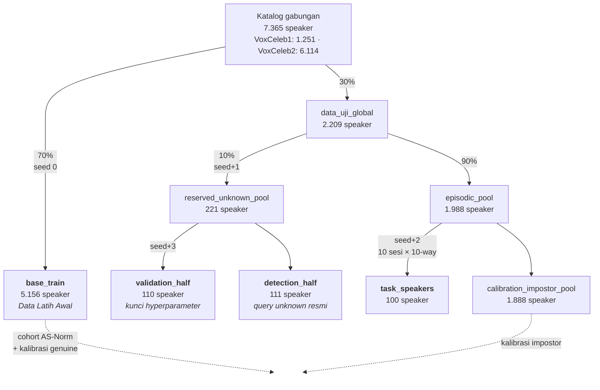
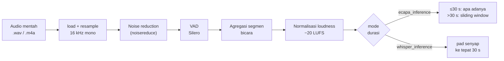
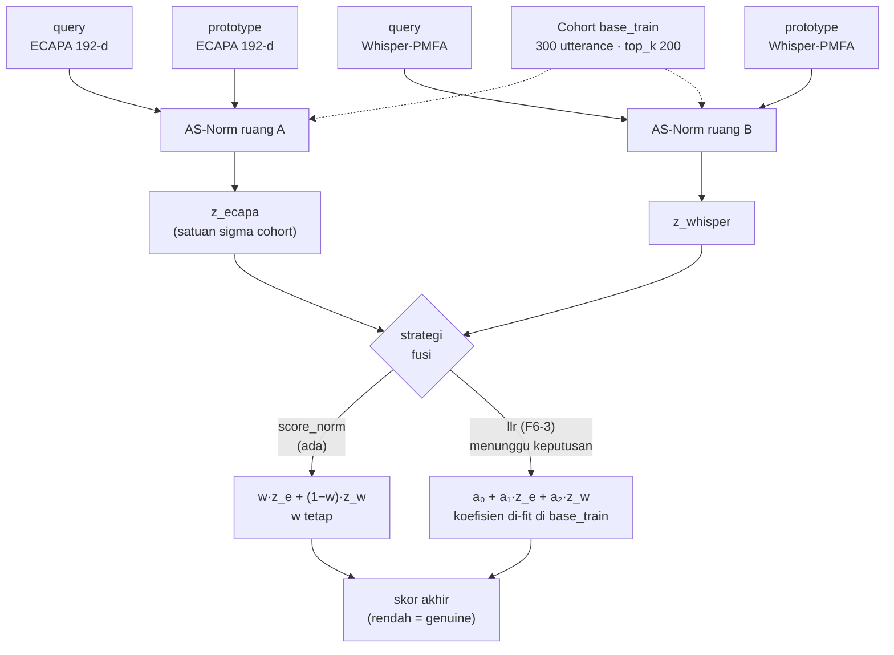
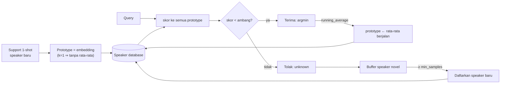
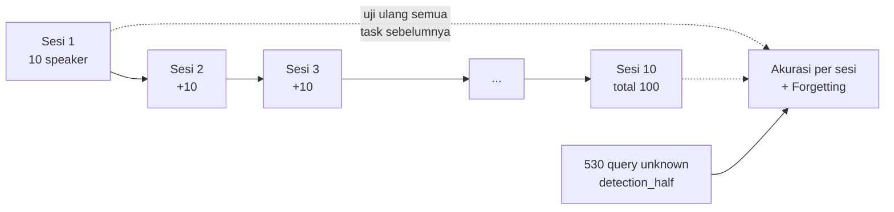

# Experiment 6 — Desain Arsitektur Final (Split Data → Evaluasi)

**Status:** dokumen **desain**, bukan laporan hasil. Tanggal 15 Agustus 2026.
**Terkait:** [`experiment-6-plan.md`](experiment-6-plan.md) (rencana & gerbang) ·
[`experiment-4-reaudit.md`](experiment-4-reaudit.md) (dasar bukti) ·
[`experiment-4-evaluation-table.md`](experiment-4-evaluation-table.md)

---

## 0. Status implementasi — apa yang sudah ada dan apa yang belum

Dokumen ini menggambarkan arsitektur **lengkap** exp6. Sebagian besar sudah
berjalan di produksi sejak exp5b; hanya tiga blok yang baru.

| Blok | Status | Sumber |
|---|---|---|
| Split data (§2) | ✅ ada & terkunci | `src/data/splits.py` |
| Preprocessing (§3) | ✅ ada | `src/preprocessing/pipeline.py` |
| Backbone ECAPA (§4.1) | ✅ ada | `src/models/ecapa.py` |
| **Readout Whisper baru (§4.2)** | ❌ **belum dibangun** (F6-1) | — |
| Cache embedding (§5) | ✅ ada | `src/features/cache.py` |
| **Post-processing anti-anisotropi (§6)** | ❌ **belum dibangun** (F6-1) | — |
| Fusi DualASNorm bobot tetap (§7.1) | ✅ ada | `src/prototypical/score_norm.py` |
| **Fusi LLR (§7.2)** | ❌ **belum dibangun** (F6-3) — *menunggu keputusan pembimbing* | — |
| Prototype & continual (§8) | ✅ ada | `src/continual/` |
| Kalibrasi ambang (§9) | ✅ ada | `src/prototypical/calibration.py` |
| Harness FSCIL & ablasi (§10) | ✅ ada | `src/evaluation/fscil.py` |
| Metrik & statistik (§11) | ✅ ada | `src/evaluation/{metrics,statistics}.py` |
| Metrik ceiling terkoreksi | ✅ **baru selesai** (F6-0) | `src/evaluation/complementarity.py` |

**Yang sudah dikerjakan dari plan exp6 sejauh ini: hanya F6-0, itupun belum
tuntas.** F6-1 sampai F6-5 belum dimulai. Rincian di §13.

---

## 1. Prinsip desain yang mengikat

Empat batasan ini tidak bisa dilanggar tanpa mengubah premis tesis:

1. **Bebas-pelatihan** — `n_train_episodes = 0`, semua backbone beku, tanpa
   fine-tuning. Yang boleh: statistik yang di-*fit* di `base_train`
   (cohort AS-Norm, ambang keputusan, whitening).
2. **Strict 1-shot** — `k_shot = 1`. Satu utterance per speaker baru.
3. **Open-set** — query bisa berasal dari speaker yang tidak terdaftar; sistem
   harus bisa menolak.
4. **Speaker-disjoint** — tidak boleh ada satu speaker pun muncul di dua peran.
   Dijaga `assert_disjoint()` dan diuji di `tests/test_data_splits.py`.

---

## 2. Tahap 1 — Split data

### 2.1 Hierarki

### 2.2 Parameter

| Parameter | Nilai | Lokasi |
|---|---|---|
| `seed` | 0 | `run_full_split` |
| `train_ratio` | 0.70 | `split_base` |
| `reserved_ratio` | 0.10 | `allocate_reserved_pool` |
| `n_sessions` | 10 | `build_episodic_sessions` |
| `n_way` | 10 | `build_episodic_sessions` |
| Stream RNG | `seed+0` base · `seed+1` reserved · `seed+2` episodic · `seed+3` halves | terpisah agar tidak berkorelasi |

### 2.3 Aturan anti-bocor yang berlaku di exp6

| Peran | Sumber speaker | Tidak boleh dipakai untuk |
|---|---|---|
| Cohort AS-Norm | `base_train` | apa pun yang di-skor |
| Kalibrasi genuine | `base_train` (paruh disjoint dari cohort via `split_cohort_and_genuine`) | cohort |
| Kalibrasi impostor | `calibration_impostor_pool` | task |
| Kunci hyperparameter | `validation_half` | pelaporan akhir |
| Query unknown resmi | `detection_half` (530 utterance) | **pemilihan aturan/hyperparameter** |
| Fit whitening/LLR (baru) | `base_train` | task, kedua paruh reserved |

> **Catatan penting exp6.** Panel deteksi tambahan yang dipakai di gerbang
> (F6-0) mengambil unknown dari **speaker `base_train` yang dikeluarkan dari
> cohort** (592 utterance / 56 speaker), **bukan** dari `detection_half` —
> memilih aturan di `detection_half` sama dengan memilih di atas test set.

---

## 3. Tahap 2 — Preprocessing

| Langkah | Parameter | Nilai |
|---|---|---|
| Resample | `TARGET_SR` | 16.000 Hz, mono |
| Denoise | pustaka | `noisereduce` (spectral gating) |
| VAD | model | Silero VAD |
| VAD | `min_speech_duration_ms` | 250 |
| VAD | `min_silence_duration_ms` | 100 |
| Loudness | `TARGET_LUFS` | −20.0 |
| Durasi ECAPA (latih) | `ECAPA_TRAIN_MIN_SEC` | 3.0 s (pad sirkular) |
| Durasi ECAPA (inferensi) | `MAX_ECAPA_INFERENCE_SEC` | 30.0 s |
| Sliding window | `SLIDING_WINDOW_SEC` / `SLIDING_HOP_SEC` | 30.0 / 30.0 (tanpa tumpang tindih) |
| Durasi Whisper | `WHISPER_FIXED_SEC` | 30.0 s (pad **senyap**, bukan sirkular) |

> Pad senyap di jalur Whisper inilah yang dulu menyebabkan bug pooling: klip
> 4 detik jadi 87 % keheningan. Sekarang dimasking di readout (§4.2).

---

## 4. Tahap 3 — Backbone & readout

### 4.1 Backbone A — ECAPA-TDNN (tidak berubah)

| Parameter | Nilai |
|---|---|
| Sumber | `speechbrain/spkrec-ecapa-voxceleb` |
| Dimensi | **192** |
| Status | beku, tanpa fine-tuning |
| Pooling | attentive statistics pooling bawaan SpeechBrain |
| Output | L2-normalisasi |

### 4.2 Backbone B — Whisper readout baru (**F6-1, belum dibangun**)

Inti perubahan exp6. Readout lama vs baru:

```mermaid
flowchart TB
    subgraph LAMA["Readout LAMA (exp1-4) — Fisher ratio 0.51"]
        L1["Whisper encoder beku<br/>openai/whisper-base · d_model 512 · 6 blok"]
        L1 --> L2["ambil SATU layer<br/>L3 (frac 0.5) atau L4 (frac 4/6)"]
        L2 --> L3["mean-pool sepanjang waktu<br/>(frame padding dimasking)"]
        L3 --> L4["L2-normalisasi<br/><b>512-d</b>"]
    end

    subgraph BARU["Readout BARU (exp6, gaya Whisper-PMFA training-free)"]
        B1["Whisper encoder beku<br/>parameter IDENTIK, tidak dilatih"]
        B1 --> B2["ambil EMPAT layer<br/>blok 3, 4, 5, 6"]
        B2 --> B3["per layer: mean DAN std<br/>sepanjang waktu (masked)"]
        B3 --> B4["konkat<br/>512 × 2 × 4 = <b>4096-d</b>"]
        B4 --> B5["post-processing §6"]
    end
```

| Parameter | Nilai | Catatan |
|---|---|---|
| Model | `openai/whisper-base` | 6 blok encoder, 7 hidden state |
| `d_model` | 512 | |
| Layer dipakai | {3, 4, 5, 6} | blok tengah–akhir paling banyak info speaker |
| Statistik pooling | mean **+** std | std sebelumnya dibuang seluruhnya |
| Masking padding | `_valid_encoder_frames` | fraksi sampel non-nol → sumbu waktu encoder |
| Dimensi keluaran | 512 × 2 × 4 = **4096** | sebelum post-processing |
| Nama cache | `whisper_pmfa` | namespace sendiri, cache lama tak tersentuh |
| Training | **nihil** | murni aritmatika di atas encoder beku |

**Gerbang G6.1:** Whisper-sendiri ≥ **0.45** pada task validasi (basis
sekarang 0.3125 untuk L3 pasca-perbaikan pooling), dan Fisher ratio > 1.0
(sekarang 0.51).

### 4.3 Backbone pembanding — ReDimNet-b2 (exp5b, tetap dilaporkan)

| Parameter | Nilai |
|---|---|
| Sumber | torch.hub `IDRnD/ReDimNet`, `b2` / `ft_lm` / `vox2` |
| Dimensi | 192 |
| Catatan leakage | 80/100 task speaker ada di VoxCeleb2-dev — diungkap |

---

## 5. Tahap 4 — Cache embedding

| Parameter | Nilai |
|---|---|
| Kunci cache | `sha1(resolve(path).as_posix())` |
| Lokasi | `data/cache/embeddings/<backbone>/<sha1>.npy` |
| Namespace | `ecapa` · `whisper` · `whisper_l4` · `whisper_pmfa` (baru) · `redimnet_b2` · `xvector` |
| Alasan | backbone beku ⇒ satu forward pass per utterance seumur proyek |

> Cache **bukan** optimisasi kosmetik: ia yang membuat 10 repetisi × 7
> konfigurasi × 10 sesi selesai dalam ~12 menit, bukan berjam-jam.

---

## 6. Tahap 5 — Post-processing anti-anisotropi (**F6-1, belum dibangun**)

Hanya untuk backbone B. **Tidak** diterapkan ke ECAPA — terbukti merusaknya
(PCA-whiten d=64: 0.8367 → 0.7325).

| Kandidat | Operasi | Hasil pada Whisper L3 |
|---|---|---|
| `raw` | L2 saja | 0.3125 (basis) |
| **`abtt_k1`** | −mean, buang 1 PC teratas, L2 | **0.3475** |
| `pca_whiten_full` | −mean, whiten penuh, L2 | 0.3433 |
| `wccn` | −mean, whiten kovarians dalam-kelas | 0.3417 |

| Parameter | Nilai |
|---|---|
| Data fit | `base_train` saja (speaker-disjoint dari task) |
| Ukuran fit | ~1.190 utterance / 111 speaker ber-cache |
| Pemilihan varian | pada `validation_half`, bukan task resmi |
| Training | tidak ada gradien — hanya mean & eigendekomposisi |

---

## 7. Tahap 6 — Fusi skor

Fusi terjadi di **level skor**, bukan level embedding. Ini keputusan yang
sudah tervalidasi: fusi embedding (gated) merusak ruang ECAPA (exp1, A1
kolaps ke 16 %), dan konkatenasi berbobot terbukti benar secara matematis
sampai presisi float32.

### 7.1 DualASNorm bobot tetap (ada)

    d_norm(q,p) = ½[ (d − μ_topK(q→cohort))/σ_topK(q→cohort)
                   + (d − μ_topK(p→cohort))/σ_topK(p→cohort) ]
    z(q,p)      = w · z_A(q,p) + (1−w) · z_B(q,p)

| Parameter | Nilai |
|---|---|
| `asnorm_cohort_size` | 300 utterance dari `base_train` (round-robin antar speaker) |
| `asnorm_top_k` | 200 |
| `score_fusion_weight` (w) | exp5b: 0.5 · **exp6: dikunci ulang di `validation_half`** |
| Orientasi | jarak — rendah = genuine, prediksi = argmin |
| Ablasi | w=1 → A1 · w=0 → A2 · w terkunci → A3 |

### 7.2 Fusi LLR (**F6-3 — menunggu keputusan pembimbing**)

    LLR_fused = a₀ + a₁·z_ecapa + a₂·z_whisper  [+ a₃·fitur kualitas]

| Parameter | Nilai |
|---|---|
| Estimasi | regresi logistik, cross-entropy berbobot prior |
| Data latih | trial `base_train` (via `split_cohort_and_genuine`) |
| Jumlah parameter | **3–4 skalar** |
| Dasar | BOSARIS/FoCal — di literatur SV ini disebut *calibration*, bukan *training* |
| Kenapa perlu | w global mentok +0.0025; ceiling fusi-linear +0.0333 hanya bisa dipanen dengan bobot yang bergantung trial |

> Sistem sekarang **sudah** memasang dua komponen yang di-fit di `base_train`
> (statistik cohort dan ambang `target_frr`). LLR ada di kategori yang sama.
> Kalau ditolak, jalur yang tersisa adalah w tetap — dan exp6 hampir pasti
> berakhir sebagai temuan negatif.

---

## 8. Tahap 7 — Prototype & continual learning

| Parameter | Nilai |
|---|---|
| `continual_mode` | `running_average` (usulan) vs `static` (ablasi B1) |
| `min_samples_for_new_speaker` | 1 |
| `silhouette_threshold` | 0.5 |
| Pembaruan prototype | rata-rata berjalan berbobot jumlah sampel |

> **Keterbatasan yang diakui** (`src/continual/manager.py`, sudah dicatat di
> review kode): buffer speaker novel adalah FIFO global tunggal, sehingga dua
> speaker baru yang berselang-seling sebelum mencapai `min_samples` bisa
> tergabung jadi satu prototype. Ini batasan algoritma yang dijelaskan
> proposal, bukan bug implementasi.

---

## 9. Tahap 8 — Kalibrasi ambang & keputusan open-set

| Parameter | Nilai |
|---|---|
| `calibration_strategy` | `target_frr` |
| `target_frr` | 0.01 (terkunci di `validation_half`) |
| `per_config_calibration` | `True` — A1/A2/A3 masing-masing punya ambang sendiri |
| Sumber genuine | `base_train` (paruh disjoint dari cohort) |
| Sumber impostor | `calibration_impostor_pool` |
| Keputusan | terima jika skor < ambang, lalu argmin; selain itu → unknown |

> `per_config_calibration=True` wajib: skala jarak bergeser antar arm, dan
> exp2 pernah memakai satu ambang A3 untuk A1/A2 sehingga angka ablasinya
> tidak sah.

---

## 10. Tahap 9 — Protokol evaluasi FSCIL

| Parameter | Nilai |
|---|---|
| Sesi | 10, kumulatif (10 → 100 kelas) |
| `n_way` | 10 |
| `k_shot` | 1 |
| `n_query` | 5 per speaker |
| `n_reps` | **10** |
| Task speaker tersedia | 99 (dari 100, keterbatasan audio ter-cache) |
| Query unknown | 530 utterance dari `detection_half` |

### Arm yang dijalankan

| Arm | Arti |
|---|---|
| `proposed_A3_running_average` | sistem usulan (fusi + continual) |
| `A1_ecapa_only` | w=1 — ablasi backbone A |
| `A2_whisper_only` | w=0 — ablasi backbone B |
| `B1_static` | prototype statis (tanpa continual) |
| `ECAPA_standard_baseline` | closed-set ECAPA |
| `ProtoNet_vanilla_baseline` | prototypical network polos |
| `xvector_PLDA_baseline` | x-vector + PLDA-lite |

> **Kriteria sukses exp6 (pre-registered):** `A3 > max(A1, A2)` signifikan.
> Bukan `A3 > A1` — di exp5b A2 (0.8766) ≥ A3 (0.8760) dengan p=0.88,
> sehingga seluruh kenaikan berasal dari ganti backbone, bukan dari fusi.

---

## 11. Tahap 10 — Metrik & uji statistik

| Metrik | Definisi | Fungsi |
|---|---|---|
| Open-set accuracy | benar termasuk penolakan unknown | `accuracy` |
| Closed-set accuracy | benar tanpa memperhitungkan penolakan | `accuracy` |
| Average accuracy | rata-rata lintas task di sesi akhir | `average_accuracy` |
| Forgetting | maks akurasi sesi **sebelum** akhir − akurasi akhir | `forgetting_measure` |
| EER | titik FAR = FRR | `find_eer_threshold` |
| AUROC | area ROC genuine vs unknown | `auroc` |
| TAR@1%FAR | true-accept pada FAR 1 % | `tar_at_far` |

| Uji | Parameter |
|---|---|
| Normalitas | Shapiro-Wilk |
| Akurasi | paired t-test (fallback Wilcoxon signed-rank) |
| Koreksi ganda | Bonferroni — 6 perbandingan ⇒ **α = 0.00833** |
| EER | bootstrap CI 95 %, **1.000 resample**, **berpasangan** (Bengio & Mariéthoz 2004) |

### Metrik analisis gerbang (F6-0, baru selesai)

| Fungsi | Guna |
|---|---|
| `oracle_report` | ceiling **seleksi** — batas atas memilih salah satu ruang |
| `linear_fusion_oracle` | ceiling **fusi linear** — batas atas `w·z_a+(1−w)·z_b`, bentuk tertutup |
| `best_global_weight` | sweep penuh [0,1] resolusi 0.01 |

> Perbedaannya menentukan: pada task validasi, seleksi +0.0142 tetapi fusi
> linear **+0.0333**. Exp4 memakai yang pertama sebagai "batas atas fusi apa
> pun" — itu salah, dan membalik vonis gerbang G4.1.

---

## 12. Tabel parameter konsolidasi

| Kelompok | Parameter | Nilai exp6 | Berubah dari exp5b? |
|---|---|---|---|
| Split | seed / train_ratio / reserved_ratio | 0 / 0.70 / 0.10 | tidak |
| Split | n_sessions × n_way | 10 × 10 | tidak |
| Preproc | sample rate / LUFS | 16 kHz / −20.0 | tidak |
| Preproc | VAD min speech / silence | 250 ms / 100 ms | tidak |
| Preproc | durasi Whisper | 30 s pad senyap | tidak |
| Backbone A | ECAPA dim | 192 | tidak |
| **Backbone B** | **readout** | **4 layer × (mean,std) = 4096-d** | **YA** |
| **Backbone B** | **post-processing** | **ABTT k=1 / whitening (fit base_train)** | **YA** |
| Fusi | AS-Norm cohort / top_k | 300 / 200 | tidak |
| **Fusi** | **strategi** | **`score_norm` → `llr` (jika disetujui)** | **YA** |
| Fusi | bobot w | dikunci ulang di validation_half | ya (nilai) |
| Continual | mode / min_samples / silhouette | running_average / 1 / 0.5 | tidak |
| Kalibrasi | strategy / target_frr / per_config | target_frr / 0.01 / True | tidak |
| Evaluasi | k_shot / n_query / n_reps | 1 / 5 / 10 | tidak |
| Statistik | α Bonferroni / bootstrap | 0.00833 / 1000 berpasangan | tidak |

---

## 13. Jawaban: apa yang sudah dikerjakan dari plan exp6

| Fase | Status | Keterangan |
|---|---|---|
| **F6-0** merge branch (C10) | ✅ selesai | commit `d1d4549`, belum di-push |
| **F6-0** `linear_fusion_oracle` (C1) | ✅ selesai | 8 tes baru, 15 lolos, commit `c5f2e6e` |
| **F6-0** grid halus (C5) | ✅ selesai | gerbang G4.2b |
| **F6-0** panel bebas-bocor + bootstrap CI (C6/C7) | ✅ selesai | 592 unknown, CI berpasangan |
| **F6-0** recompute cache `whisper_l4` (C0/C9) | 🔄 **berjalan** | ~10.700/17.700 |
| **F6-0** run exp4 v2 | ⏳ menunggu cache | menghasilkan tabel exp4 yang layak kutip |
| **F6-1** readout Whisper baru | ❌ belum | inti hipotesis exp6 |
| **F6-2** ceiling ulang dengan readout baru | ❌ belum | |
| **F6-3** fusi LLR | ❌ belum | **diblokir keputusan pembimbing** |
| **F6-4** aturan deteksi dua-ruang | ❌ belum | |
| **F6-5** run resmi 10 repetisi | ❌ belum | |
| ~~F6-6 backend terlatih~~ | ❌ dicoret | melanggar batasan bebas-pelatihan |

Verifikasi parsial yang sudah didapat: skrip terkoreksi mereproduksi re-audit
persis pada varian L3 — ceiling seleksi +0.0142, ceiling fusi-linear
**+0.0333**, grid halus 0.8392 @ w=0.953 (gain +0.0025, **di dalam** noise
antar-seed 0.0031). Gerbang G4.1 `CLOSED` tetapi **G4.1b `OPEN`** — inversi
vonis yang diprediksi re-audit.

---

## 14. Risiko yang sudah diketahui

| Risiko | Peluang | Dampak |
|---|---|---|
| G6.1 gagal (readout training-free tidak cukup) | sedang | Tidak ada rencana cadangan — F6-6 dicoret. Exp6 jadi temuan negatif. |
| G6.1 lolos tapi G6.3 gagal (fusi tetap ≤ backbone terbaik) | **~50 %** | Bukti **ketiga** bahwa fusi dua-backbone tidak menambah apa pun di rezim ini |
| F6-3 ditolak pembimbing | sedang | Hanya w tetap tersisa ⇒ mentok +0.0025 |
| `base_train` ber-cache hanya 111 speaker | pasti | Membatasi kualitas whitening/LDA/LLR; jangan pakai metode berparameter banyak |

Kalau skenario 50 % itu terjadi, tesis punya tiga bukti independen (exp4
Whisper, exp5b ReDimNet, exp6 Whisper-PMFA) bahwa fusi dua-backbone tidak
menambah apa pun di rezim 1-shot open-set ini. Itu temuan yang sah dan bisa
dipertahankan — **asalkan kriteria suksesnya sudah dikunci sekarang**, bukan
digeser setelah melihat hasil.
