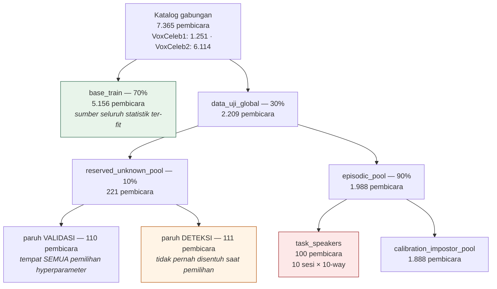
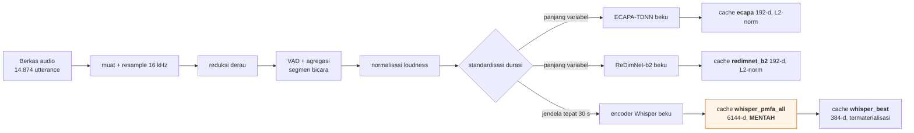
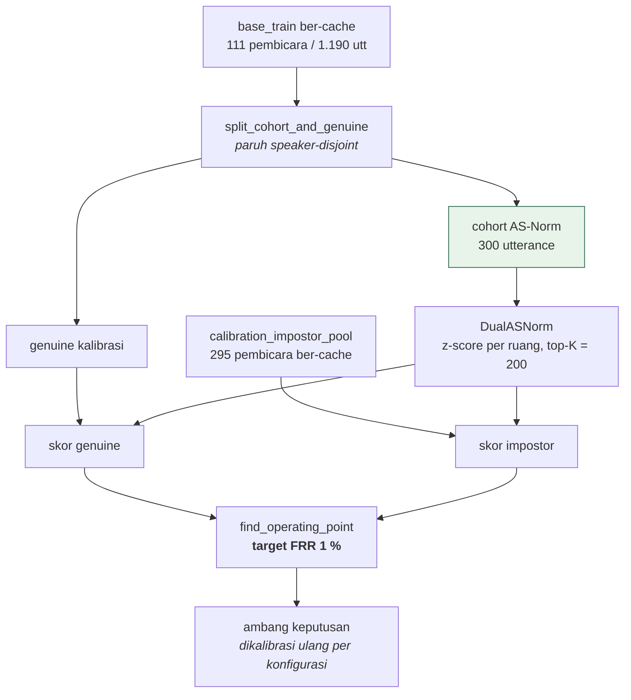
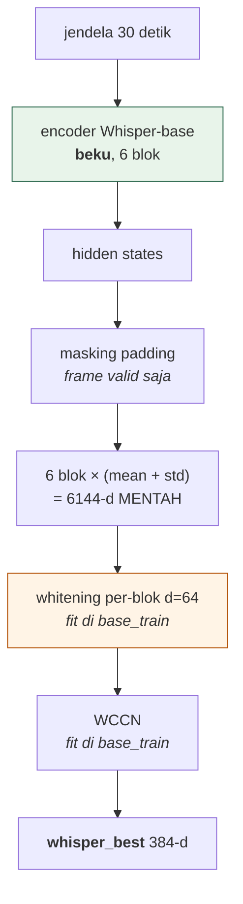

# Experiment 6 — Investigasi Menyeluruh Mekanisme Fusi Dua-Backbone pada Pengenalan Penutur 1-Shot Open-Set

**Status:** ✅ **SELESAI** (30 Agustus 2026). Seluruh fase dijalankan atau ditutup dengan alasan terukur. Satu-satunya dependensi tersisa bersifat eksternal — keputusan pembimbing atas [memo F6-3](memo-keputusan-f63.md) — dan hanya memengaruhi status fusi LLR di naskah, bukan hasil apa pun.
**Rencana & gerbang:** [`experiment-6-plan.md`](experiment-6-plan.md) · **Desain arsitektur:** [`experiment-6-architecture.md`](experiment-6-architecture.md)
**Prasyarat:** [Experiment 4](experiment-4.md) + [re-audit](experiment-4-reaudit.md) · [Experiment 5](experiment-5.md)
**Tag registry:** `exp6_whisper_fusion` / `_w75` / `_w50` · `exp6_redimnet_fusion_w30` · `exp6_redimnet_fusion_w30_n55` *(tag default tidak berubah: `exp5b_redimnet_fusion`)*

---

## Ringkasan eksekutif

Experiment 6 menjawab pertanyaan yang tersisa dari Experiment 4 dan 5: **ketika dua model pengenal penutur digabungkan (fusi), mengapa hasil gabungannya tidak pernah terbukti melebihi model tunggal terbaiknya — dan dapatkah hal itu diperbaiki?** Dua hipotesis diuji terpisah: (i) *readout* — cara membaca keluaran model kedua — yang buruk, dan (ii) *operator fusi* — cara menggabungkan skor — yang buruk.

Setelah delapan run evaluasi resmi, empat sweep validasi, pengukuran plafon teoretis, diagnostik keterpisahan sinyal, dua keluarga operator baru, satu run daya 55 repetisi yang dipra-registrasi, dan bootstrap 5.000 resample, jawabannya konklusif:

1. **Readout dapat diperbaiki, tetapi tidak cukup.** Readout Whisper terbaik yang dapat dicapai tanpa pelatihan naik 14 % relatif (0.3475 → 0.3975) namun gagal gerbang G6.1 (syarat ≥ 0.45). Fusi ECAPA+Whisper terbukti **merugikan pada semua bobot yang diuji** — mencampurkan Whisper 5 % saja sudah menurunkan akurasi secara signifikan (p = 0.0037).
2. **Operator juga dapat diperbaiki, tetapi perbaikannya satu orde terlalu kecil.** Operator adaptif nol-parameter mengungguli bobot konstan (p = 0.0085), namun plafon teoretis fusi (+0.0413 di atas backbone tunggal terbaik) tidak terjangkau oleh operator level-skor mana pun yang diuji — termasuk fusi regresi logistik.
3. **Pertanyaan sentral ditutup dari lima garis bukti independen:** fusi dua-backbone tidak mengungguli backbone tunggal terbaiknya pada rezim ini. Run daya n = 55 yang dipra-registrasi membatasi efek sesungguhnya di bawah +0.006 (p = 0.1427; Cohen's d menyusut 0.47 → 0.20).
4. **Yang justru menguat:** konfigurasi terbaik baru — **ECAPA 30 % + ReDimNet 70 %**, dipilih sweep 10-seed — mencapai **0.880 ± 0.019** pada 55 repetisi; keunggulannya atas ECAPA-saja (p < 0.0001) **bertahan pada pembicara bebas-leakage** (p = 0.0313), dan keunggulan pembaruan *continual* atas prototipe statis — tidak signifikan pada Experiment 5b — kini **p < 0.0001 pada akurasi**.
5. **Temuan metodologis:** sweep validasi 3-seed terbukti tidak mampu mengurutkan konfigurasi (urutannya berbalik pada 10 seed); seluruh sweep sesudahnya memakai 10 seed. Klaim pemilihan layer Experiment 2 terbukti terbalik pada cache yang benar dan telah dikoreksi.

**Batasan yang mengikat sepanjang eksperimen:** strict 1-shot (K_SHOT = 1), **bebas-pelatihan** (0 episode pelatihan, backbone beku, tanpa *fine-tuning*), protokol evaluasi Experiment 3 penuh.

---

## 1. Pendahuluan — sistem yang diteliti dan pertanyaan yang dijawab

### 1.1 Sistem yang diteliti

Sistem yang dibangun tesis ini adalah **pengenal penutur inkremental open-set**: sistem yang (a) mendaftarkan penutur baru dari **satu** contoh ucapan saja (*1-shot enrollment*), (b) terus menerima penutur baru sesi demi sesi tanpa melupakan penutur lama (*incremental*), dan (c) mampu **menolak** ucapan dari orang yang tidak pernah didaftarkan (*open-set*), bukan memaksakan tebakan.

Cara kerjanya: setiap ucapan diubah menjadi vektor (*embedding*) oleh jaringan saraf pra-latih yang **beku** — bobotnya tidak pernah diubah. Setiap penutur terdaftar diwakili satu vektor *prototipe*. Ucapan yang masuk dibandingkan terhadap seluruh prototipe; bila skor terdekatnya melewati ambang, ucapan dikenali sebagai penutur tersebut, bila tidak, ditolak sebagai *unknown*. Prototipe diperbarui secara *running average* setiap kali penuturnya dikenali (komponen *continual*).

Backbone utama adalah **ECAPA-TDNN** [1] (192 dimensi, pra-latih pada VoxCeleb). Sejak Experiment 2, sistem menambahkan **backbone kedua** dan menggabungkan keduanya pada level skor. Pertanyaan yang menghantui Experiment 4–6: apakah penggabungan itu benar-benar menyumbang sesuatu.

### 1.2 Mengapa Experiment 6 ada

- **Experiment 4** menutup fusi ECAPA+Whisper — tetapi belakangan ditemukan seluruh angkanya dihitung dari cache embedding yang dibuat **sebelum** perbaikan bug *masked pooling* (klip pendek didominasi keheningan padding), dan metrik "batas atas fusi"-nya ternyata hanya batas atas *seleksi*, bukan batas atas keluarga fungsi yang benar-benar dipakai. Vonisnya mungkin benar — dasarnya tidak sah.
- **Experiment 5b** mengganti Whisper dengan ReDimNet-b2 [2]; akurasi naik 0.833 → 0.876. Namun arm A2 (ReDimNet **sendirian**) mencapai 0.8766 sementara A3 (fusi) 0.8760, p = 0.88: **seluruh kenaikan berasal dari penggantian backbone, mekanisme fusi menyumbang nol** — tertutupi karena backbone barunya kuat.

Dari dua pengamatan itu dirumuskan dua pertanyaan yang diuji terpisah:

> **P1 — readout.** Apakah ruang Whisper menjadi cukup diskriminatif bila dibaca dengan resep yang benar (agregasi multi-layer + *statistics pooling*), alih-alih satu layer dengan mean pooling?
>
> **P2 — operator.** Apakah operator fusi berbobot konstan meninggalkan potensi tak terpanen, mengingat plafon *oracle* bobot per-query jauh melebihi capaian bobot global terbaik?

### 1.3 Konfigurasi ekstraksi fitur — dua pasangan untuk dua pertanyaan

| Pertanyaan | Backbone 1 | Backbone 2 | Alasan |
|---|---|---|---|
| P2 (operator) | ECAPA-TDNN (192-d) | **ReDimNet-b2** (192-d) | Menguji operator di atas ECAPA+Whisper mengacaukan dua variabel — kegagalan bisa dari operator atau dari ruang Whisper yang diketahui buruk (Fisher 0.51). ReDimNet, backbone kedua terbaik yang tersedia, **menghilangkan kualitas readout sebagai variabel pengganggu** |
| P1 (readout) | ECAPA-TDNN (192-d) | **Whisper-base** [3] readout baru (6144-d mentah → 384-d terproses) | Pertanyaannya memang tentang readout Whisper |

ECAPA-TDNN selalu menjadi backbone pertama dan bobotnya tidak pernah diubah satu bit pun; yang berevolusi antar eksperimen adalah perlakuan terhadap embedding keluarannya.

---

## 2. Batasan bebas-pelatihan — perumusan operasional

Premis bebas-pelatihan sebelumnya berupa slogan yang tak bisa memutuskan kasus batas. Experiment 6 merumuskannya menjadi taksonomi tiga tingkat:

| Tingkat | Definisi operasional | Isi |
|---|---|---|
| **0 — representasi** | Ada gradien pada parameter yang **menghasilkan embedding** | Kosong. Backend terlatih (AAM-softmax + LoRA, resep Whisper-PMFA penuh) ada di sini → **dilarang, dicoret dari rencana** |
| **1 — statistik & kalibrasi skor** | Di-*fit* pada `base_train` speaker-disjoint, **tidak menyentuh embedding**, berorde puluhan parameter | Cohort AS-Norm (300 utt); ambang keputusan; bobot fusi `w`; whitening/WCCN readout; **fusi LLR (F6-3)** |
| **2 — nol parameter** | Adaptif per-trial tanpa ada yang di-*fit* | Aturan margin F6-3b; `margin_shift` |

Poin krusial: sistem yang sudah berjalan (Experiment 3b, 5b) **sudah memuat empat komponen tingkat 1**. Keputusan "apakah LLR boleh" sesungguhnya adalah keputusan "di mana garisnya" — dan garis antara tingkat 1–2 akan ikut menggugurkan Experiment 3b dan 5b. Pertanyaan ini dikemas sebagai memo keputusan satu halaman ([`memo-keputusan-f63.md`](memo-keputusan-f63.md)); selama menunggu, **implementasi LLR hidup di skrip analisis saja dan tidak pernah masuk runtime** (§8.4).

---

## 3. Data, pembagian, dan alur arsitektur

### 3.1 Pembagian dataset (speaker-disjoint, deterministik)

Sumber data: VoxCeleb1 dan VoxCeleb2 [4, 5]. Pembagian murni atas daftar ID pembicara, deterministik terhadap seed; setiap pasangan kelompok diverifikasi tidak beririsan (`assert_disjoint`).



Tiga peran yang dipisahkan ketat:

- **`base_train`** — sumber seluruh statistik ter-fit (cohort AS-Norm, ambang, transform whitening, trial LLR). Dari 5.156 pembicara nominal, yang ter-*cache* adalah 111 pembicara / 1.190 utterance (dibatasi kapasitas unduhan); jumlah inilah yang dipakai seluruh analisis. Pemisahan tambahan `split_cohort_and_genuine` menjamin cohort AS-Norm dan sampel genuine kalibrasi tidak berbagi pembicara.
- **Paruh validasi** — tempat *semua* pemilihan: bobot fusi, aturan fusi, transform terbaik. Angka dari paruh ini **tidak pernah** dikutip sebagai hasil sistem.
- **`task_speakers` + paruh deteksi** — populasi run resmi; memilih apa pun di sini = memilih di atas test set.

> **Catatan pembacaan tabel.** Karena kedua populasi tidak beririsan, arm yang sama bernilai berbeda antara tabel validasi dan tabel resmi (contoh A1: 0.8402 vs 0.8332). Keduanya benar; yang dikutip sebagai hasil tesis selalu angka **task resmi**. Hal serupa berlaku untuk Whisper-sendiri yang terbaca 0.3975 (gerbang statis, identifikasi tertutup) / 0.2200 (sweep validasi FSCIL) / 0.223 (run resmi) — tiga protokol berbeda.

### 3.2 Prapemrosesan dan cache embedding



Embedding dihitung **satu kali** per utterance per backbone, disimpan dalam *namespace* terpisah sehingga varian hidup berdampingan dan setiap hasil lama tetap tereproduksi. Penyimpangan yang disengaja: cache `whisper_pmfa*` menyimpan vektor **mentah tanpa normalisasi** — skala aktivasi antar-blok terukur berbeda hingga 3,7× (norma 8,1–29,7) dan pilihan penyamaannya justru variabel yang diukur F6-1; menyimpan mentah membuat semua pilihan terjangkau tanpa komputasi ulang GPU ±52 menit per ablasi.

### 3.3 Kalibrasi ambang dan evaluasi



Evaluasi resmi (`run_full_evaluation.py`): 10 sesi FSCIL × 10-way, k = 1, 99/100 task speaker tersedia, 530 query unknown nyata; metrik = akurasi open-set rata-rata lintas sesi, akurasi closed-set, *forgetting*, EER/AUROC/TAR@1%FAR deteksi; dua baseline (ProtoNet vanilla, whitener LDA x-vector+PLDA-lite) **dilatih ulang setiap run**. Ambang dikalibrasi ulang per konfigurasi — pembobotan yang berbeda menggeser distribusi skor, dan membandingkan arm pada titik operasi yang berbeda tidak sah.

---

## 4. Metode dan rumus

Seluruh formula yang dipakai Experiment 6, masing-masing dengan sumber jurnalnya.

### 4.1 Fusi level skor tanpa penyamaan dimensi

Dua embedding berbeda dimensi (192 vs 192/384) **tidak** diproyeksikan ke ruang bersama — pelajaran Experiment 0/1, ketika proyeksi terlatih 192→256 meruntuhkan arm ECAPA dari ~0.79 ke ~0.16. Masing-masing di-L2-normalisasi (*length normalization* [6]) lalu dikonkatenasikan berbobot:

```
out = [ √w · ê₁ ; √(1−w) · ê₂ ],       ê = e / ‖e‖₂
```

dengan identitas kunci (diverifikasi numerik, galat maksimum 2,6×10⁻⁶):

```
‖out(q) − out(p)‖² = 2 · [ w · cosdist₁(q,p) + (1−w) · cosdist₂(q,p) ]
```

sehingga jarak Euclidean pada vektor gabungan **persis** setara fusi skor berbobot, dan beda dimensi tidak membuat satu ruang mendominasi.

### 4.2 Normalisasi skor adaptif (AS-Norm) dan fusi dua ruang

Skor mentah dinormalkan terhadap **cohort** 300 utterance non-task (Matějka dkk. [7]; varian simetris-adaptif dari Cumani dkk. [8]):

```
z(q,p) = ½ [ (d(q,p) − μ_topK(q→C)) / σ_topK(q→C)  +  (d(q,p) − μ_topK(p→C)) / σ_topK(p→C) ]
```

dengan statistik atas K = 200 anggota cohort paling kompetitif (jarak terkecil). Fusi dua ruang (`DualASNorm`, Experiment 5):

```
z_fusi(q,p) = w · z_ecapa(q,p) + (1−w) · z_backbone2(q,p)
```

Kedua suku dalam satuan sigma-cohort — inilah yang membuat penjumlahan berbobot terdefinisi baik. Arm A1 (`w`=1), A2 (`w`=0), A3 berbagi satu mesin; hanya bobot normalizer yang berbeda.

### 4.3 Readout Whisper-PMFA bebas-pelatihan (F6-1)

Mengikuti separuh bebas-pelatihan resep **Whisper-PMFA** (Zhao dkk., Interspeech 2024 [9]): hidden state beberapa blok encoder sekaligus, masing-masing dengan **mean dan standar deviasi** sepanjang waktu (*statistics pooling*, Okabe dkk., Interspeech 2018 [10]), dengan masking frame padding — krusial justru karena std pooling, sebab keheningan padding akan terbaca sebagai variasi intra-utterance palsu:

```
r = [ μ(h_L₁) ; σ(h_L₁) ; μ(h_L₂) ; σ(h_L₂) ; … ]      — 6 blok × 2 × 512 = 6144 dimensi
```

Kebenaran masking dikunci pengujian: blok mean layer-3 readout baru cocok dengan readout satu-layer lama hingga kosinus 0,99999994 pada audio nyata. Bagian resep asli yang **tidak** diambil: backend terlatih AAM-softmax + LoRA (tingkat 0 taksonomi §2).

### 4.4 Pengondisian ruang (post-processing anti-anisotropi)

Seluruh transform di-*fit* pada `base_train` saja (tingkat 1):

| Transform | Rumus | Sumber |
|---|---|---|
| **ABTT** (all-but-the-top, buang rerata + k PC teratas) | `x ↦ x_c − Σᵢ₌₁ᵏ (vᵢᵀx_c)vᵢ`, `x_c = x̂ − μ` | Mu & Viswanath, ICLR 2018 [11] |
| **PCA-whitening** | `x ↦ (x̂ − μ) V Λ^(−1/2)` | praktik WhiteningBERT, Findings of EMNLP 2021 [12] |
| **WCCN** (whitening kovarians dalam-kelas) | `x ↦ (x̂ − μ) L`, `LLᵀ = W⁻¹` | Hatch dkk., Interspeech 2006 [13] |
| **LDA** sebelum scoring | proyeksi diskriminan | resep x-vector, Snyder dkk., ICASSP 2018 [14] |
| **Whitening per-blok** *(kontribusi Experiment 6)* | PCA-whitening tiap blok 1024-d terpisah → konkatenasi | §7.2 |

Motivasi whitening per-blok: pada konkatenasi 6144-d, fit set 1.190 sampel membuat estimasi kovarians penuh *ill-posed* (rank ≤ 1.189 di 6.144 dimensi) — penyebab langsung *effective rank* runtuh ke 7,0. Estimasi per-blok *well-posed* dan memulihkannya ke 101,7.

Diagnostik geometri: **Fisher trace ratio** `tr(S_b)/tr(S_w)` (> 1 berarti variasi antar-penutur melebihi dalam-penutur) dan ***effective rank* partisipasi** `(Σλᵢ)² / Σλᵢ²`.

### 4.5 Operator fusi adaptif nol-parameter

**Margin** ruang-i pada query q = selisih dua skor-z terkecil terhadap seluruh prototipe (ukuran keyakinan ruang itu pada query itu):

```
mᵢ(q) = zᵢ⁽²⁾(q) − zᵢ⁽¹⁾(q)
```

Tiga aturan diuji; tidak satu pun punya parameter ter-fit:

```
margin_weighted :  w(q) = m₁(q) / (m₁(q) + m₂(q))                        (F6-3b)
margin_select   :  w(q) = 1 bila m₁(q) ≥ m₂(q), selainnya 0               (F6-3b — bentuk praktis oracle seleksi)
margin_shift    :  w(q) = clip( w₀ + α · (m₁(q) − m₂(q)), 0, 1 )         (§8.3)
```

Rasio (bukan margin absolut) pada F6-3b esensial karena jumlah prototipe berbeda antara kalibrasi (±55) dan sesi FSCIL (10, bertambah), sedangkan margin membesar dengan jumlah prototipe. `margin_shift` memperbaiki dua cacat yang ditemukan diagnostik §8.2: jangkar di bobot terkunci `w₀` = 0.3 (bukan 0.5 simetris — populasi *decidable* tidak simetris, 83 : 33) dan penggerak **selisih** margin (AUROC 0.8583) alih-alih rasio (0.8383). Skalar `α` dipilih di paruh validasi — kedudukan yang sama dengan `w`. Kasus degeneratif (< 2 prototipe) jatuh kembali ke bobot konstan, sehingga ketiganya **generalisasi ketat** dari `DualASNorm` (dikunci pengujian bit-identik).

### 4.6 Fusi LLR (F6-3 — eksploratori, kontingen keputusan pembimbing)

Fusi regresi logistik gaya BOSARIS/FoCal (Brümmer dkk., IEEE TASLP 2007 [15]; tutorial: Morrison, AJFS 2013 [16]):

```
llr3 : logit(q,p) = a₀ + a₁·z_e(q,p) + a₂·z_b(q,p)
llr4 : logit(q,p) = a₀ + a₁·z_e + a₂·z_b + a₃ · (m_e(q) − m_b(q)) · (z_e − z_b)
```

Koefisien di-fit dengan **IRLS** (Newton untuk regresi logistik) pada *cross-entropy* berbobot prior + regularisasi L2, atas 1.997 trial `base_train` (556 genuine) yang speaker-disjoint dari cohort maupun task; positif = query genuine vs prototipe penuturnya sendiri, negatif = query vs prototipe non-cocok terdekat (*hard negative*). Koefisien tercatat verbatim di artefak (spesifikasi rencana F6-3 butir 6). Fakta struktural yang dinyatakan **sebelum** run: `llr3` adalah kombinasi linear tetap — offset a₀ tidak mengubah argmin — sehingga identifikasinya paling banter menyamai `w` tetap terbaik; nilainya pada bobot ter-fit dan kalibrasi. Hanya `llr4` yang benar-benar per-query.

### 4.7 Plafon (batas atas) fusi

Dihitung per query berlabel pada task validasi:

- **Plafon seleksi**: `acc_oracle = mean[ argmin(z_e) benar ∨ argmin(z_b) benar ]` — batas atas bila boleh *memilih* satu ruang per query.
- **Plafon fusi-linear** (`linear_fusion_oracle`, kontribusi F6-0): batas atas keluarga `w·z_e + (1−w)·z_b` melalui interval-`w` *feasible* per query (bentuk tertutup) — batas atas keluarga fungsi yang benar-benar dipakai sistem; dapat melebihi plafon seleksi karena jumlah berbobot bisa benar ketika **kedua** argmin salah.

### 4.8 Pengujian statistik

- **Uji berpasangan antar-seed/repetisi**: Shapiro–Wilk pada selisih berpasangan menentukan paired *t*-test atau Wilcoxon signed-rank; koreksi **Bonferroni** α = 0.05/6 = 0.00833 untuk enam perbandingan run resmi. Uji dua sisi — "signifikan" tidak memuat arah, dan arah selalu dilaporkan eksplisit.
- **Bootstrap EER berpasangan** (Bengio & Mariéthoz, Odyssey 2004 [17]): resampling *trial* dengan satu himpunan indeks bersama untuk kedua sistem; kriteria = CI 95 % tidak memotong nol. Resample dinaikkan 1.000 → 5.000 ketika derau Monte-Carlo kuantil 97,5 % (∼10⁻⁴) menyamai jarak CI ke nol.
- **Ukuran efek & daya**: Cohen's *d* = μ_selisih/σ_selisih; kebutuhan repetisi `n = ((z_{α/2} + z_β)/d)²` untuk daya 80 %.
- **Metrik**: akurasi open-set rata-rata lintas sesi (penolakan unknown dihitung sebagai keputusan); *forgetting*; EER, AUROC, TAR@1%FAR untuk deteksi unknown.

---

## 5. Perubahan kode — apa yang diubah dan disiplinnya

Seluruh perubahan mengikuti disiplin *feature-flag* ([rencana §Disiplin](experiment-6-plan.md)): perilaku baru selalu di balik nilai default yang mempertahankan perilaku lama; backbone baru = namespace cache sendiri; skrip analisis aditif; *rollback* = mengganti satu tag, bukan revert.

| Berkas | Perubahan | Default (= perilaku lama) |
|---|---|---|
| `src/models/whisper_encoder.py` | + `extract_embedding_pmfa(_windows)` — readout §4.3 | ekstraktor lama tak tersentuh |
| `src/features/cache.py` | + 3 namespace: `whisper_pmfa` (4096-d), `whisper_pmfa_all` (6144-d), `whisper_best` (384-d termaterialisasi; komputasi on-demand **ditolak dengan error** agar transform ter-fit tidak setengah-terterap) | cache lama tak tersentuh |
| `src/prototypical/score_norm.py` | + `AdaptiveDualASNorm`, + `MarginShiftDualASNorm` (§4.5) — generalisasi ketat `DualASNorm`, parameter netral = bit-identik (dikunci tes) | `DualASNorm` tak berubah |
| `src/prototypical/calibration.py` | + parameter `out_matrices=None` — mengekspos matriks kalibrasi untuk diagnostik | `None` = identik |
| `scripts/run_full_evaluation.py` | seed repetisi > 10 melanjutkan barisan identitas (`SEED_LIST[rep] == rep` untuk semua run lama) — dibutuhkan run n = 55 | bit-identik untuk n ≤ 10 |
| `scripts/exp4_complementarity_asnorm.py` | jumlah seed via env `EXP4_N_SEEDS` | 3 |
| `scripts/exp5_bootstrap_eer.py` | jumlah resample via env `N_BOOTSTRAP` | 1000 |
| `scripts/exp5_leakage_robustness.py` | + arm `w` = 0.3 (aditif) | tiga arm lama tak berubah |
| `src/experiments.py` | + 5 entri registry `exp6_*` | tag default tetap `exp5b_redimnet_fusion` |
| Skrip baru | `exp6_adaptive_fusion_sweep` · `exp6_pmfa_readout_gate` · `exp6_pmfa_validation_sweep` · `exp6_materialize_whisper_space` · `exp6_oracle_predictability` · `exp6_operator_sweep` *(LLR hidup hanya di sini)* | — |

**Disiplin ini bukan klaim melainkan hasil uji:** run resmi `exp5b_redimnet_fusion` dan uji leakage Experiment 5 dijalankan ulang pada kode akhir dan mereproduksi artefak 2 Agustus **bit-identik** (ambang cocok sampai enam desimal, −1.537589). Suite pengujian penuh: **181 lulus**, 17 di antaranya pengujian baru Experiment 6.

**Kesalahan yang ditemukan dan diperbaiki selama pengerjaan** (dilaporkan demi kejujuran metodologis): (i) bug *variable shadowing* pada parameterisasi skrip gerbang membuat satu run memuat cache yang salah — tertangkap lewat ketidakcocokan dimensi, diperbaiki, run diulang; (ii) pembacaan sementara "agregasi multi-layer selalu merugikan" terbukti artefak jendela {3,4,5,6} yang mulai setelah puncak kualitas — dikoreksi begitu blok 1–2 diukur (§7.2); (iii) `run_full_evaluation.py` crash pada n > 10 karena indeks seed — diperbaiki dengan ekstensi barisan identitas.

---

## 6. Fase F6-0 — pemulihan dasar Experiment 4 (15 Agustus)

Cache `whisper_l4` dihitung ulang di atas kode ter-perbaiki dan seluruh analisis Experiment 4 diulang (`exp4_ceiling_asnorm_v2.json`). Tiga koreksi: (i) akurasi Whisper-sendiri naik tajam begitu padding dimasking — L3: 0.2317 → 0.3125 (+35 % relatif), L4: 0.2425 → 0.2842; (ii) plafon yang benar untuk keluarga fusi-linear adalah **+0.0333**, bukan +0.0142 (angka lama hanya plafon seleksi — kesalahan dokumentasi metrik yang menentukan vonis gerbang); (iii) temuan positif tunggal Experiment 4 — aturan deteksi `mean` — **tidak bertahan** CI bootstrap pada keempat kombinasi panel dan berbalik tanda pada panel bebas-bocor 592 query.

---

## 7. Hasil utama per konfigurasi

### 7.1 F6-3b — operator adaptif nol-parameter (paruh validasi, 10 seed)

Gerbang tunggal rencana dipecah dua saat implementasi karena arm bobot-tetap sendiri sudah melewati "adaptif > max(A1, A2)" — gerbang tunggal tidak memisahkan *fusi berguna* dari *adaptivitas berguna* (jebakan yang sama dengan `A3 > A1` pada Experiment 5b).

| Arm *(task validasi)* | val_acc (10 seed) | (3 seed, paritas) |
|---|---|---|
| A1 — ECAPA saja | 0.8402 ± 0.0176 | 0.8525 |
| A2 — ReDimNet saja | 0.8962 ± 0.0192 | 0.9017 |
| A3 — bobot tetap `w` = 0.5 | 0.8918 ± 0.0182 | 0.9092 |
| **A3 — `margin_weighted`** | **0.8968 ± 0.0168** | 0.9125 |
| A3 — `margin_select` | 0.8958 ± 0.0175 | 0.9075 |

- **G6.3b-2 LOLOS** — adaptif > bobot tetap: +0.0050, paired *t* **p = 0.0085**, menang 8/10 seed. Diagnostik bobot menegaskan aturannya benar-benar bergerak (rerata 0.479, σ = 0.251, p05–p95 = [0.07, 0.93], 0 % di titik ekstrem) — bukan bobot konstan yang menyamar.
- **G6.3b-1 GAGAL** — adaptif vs max(A1, A2): hanya +0.0005 lawan simpangan antar-seed 0.0192.

Kolom 3-seed mereproduksi sweep Experiment 5 **bit-identik** — verifikasi harness sekaligus pembuka temuan metodologis §10.

### 7.2 F6-1 — readout Whisper dan gerbang G6.1 (GAGAL)



Profil per blok encoder (masing-masing mean+std 1024-d; angka = transform terbaik per varian, task validasi Experiment 4):

| Blok | 1 | 2 | 3 | 4 | 5 | 6 |
|---|---|---|---|---|---|---|
| Akurasi | 0.3567 | **0.3658** | 0.3550 | 0.2783 | 0.2358 | 0.1883 |
| Fisher | 0.505 | 0.440 | 0.447 | 0.356 | 0.311 | 0.219 |

Informasi penutur terkonsentrasi di blok **awal** dan meluruh monoton dengan kedalaman — konsisten dengan spesialisasi lapisan akhir Whisper untuk konten fonetik. Jendela agregasi: {1,2} = 0.3858; **{1,2,3} = 0.3967**; {1..4} = 0.3683; {1..6} = 0.3242. **Premis agregasi parsial Whisper-PMFA terkonfirmasi** ({1,2,3} mengungguli blok tunggal terbaik +0.0309) — tetapi hanya bila jendelanya dangkal; pemilihan blok tengah-ke-akhir resep aslinya adalah analog encoder 32 blok dan tidak berlaku pada whisper-base 6 blok.

Varian terbaik: **whitening per-blok d=64 atas keenam blok + WCCN → 0.3975** (384-d), Fisher 0.321. Hubungan pengondisian–akurasi tidak monoton: d=128 dan d=192 menaikkan *effective rank* lebih jauh (194,7; 275,3) sementara akurasinya **turun** (0.3600; 0.3733) — arah yang dipulihkan berisi derau.

**Gerbang G6.1 (akurasi ≥ 0.45 DAN Fisher > 1.0): GAGAL pada kedua syarat**, meski naik +0.0500 (14 % relatif) atas baseline satu-layer 0.3475. Tiga penjelasan alternatif ditutup dengan pengukuran, bukan argumen: bukan jendela layer (seluruh 6 blok tunggal + semua jendela diukur), bukan pengondisian (rank dipulihkan 12×, akurasi tidak mengikuti), bukan operator fusi (F6-3b). Kesimpulan tersisa: **encoder whisper-base beku tidak memuat cukup informasi penutur**, dan capaian EER 1,42 % Whisper-PMFA [9] bergantung pada backend terlatihnya — komponen yang dilarang batasan tesis.

Konfigurasi terbaik dimaterialisasi sebagai cache `whisper_best` (fit di 1.190 utterance `base_train`; provenance di `materialized_whisper_best.json`; audit kebocoran §9.3) agar evaluasi resmi membacanya seperti backbone biasa — mencegah bug transform setengah-terterap.

### 7.3 ECAPA + Whisper pada protokol resmi — kurva dosis

Vonis Whisper pada Experiment 4 tidak pernah melewati evaluasi resmi, sehingga tesis tidak memiliki baris ECAPA+Whisper yang sebanding dengan baris ECAPA+ReDimNet. Baris tersebut dibuat di sini — dengan konfigurasi Whisper **terbaik** (bukan terlemah, agar bukan *strawman*), dan **dipra-registrasi sebagai ablasi terdokumentasi** karena sweep validasi 10-seed tidak menemukan satu pun bobot fusi yang mengalahkan ECAPA-saja: akurasi validasi menurun monoton (w = 1.0 → 0.8402; 0.5 → 0.6240; 0.1 → 0.3015) dan titik fusi terbaik w = 0.95 **signifikan lebih buruk** daripada A1 (−0.0085, p = 0.0111, menang 1/10 seed).

Run resmi, 10 repetisi per bobot:

| Bobot Whisper | 0 % (=A1) | 5 % | 25 % | 50 % | 100 % (=A2) |
|---|---|---|---|---|---|
| Open-set Acc | **0.833** | 0.823 | 0.775 | 0.646 | 0.223 |
| det-EER | **0.127** | 0.128 | 0.153 | 0.222 | 0.407 |
| AUROC | **0.938** | 0.936 | 0.920 | 0.862 | 0.631 |
| TAR@1%FAR | **0.429** | 0.417 | 0.326 | 0.176 | 0.065 |

Respons-dosis **monoton merugikan pada seluruh metrik serentak** — tidak ada metrik yang menyembunyikan manfaat. A3 (w = 0.95) vs A1: p = 0.0037 — signifikan **dengan arah merugikan** (uji dua sisi; "signifikan" di sini berarti mencampurkan Whisper signifikan *menurunkan* akurasi). Ini kebalikan mutlak dari ReDimNet, yang memikul bobot 50–70 % dan menaikkan hasil.

### 7.4 Konfigurasi terbaik: ECAPA 30 % + ReDimNet 70 %

Penurunan ulang sweep bobot dengan **10 seed** (`exp6_validation_sweep_redimnet_b2_10seed.json`) memindahkan optimum dari `w` = 0.5 (pilihan 3-seed Experiment 5b) ke `w` = 0.3. Run resmi pada bobot tersebut (tag `exp6_redimnet_fusion_w30`):

| Metrik | `w` = 0.5 (exp5b) | **`w` = 0.3** | Δ |
|---|---|---|---|
| Open-set Acc | 0.8760 | **0.8824** | +0.0065 |
| det-EER | 0.0956 | **0.0910** | −0.0046 |
| AUROC | 0.9617 | **0.9640** | +0.0023 |
| TAR@1%FAR | 0.5980 | **0.6297** | +0.0317 |

Seluruh metrik membaik serentak. Dua hasil signifikansi baru (α Bonferroni = 0.00833): **A3 > A1** (Wilcoxon, p = 0.0020) dan — pertama kalinya pada akurasi — **A3 > B1 static** (p = 0.0071; pada Experiment 5b p = 0.0310, tidak signifikan). A3 vs A2 tetap tidak signifikan (p = 0.1715): kenaikan 0.876 → 0.882 adalah **perbaikan titik operasi, bukan bukti fusi bekerja**.

### 7.5 Tabel gabungan — seluruh konfigurasi pada satu protokol resmi

Seluruh baris dari `run_full_evaluation.py` dengan split, kalibrasi per-konfigurasi, dan 10 repetisi identik; satu-satunya perbedaan adalah backbone kedua dan bobotnya. Kontrol kesebandingan: baris A1 dan ketiga baseline identik hingga tiga desimal di semua run.

| Konfigurasi *(task resmi, 10 repetisi)* | Open-set Acc | Closed-set | Forgetting | det-EER | AUROC | TAR@1%FAR |
|---|---|---|---|---|---|---|
| **A3 — ECAPA 30 % + ReDimNet 70 %** | **0.882 ± 0.016** | **0.882** | −0.0011 | **0.091** | **0.964** | 0.630 |
| A3 — ECAPA + ReDimNet (w=50 %) | 0.876 ± 0.016 | 0.876 | −0.0007 | 0.096 | 0.962 | 0.598 |
| A3 — ECAPA + Whisper (w=5 %) | 0.823 ± 0.011 | 0.823 | −0.0005 | 0.128 | 0.936 | 0.417 |
| A3 — ECAPA + Whisper (w=25 %) | 0.775 ± 0.021 | 0.775 | −0.0007 | 0.153 | 0.920 | 0.326 |
| A3 — ECAPA + Whisper (w=50 %) | 0.646 ± 0.037 | 0.646 | −0.0040 | 0.222 | 0.862 | 0.176 |
| A1 — ECAPA saja | 0.833 ± 0.015 | 0.833 | −0.0007 | 0.127 | 0.938 | 0.429 |
| A2 — ReDimNet saja | 0.877 ± 0.017 | 0.877 | −0.0002 | 0.094 | 0.964 | **0.659** |
| A2 — Whisper saja (`whisper_best`) | 0.223 ± 0.026 | 0.223 | +0.0072 | 0.407 | 0.631 | 0.065 |
| B1 — static (ReDimNet, w=30 %) | 0.863 ± 0.018 | 0.863 | +0.0348 | 0.193 | 0.882 | 0.378 |
| B1 — static (ReDimNet, w=50 %) | 0.859 ± 0.018 | 0.860 | +0.0379 | 0.196 | 0.877 | 0.347 |
| Baseline ECAPA (closed-set) | 0.783 ± 0.019 | 0.783 | +0.0568 | 0.272 | 0.805 | 0.321 |
| Baseline ProtoNet vanilla [18] | 0.402 ± 0.015 | 0.402 | +0.1142 | 0.460 | 0.566 | 0.045 |
| Baseline x-vector+PLDA-lite [14] | 0.258 ± 0.017 | 0.258 | +0.1143 | 0.456 | 0.558 | 0.039 |

---

## 8. Keterbuktian klaim kontribusi fusi — enam analisis penutup

Perbandingan yang menentukan bagi tesis adalah **A3 lawan A2**: apakah fusi mengungguli backbone tunggal terkuatnya. Pada run resmi `w` = 0.3 selisihnya +0.0059, p = 0.1715. Enam analisis berikut memutuskan apakah klaim itu *belum* terbukti atau *tidak dapat* dibuktikan.

### 8.1 Plafon komplementaritas (10 seed)

| Besaran (relatif A2 ReDimNet-saja) | Nilai |
|---|---|
| Plafon **fusi-linear** (§4.7) | **+0.0413 ± 0.0098** |
| Plafon seleksi | +0.0330 |
| Dicapai bobot tetap grid-halus | +0.0170 (**41 %**) |
| Dicapai F6-3b | +0.0050 |

Ruangnya nyata dan sebagian besar belum terpanen. `w` optimum grid-halus (0.376) mendarat dekat `w` = 0.30 pilihan sweep validasi — konfirmasi silang dua prosedur independen. (Terhadap A1, plafon yang sama +0.0783 — lebih dari dua kali plafon ECAPA+Whisper pada Experiment 4.)

### 8.2 Keterpisahan sinyal (diagnostik oracle)

Dari 1.200 query task validasi: 971 benar di kedua ruang, 113 salah di keduanya, dan hanya **116 (9,7 %) *decidable*** — tepat satu ruang benar; di antaranya ReDimNet benar 83, ECAPA 33. AUROC sinyal bebas-parameter untuk memprediksi ruang yang benar: **selisih margin 0.8583** · rasio margin 0.8383 · selisih best-z 0.8145 · selisih entropi-softmax 0.7996. Sinyalnya kuat.

**Verifikasi silang aritmetika:** 33/1200 = +0.0275 = **persis** plafon seleksi 3-seed yang diukur terpisah; selisih plafon fusi-linear terhadap seleksi (+0.0092 ≈ 11 query) berasal dari query yang kedua argmin-nya salah namun jumlah berbobotnya benar. Dua analisis independen saling menutup.

### 8.3 Sweep operator — kedua keluarga gagal memanen

8 arm × 10 seed, protokol validasi identik (`exp6_operator_sweep.json`):

| Arm | val_acc | calEER |
|---|---|---|
| A2 — ReDimNet saja | 0.8955 ± 0.0187 | 0.1533 |
| A3 — bobot tetap w = 0.3 | 0.8970 ± 0.0149 | 0.1524 |
| `margin_shift` α = 0.25 / 0.5 / 1.0 / 2.0 | 0.8975 / 0.8972 / 0.8980 / **0.8992** | 0.156–0.166 |
| `llr3` (bobot implisit 0.211) | 0.8948 | **0.1472** |
| `llr4` + fitur margin | 0.8955 | 0.1474 |

**Kedua gerbang pra-registrasi GAGAL** — G-op-A (terbaik > A2): +0.0038, p = 0.4026; G-op-B (terbaik > bobot tetap): +0.0023, p = 0.3371, menang 4/10 seed. Selisih antar-arm (≈0.002) jauh di bawah simpangan antar-seed (≈0.017); α tidak disapu lebih jauh karena itu berarti menyetel pada derau validasi.

Tiga pengamatan yang menambah bobot hasil: (i) `llr3` berperilaku **persis seperti prediksi struktural yang dicatat sebelum run** — kombinasi linear tetap tidak mengubah argmin; (ii) bobot implisit `llr3` (0.211), dari regresi yang tidak pernah melihat grid mana pun, jatuh di wilayah yang sama dengan sweep validasi (0.30) dan grid plafon (0.376) — **empat prosedur independen menunjuk wilayah bobot yang sama**; (iii) nilai LLR muncul persis di tempat yang teori kalibrasi janjikan: calEER terbaik dari seluruh arm.

Mengapa sinyal AUROC 0.86 tidak termanen: diagnostiknya mengukur query *decidable* pada task statis 100 penutur, sedangkan saat runtime margin dihitung terhadap himpunan prototipe sesi yang kecil (10, bertambah) sehingga jauh lebih berderau — dan aturan per-query menggeser bobot pada **semua** query, termasuk 81 % yang sudah benar di kedua ruang, yang sebagian dirusaknya.

### 8.4 Status LLR

Implementasi LLR hidup **hanya** di `scripts/exp6_operator_sweep.py` dan tidak pernah masuk runtime `src/` — statusnya eksploratori, kontingen pada keputusan [memo pembimbing](memo-keputusan-f63.md). Hasil eksplorasinya memperjelas isi memo: pada identifikasi LLR tidak menolong (fakta struktural), pada kalibrasi ia terbaik.

### 8.5 Run daya n = 55 (pra-registrasi) — hipotesis GAGAL, secara informatif

Dipra-registrasi **sebelum eksekusi** (dokumen ini dan komentar registry): *A3 (w = 0.3) > A2, uji berpasangan, α = 0.00833, n = 55* — dari analisis daya (80 % daya untuk d = 0.47; 36 repetisi pada α = 0.05 tanpa koreksi) — dijalankan **sekali**, dilaporkan apa adanya.

| Besaran | n = 10 | **n = 55** |
|---|---|---|
| Selisih A3 − A2 | +0.00587 | **+0.00267** |
| Cohen's d | 0.470 | **0.201** |
| Menang | 6/10 | 32/55 |
| p (paired t) | 0.1715 | **0.1427** |
| CI95 selisih | — | **[−0.0009, +0.0063]** |

Repetisi 5,5× lipat nyaris tidak menggerakkan p karena estimasi efek n = 10 terinflasi keberuntungan sampling (d menyusut 0.47 → 0.20). CI membatasi efek sesungguhnya **di bawah +0.006** — di bawah ambang kebermaknaan praktis mana pun. Sesuai pra-registrasi: **temuan negatif sesungguhnya**, bukan kekurangan daya, dan tidak diuji ulang. (Cakupan: repetisi menata ulang episode atas 99 penutur yang sama; klaim berlaku untuk task ini, bukan populasi.)

Sistem final pada n = 55: **A3 = 0.880 ± 0.019** (det-EER 0.095, AUROC 0.962, TAR@1%FAR 0.637); A3 > A1 p < 0.0001; **A3 > B1 p < 0.0001**.

### 8.6 Bootstrap 5.000 resample — perbatasan diputuskan

A3 vs A2 pada det-EER: −0.0033, CI95 **[−0.0067, +0.0002]** — memotong nol. Perbatasan pada 1.000 resample (batas atas +0.0001) bukan menyembunyikan hasil positif; selangnya memang mencakup nol. Kontrol kesehatan mesin uji: A3 vs A1 = −0.0367 [−0.0420, −0.0314], signifikan 10/10 repetisi.

### 8.7 Vonis

**Lima garis bukti independen** — Experiment 4 (Whisper), Experiment 5b, sweep 10-seed, run n = 55 pra-registrasi, bootstrap 5.000 — menunjuk kesimpulan yang sama: **fusi dua-backbone tidak mengungguli backbone tunggal terbaiknya pada rezim 1-shot open-set bebas-pelatihan ini.** Plafonnya nyata (+0.0413) tetapi tidak terjangkau operator level-skor kelas kalibrasi — nol-parameter maupun ter-fit ringan; satu-satunya tingkat yang masuk akal dapat menjangkaunya adalah backend terlatih, yang berada di luar batasan tesis *by construction*. Efek sisa terbatasi < +0.006 dan tidak ada sisi statistik yang menggantung.

---

## 9. Pemeriksaan penutup

### 9.1 F6-4 — aturan deteksi dua ruang

Pada run resmi `w` = 0.3 (10 repetisi, 495 genuine / 530 unknown per repetisi): skor produksi A3 adalah aturan deteksi **terbaik** — EER 0.0910 ± 0.0044, mengungguli ReDimNet-saja (0.0942), `mean` (0.0992), `max` (0.1009), dan ECAPA-saja (0.1273). Aturan dua-ruang post-hoc — termasuk `mean`, satu-satunya temuan positif Experiment 4 dulu — tidak menambah apa pun di atas skor produksi. F6-4 ditutup tanpa ada yang perlu diadopsi ke runtime.

### 9.2 Ketahanan leakage

ReDimNet-b2 dilatih pada VoxCeleb2-dev dan 80/100 task speaker berada di dalamnya (diungkap sejak Experiment 5). Pada **19 penutur yang tidak pernah dilihat ReDimNet** (task statis 19-way, 10 seed): A3 (w = 0.3) = 0.9667 ± 0.0329, dan **A3 > A1 signifikan (p = 0.0313)** — pada w = 0.5 milik Experiment 5b perbandingan ini tidak signifikan (p = 0.1475) dan hanya bisa dibela dengan argumen kurangnya daya. Kekhawatiran bahwa keunggulan sistem merupakan artefak leakage kini jauh lebih lemah. A3 vs A2 di subset ini p = 0.1994 — konsisten dengan task resmi. Ketiga arm lama mereproduksi artefak 2 Agustus bit-identik.

### 9.3 Audit kebocoran transform `whisper_best`

111 penutur fit-set diverifikasi terhadap seluruh partisi: irisan dengan task / paruh validasi / paruh deteksi = **0 / 0 / 0**. Irisan nominal 10 penutur dengan `calibration_impostor_pool` (semuanya `vox1_sample`) memiliki **nol utterance** di `eval_capped` sehingga tidak pernah menjadi query impostor — bukan kebocoran dalam praktik, dicatat demi kelengkapan.

### 9.4 Reproduksi

Tiga pemeriksaan reproduksi lolos **bit-identik** pada kode akhir: (i) run resmi exp5b — tujuh arm, ambang enam desimal; (ii) uji leakage Experiment 5 — tiga arm lama; (iii) subset 3-seed sweep F6-3b terhadap sweep Experiment 5.

---

## 10. Temuan metodologis — kecukupan seed sweep validasi

Sweep validasi Experiment 5 memakai 3 seed dan atas dasarnya gerbang G5.3 dinyatakan lolos (A3 0.9092 > A2 0.9017). Pada 10 seed dengan protokol yang sama persis, urutannya **terbalik** (0.8918 vs 0.8962). Keputusan G5.3 diambil di atas pengurutan yang tidak stabil — dan inilah penjelasan teka-teki Experiment 5b (validasi meyakinkan, run resmi A2 ≥ A3): **kekurangan daya statistik sweep-nya, bukan perbedaan populasi.** Seluruh sweep validasi sejak temuan ini memakai 10 seed.

Temuan turunan yang berdampak ke [Experiment 2](experiment-2.md): klaim "L4 paling diskriminatif" terbalik pada cache yang benar (L3 0.3475 vs L4 0.2850); sweep aslinya berjalan pada cache pra-perbaikan bug dan tidak pernah divalidasi ulang. Koreksi telah dituliskan pada dokumen Experiment 2 dan komentar `cache.py`.

---

## 11. Kesimpulan

1. **Pertanyaan fusi ditutup.** Fusi dua-backbone tidak memberikan kontribusi terukur di atas backbone tunggal terbaiknya; efek sisanya terbatasi < +0.006, plafonnya (+0.0413) tidak terjangkau operator level-skor, dan lima garis bukti independen bersepakat. Bagi tesis, ini temuan negatif yang **kuat dan lengkap dengan diagnosis mekanistiknya** — jauh melampaui "tidak berhasil dibuktikan".
2. **Sistem final: ECAPA 30 % + ReDimNet 70 %, 0.880 ± 0.019 (55 repetisi)** — dengan pengakuan eksplisit bahwa kontribusinya datang dari **pemilihan backbone** dan **pembaruan continual** (A3 > B1, p < 0.0001; A3 > A1, p < 0.0001; tahan uji leakage), bukan dari mekanisme fusi.
3. **Jalur Whisper ditutup definitif** — kurva dosis resmi monoton merugikan pada semua metrik, setelah readout terbaiknya (bukan terlemah) diberi kesempatan penuh.
4. **Praktik yang diwariskan:** sweep validasi 10 seed; pra-registrasi hipotesis dan n sebelum run; setiap klaim berpasangan dengan artefak; reproduksi bit-identik sebagai uji disiplin *feature-flag*; kesalahan selama pengerjaan dilaporkan, bukan dihapus.

---

## 12. Artefak, reproduksi, dan waktu komputasi

**Run resmi** (`full_evaluation_summary_<tag>.json` + `detection_scores_<tag>.json`): `exp6_whisper_fusion` (w=5 %) · `_w75` · `_w50` · `exp6_redimnet_fusion_w30` · `_n55` · reproduksi `exp5b_redimnet_fusion`.

**Sweep & analisis:** `exp6_adaptive_fusion_sweep.json` · `exp6_readout_gate_whisper_pmfa(_all).json` · `materialized_whisper_best.json` · `exp6_validation_sweep_whisper_best.json` · `exp6_validation_sweep_redimnet_b2_10seed.json` · `exp6_ceiling_redimnet(_10seed).json` · `exp6_oracle_predictability_redimnet_b2.json` · `exp6_operator_sweep.json` · `exp5_bootstrap_eer_exp6_redimnet_fusion_w30.json` (5.000 resample) · `exp5_detection_rules_exp6_redimnet_fusion_w30.json` · `exp5_leakage_robustness.json`. Log lengkap setiap run tersimpan di `experiments/exp6_*_log.txt`.

**Waktu terukur** (RTX 3050): run resmi 10 repetisi ≈ 12 mnt · n = 55 ≈ 62 mnt · sweep validasi 10-seed 8–19 mnt · komputasi cache 14.874 utterance ≈ 52 mnt · materialisasi `whisper_best` 2,6 mnt. Kebijakan: seluruh pipeline dijalankan ulang dari cache hingga statistik untuk setiap perubahan; tidak ada angka yang ditambal dari run lama.

---

## 13. Referensi

Status venue seluruh rujukan diverifikasi 30 Agustus 2026.

1. Desplanques, B., Thienpondt, J., & Demuynck, K. (2020). *ECAPA-TDNN: Emphasized Channel Attention, Propagation and Aggregation in TDNN Based Speaker Verification.* **Interspeech 2020**.
2. Yakovlev, I., dkk. (2024). *Reshape Dimensions Network for Speaker Recognition* (ReDimNet). **Interspeech 2024**.
3. Radford, A., dkk. (2023). *Robust Speech Recognition via Large-Scale Weak Supervision* (Whisper). **ICML 2023**.
4. Nagrani, A., Chung, J. S., & Zisserman, A. (2017). *VoxCeleb: a Large-Scale Speaker Identification Dataset.* **Interspeech 2017**.
5. Chung, J. S., Nagrani, A., & Zisserman, A. (2018). *VoxCeleb2: Deep Speaker Recognition.* **Interspeech 2018**.
6. Garcia-Romero, D., & Espy-Wilson, C. Y. (2011). *Analysis of i-vector Length Normalization in Speaker Recognition Systems.* **Interspeech 2011**.
7. Matějka, P., dkk. (2017). *Analysis of Score Normalization in Multilingual Speaker Recognition.* **Interspeech 2017**.
8. Cumani, S., dkk. (2011). *Comparison of Speaker Recognition Approaches for Real Applications.* **Interspeech 2011**.
9. Zhao, dkk. (2024). *Whisper-PMFA: Partial Multi-Scale Feature Aggregation for Speaker Verification using Whisper Models.* **Interspeech 2024**.
10. Okabe, K., Koshinaka, T., & Shinoda, K. (2018). *Attentive Statistics Pooling for Deep Speaker Embedding.* **Interspeech 2018**.
11. Mu, J., & Viswanath, P. (2018). *All-but-the-Top: Simple and Effective Postprocessing for Word Representations.* **ICLR 2018**.
12. Huang, J., dkk. (2021). *WhiteningBERT: An Easy Unsupervised Sentence Embedding Approach.* **Findings of EMNLP 2021**.
13. Hatch, A. O., Kajarekar, S., & Stolcke, A. (2006). *Within-Class Covariance Normalization for SVM-based Speaker Recognition.* **Interspeech 2006**.
14. Snyder, D., dkk. (2018). *X-Vectors: Robust DNN Embeddings for Speaker Recognition.* **ICASSP 2018**.
15. Brümmer, N., dkk. (2007). *Fusion of Heterogeneous Speaker Recognition Systems in the STBU Submission for NIST SRE 2006.* **IEEE Transactions on Audio, Speech, and Language Processing** 15(7).
16. Morrison, G. S. (2013). *Tutorial on Logistic-Regression Calibration and Fusion: Converting a Score to a Likelihood Ratio.* **Australian Journal of Forensic Sciences** 45(2). *(Koreksi atribusi 30 Agustus 2026: penulisnya Morrison, bukan Brümmer — Brümmer hanya diberi acknowledgement.)*
17. Bengio, S., & Mariéthoz, J. (2004). *A Statistical Significance Test for Person Authentication.* **Odyssey 2004: The Speaker and Language Recognition Workshop**.
18. Snell, J., Swersky, K., & Zemel, R. (2017). *Prototypical Networks for Few-shot Learning.* **NeurIPS 2017**.

Rujukan pendukung yang belum ber-*peer-review* disebut tanpa dijadikan tumpuan klaim: BOSARIS Toolkit (arXiv:1304.2865, *technical report* — selalu dipasangkan dengan [15]).
