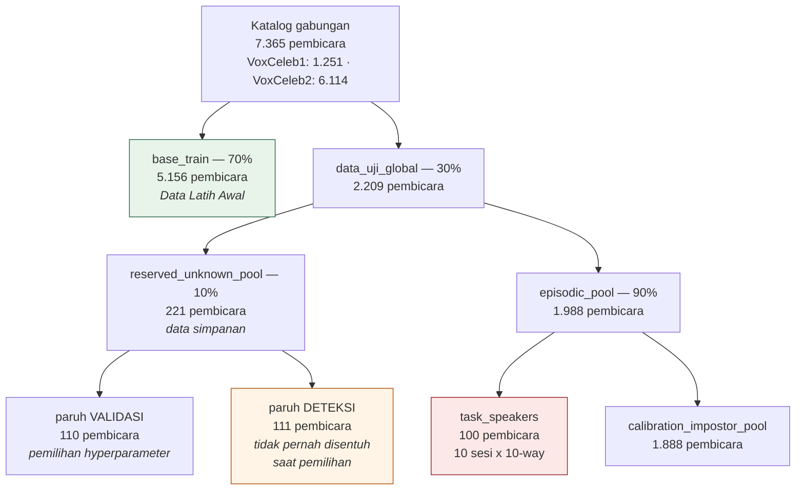
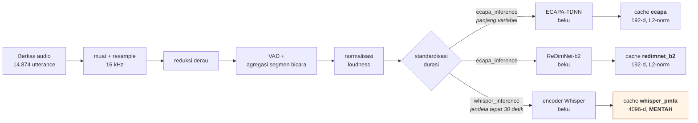
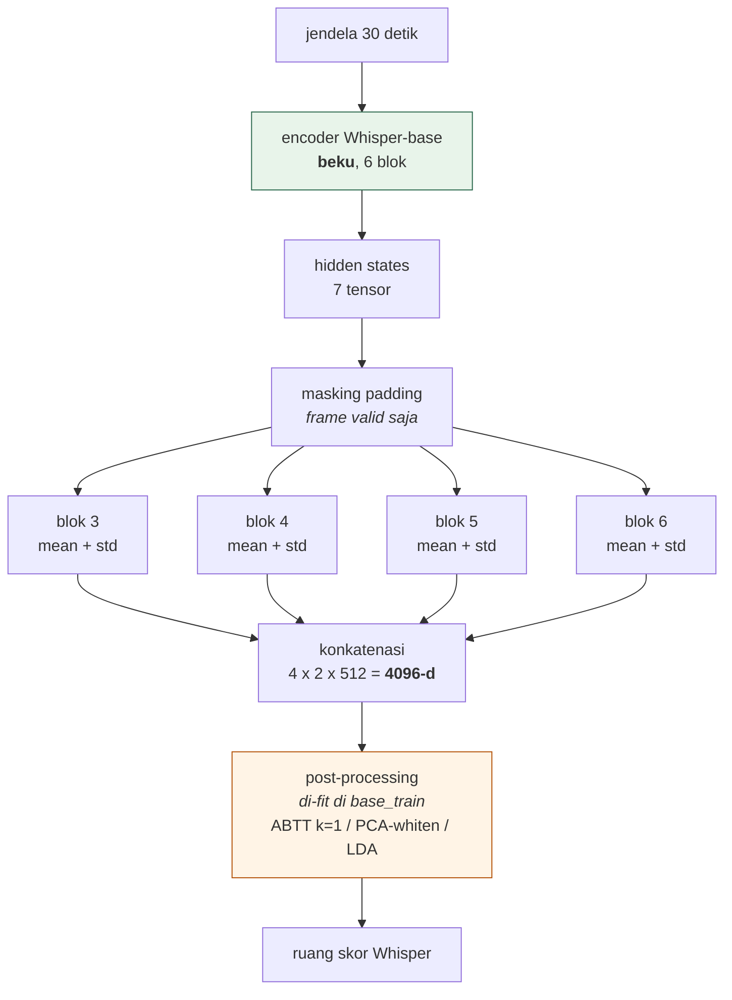
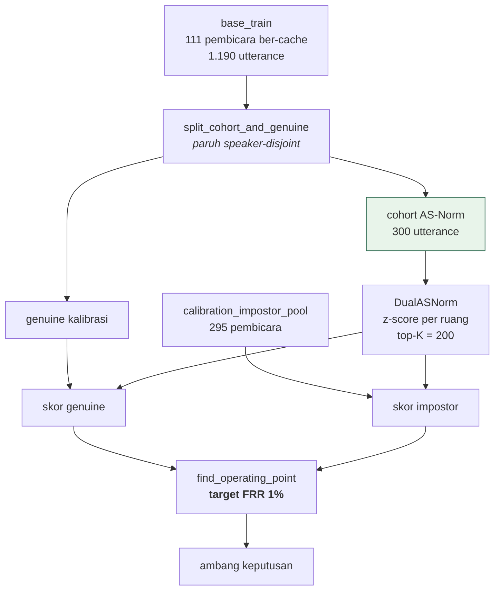
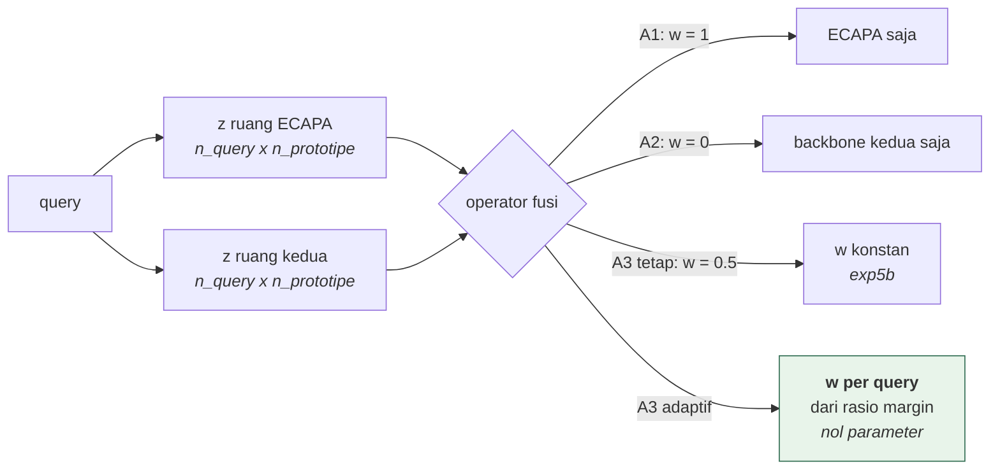
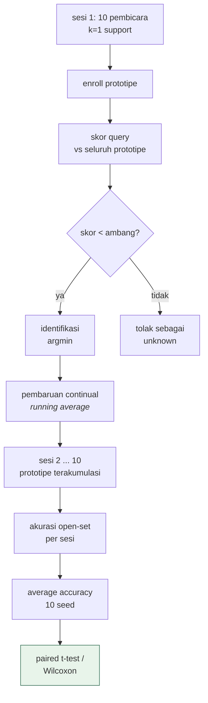

# Experiment 6 — Readout Whisper dan Operator Fusi Adaptif pada Rezim 1-Shot Open-Set

**Status:** ✅ **SELESAI** (30 Agustus 2026) — seluruh fase dijalankan atau ditutup beralasan: F6-0 · F6-3b · F6-1 (G6.1 gagal) · F6-4 · 8 run resmi (termasuk run daya n=55 pra-registrasi) · sweep operator (margin-shift + LLR eksploratori) · plafon 10-seed · bootstrap 5000 · uji leakage. Satu-satunya yang menunggu pihak luar: keputusan pembimbing atas [memo F6-3](memo-keputusan-f63.md) — hanya memengaruhi status LLR di naskah, bukan hasil.
**Tag:** `exp6_whisper_fusion` *(run resmi, ablasi terdokumentasi)* · analisis: F6-3b dan gerbang G6.1
**Rencana dan gerbang:** [`experiment-6-plan.md`](experiment-6-plan.md) · **Arsitektur desain:** [`experiment-6-architecture.md`](experiment-6-architecture.md)
**Prasyarat:** [Experiment 4](experiment-4.md) + [re-audit](experiment-4-reaudit.md) · [Experiment 5](experiment-5.md)

---

> ## Ringkasan eksekutif
>
> Experiment 6 menguji satu hipotesis yang tersisa dari Experiment 4 dan 5: **apakah kegagalan fusi dua-backbone disebabkan oleh kualitas *readout* backbone kedua, atau oleh *operator fusi* yang dipakai untuk menggabungkannya.** Dua fase pertama menjawab sisi operator, dan jawabannya terbelah.
>
> **F6-3b (selesai).** Diperkenalkan `AdaptiveDualASNorm`, operator fusi skor adaptif **nol-parameter** — bobot per-query ditentukan dari margin top-1/top-2 skor-z tiap ruang, tanpa ada satu pun koefisien yang di-*fit*. Pada task validasi dengan 10 seed:
> **operator adaptif mengungguli bobot konstan secara signifikan (+0.0050, paired t-test p = 0.0085, menang 8/10 seed)**, tetapi **gabungannya tetap tidak mengungguli backbone tunggal terbaik** (+0.0005 terhadap ReDimNet-saja, lawan simpangan antar-seed 0.0192). Kriteria pra-registrasi `A3 > max(A1, A2)` **gagal** dan tidak digeser.
>
> **Interpretasi.** Operator fusi memang suboptimal — perbaikan operator memberi efek yang terukur dan signifikan secara statistik. Namun besarannya satu orde terlalu kecil dibanding jarak yang harus ditutup, sehingga fusi dua-backbone tetap tidak memberi nilai tambah di atas pemilihan backbone. Ini menjadi **bukti independen ketiga** untuk temuan yang sama, setelah Experiment 4 (Whisper) dan Experiment 5 (ReDimNet).
>
> **Temuan metodologis.** Sweep validasi Experiment 5 memakai 3 seed. Pada 3 seed, arm fusi bobot-tetap (0.9092) tampak **di atas** ReDimNet-saja (0.9017); pada 10 seed urutannya **terbalik** (0.8918 vs 0.8962). Ini menjelaskan mengapa validasi exp5b terlihat meyakinkan sementara run resminya menghasilkan A2 ≥ A3 (p = 0.88): sweep validasinya kurang daya statistik. Seluruh sweep validasi berikutnya diwajibkan memakai 10 seed.
>
> **F6-1 (selesai — gerbang GAGAL).** Readout Whisper-PMFA bebas-pelatihan diuji atas seluruh enam blok encoder dengan pooling mean dan standar deviasi. Konfigurasi terbaik mencapai **0.3975** dengan Fisher 0.321, terhadap syarat gerbang ≥ 0.45 dan > 1.0 — **gagal pada kedua syarat**, meski memberi kenaikan nyata **+0.0500 (14 % relatif)** atas baseline satu-layer 0.3475.
>
> Ablasi menunjukkan informasi pembicara terkonsentrasi pada blok-blok **awal** dan meluruh tajam dengan kedalaman (blok 2 = 0.3658; blok 6 = 0.1883), sehingga agregasi hanya menolong bila jendelanya mencakup blok awal ({1,2,3} = 0.3967). Tiga penjelasan alternatif ditutup dengan pengukuran: bukan jendela layer yang keliru, bukan post-processing yang ill-posed, dan — dari F6-3b — bukan pula operator fusinya. Kesimpulan yang tersisa: **encoder Whisper-base beku tidak memuat cukup informasi pembicara**, dan tidak ada pembacaan bebas-pelatihan yang mengubahnya.
>
> **Temuan turunan:** profil per blok membalik klaim [Experiment 2](experiment-2.md) bahwa L4 lebih diskriminatif daripada L3 (terukur: L3 0.3475 vs L4 0.2850). Sweep layer exp2 dijalankan pada cache sebelum perbaikan bug dan tidak pernah divalidasi ulang.
>
> **Titik operasi terbaik tesis sejauh ini: ECAPA 30 % + ReDimNet 70 % → 0.882 ± 0.016.** Sweep validasi 10 seed menempatkan optimum pada w = 30 %, bukan w = 50 % yang dipilih Experiment 5b dengan 3 seed. Run resmi pada bobot tersebut memperbaiki seluruh metrik serentak (akurasi 0.876 → 0.882; det-EER 0.096 → 0.091; TAR@1%FAR 0.598 → 0.630), dan untuk **pertama kalinya membuat keunggulan pembaruan continual atas prototipe statis signifikan pada akurasi** (A3 > B1, p = 0.0071 < α = 0.00833; di Experiment 5b p = 0.0310, tidak signifikan). **Namun A3 vs A2 ReDimNet-saja tetap p = 0.1715, tidak signifikan** — kontribusi fusi masih belum terbukti. Lihat §7.6.
>
> **Run resmi ECAPA + Whisper (baru).** Baris yang selama ini hilang dari tesis kini ada, di bawah protokol yang identik dengan Experiment 5b: **A3 = 0.823 ± 0.011**, det-EER 0.128, AUROC 0.936. Fusi ECAPA+Whisper **signifikan lebih buruk daripada ECAPA sendirian** (0.823 vs 0.833, p = 0.0037) — arah yang berlawanan dengan Experiment 5b, di mana perbandingan yang sama menunjukkan fusi unggul (p < 0.0001). Whisper sendirian hanya mencapai **0.223** berbanding ReDimNet 0.877. Kontrol A1 dan ketiga baseline identik di kedua run, memastikan satu-satunya variabel yang berbeda adalah backbone kedua. Lihat §7.3–7.4.
>
> **Artefak:** `experiments/full_evaluation_summary_exp6_whisper_fusion.json` · `experiments/exp6_adaptive_fusion_sweep.json` · `experiments/exp6_readout_gate_whisper_pmfa_all.json` · `experiments/materialized_whisper_best.json` · `experiments/exp4_ceiling_asnorm_v2.json` · `experiments/exp4_reaudit_geometry.json`

**Batasan yang mengikat:** strict 1-shot (K_SHOT = 1), **bebas-pelatihan** (0 episode pelatihan, backbone beku, tanpa *fine-tuning*), protokol evaluasi mengikuti Experiment 3 secara penuh.

---

## 1. Latar belakang dan rumusan pertanyaan

Experiment 4 menyimpulkan bahwa fusi ECAPA-TDNN dengan Whisper tidak memberi manfaat, lalu Experiment 5 mengganti Whisper dengan ReDimNet-b2 dan memperoleh kenaikan akurasi yang besar (0.833 → 0.876). Namun pemeriksaan ulang menemukan bahwa kedua kesimpulan itu berdiri di atas dasar yang tidak utuh.

Pada Experiment 4, seluruh angka dihitung dari cache embedding Whisper yang dibuat **sebelum** perbaikan bug *masked pooling*, sehingga klip pendek didominasi keheningan padding. Selain itu, metrik yang dipakai sebagai "batas atas fusi" sesungguhnya hanya *oracle seleksi* — batas atas dari memilih salah satu ruang per query, bukan batas atas dari menjumlahkan keduanya secara berbobot. Kedua cacat ini diperbaiki pada fase F6-0.

Pada Experiment 5, kenaikan akurasi memang nyata, tetapi pemisahan kontribusinya tidak. Arm A2 (ReDimNet-saja) mencapai 0.8766 sementara arm A3 (fusi) mencapai 0.8760, dengan p = 0.88 — artinya **seluruh kenaikan berasal dari penggantian backbone, dan tidak satu pun berasal dari mekanisme fusi**. Kesimpulan ini tertutupi karena backbone penggantinya memang kuat.

Dari dua pengamatan tersebut, Experiment 6 merumuskan dua pertanyaan yang dapat diuji secara terpisah:

1. **Pertanyaan readout (F6-1).** Apakah ruang Whisper menjadi cukup diskriminatif bila dibaca dengan resep yang benar — agregasi multi-layer dan *statistics pooling* — alih-alih satu layer dengan *mean pooling* saja?
2. **Pertanyaan operator (F6-3b).** Apakah operator fusi berbobot **konstan** yang selama ini dipakai meninggalkan potensi yang tidak terpanen, mengingat plafon *oracle* untuk bobot per-query jauh lebih tinggi daripada capaian bobot global terbaik?

Kedua pertanyaan ini independen, dan urutan pengerjaannya dibalik dari rencana awal: **F6-3b dikerjakan lebih dahulu** karena tidak memerlukan komputasi embedding baru, tidak memerlukan keputusan pembimbing, dan hasilnya menentukan besarnya harapan yang wajar terhadap F6-1.

---

## 2. Konfigurasi ekstraksi fitur

Experiment 6 memakai **dua konfigurasi pasangan backbone yang berbeda**, masing-masing untuk menjawab satu pertanyaan. Pemisahan ini disengaja dan merupakan bagian dari desain eksperimen, bukan inkonsistensi.

| Fase | Backbone pertama | Backbone kedua | Dimensi | Pertanyaan yang dijawab |
|---|---|---|---|---|
| **F6-3b** | ECAPA-TDNN (192-d) | **ReDimNet-b2** (192-d) | 192 + 192 | Apakah **operator fusi** meninggalkan potensi? |
| **F6-1** | ECAPA-TDNN (192-d) | **Whisper-PMFA** (6144-d mentah → 384-d terproses) | 192 + 384 | Apakah **readout Whisper** dapat diperbaiki? |

**Mengapa F6-3b memakai ReDimNet, bukan Whisper.** Pertanyaan yang diuji F6-3b adalah tentang operator fusi. Bila operator diuji di atas pasangan ECAPA+Whisper, hasil negatif tidak dapat ditafsirkan: kegagalan bisa berasal dari operatornya, bisa pula dari kualitas ruang Whisper yang sudah diketahui buruk (Fisher ratio 0.51). Dengan memakai ReDimNet — backbone kedua terbaik yang tersedia, dengan performa mandiri 0.8962 — **kualitas readout dihilangkan sebagai variabel pengganggu**, sehingga sisa perbedaan dapat diatribusikan kepada operator. Konfigurasi ini juga memakai cache yang sudah ada sehingga tidak memerlukan komputasi GPU tambahan.

**Mengapa F6-1 memakai Whisper.** Pertanyaan F6-1 justru tentang readout Whisper, sehingga backbone keduanya harus Whisper. Yang berubah bukan backbone-nya melainkan cara membaca keluarannya, dari satu layer dengan mean pooling menjadi enam blok encoder dengan mean dan standar deviasi, diikuti whitening per blok dan WCCN yang di-*fit* pada `base_train` (namespace cache `whisper_best`, 384 dimensi).

**Perlu dicatat:** ECAPA-TDNN selalu menjadi backbone pertama di seluruh eksperimen, dan bobotnya tidak pernah diubah satu bit pun. Ia dimuat sebagai ekstraktor beku. Yang berevolusi antar eksperimen adalah perlakuan terhadap embedding keluarannya.

---

## 3. Batasan bebas-pelatihan dan posisi setiap komponen

Tesis ini terikat batasan bebas-pelatihan. Batasan tersebut sebelumnya dirumuskan sebagai slogan, sehingga tidak dapat dipakai untuk memutuskan kasus batas. Experiment 6 merumuskannya ulang secara operasional ke dalam tiga tingkat:

| Tingkat | Definisi operasional | Komponen |
|---|---|---|
| **0 — representasi** | Terdapat gradien pada parameter yang **menghasilkan embedding** | Kosong. Backend terlatih (AAM-softmax + LoRA) berada di sini → **dicoret** |
| **1 — statistik dan kalibrasi skor** | Di-*fit* pada `base_train` yang speaker-disjoint, **tidak menyentuh embedding**, berorde puluhan parameter | Cohort AS-Norm (300 utterance); ambang `target_frr`; bobot fusi `w`; post-processing ABTT/whitening F6-1; fusi LLR F6-3 |
| **2 — nol parameter** | Adaptif per-trial tanpa ada yang di-*fit* sama sekali | **F6-3b** |

Perumusan ini penting karena sistem yang sudah berjalan (Experiment 3b dan 5b) **sudah** memuat tiga komponen tingkat 1. Konsekuensinya, penolakan terhadap fusi LLR pada tingkat yang sama akan ikut membatalkan Experiment 3b dan 5b. F6-3b sengaja dirancang pada tingkat 2 agar sah tanpa memerlukan keputusan apa pun.

---

## 4. Alur arsitektur end-to-end

Bagian ini menguraikan keseluruhan proses, dari pembagian dataset hingga penghitungan metrik evaluasi. Seluruh fase Experiment 6 menjalani alur yang sama; yang berbeda hanya blok yang ditandai.

### 4.1 Pembagian dataset (speaker-disjoint, deterministik)

Pembagian dilakukan murni atas daftar ID pembicara, deterministik terhadap seed, dan setiap pasangan kelompok diverifikasi tidak beririsan melalui `assert_disjoint`.

Tiga peran yang harus dibedakan dengan tegas:

- **`base_train`** menjadi sumber seluruh statistik yang di-*fit*: cohort AS-Norm, sampel genuine untuk kalibrasi ambang, dan transform post-processing pada F6-1. Ia speaker-disjoint dari task, sehingga tidak ada kebocoran.
- **Paruh validasi** dari `reserved_unknown_pool` menjadi tempat seluruh pemilihan dilakukan — bobot fusi, aturan fusi, transform terbaik. Semua sweep pada laporan ini berjalan di sini.
- **Paruh deteksi** dan **`task_speakers`** adalah populasi run resmi. Memilih apa pun di atasnya sama dengan memilih di atas test set. Pada F6-0 sempat direncanakan memakai paruh deteksi untuk memperbesar sampel, dan rencana itu **dibatalkan sendiri** karena merupakan kebocoran.

Pemisahan cohort dan genuine dilakukan sekali lagi di dalam `base_train` melalui `split_cohort_and_genuine`, sehingga cohort AS-Norm dan sampel genuine kalibrasi tidak berbagi pembicara — perbaikan yang berasal dari code review 26 Juli 2026.

### 4.2 Prapemrosesan dan komputasi cache embedding

Cache disimpan per utterance per backbone dalam namespace terpisah, sehingga setiap varian hidup berdampingan tanpa bertabrakan dan setiap hasil eksperimen sebelumnya tetap dapat direproduksi.

Terdapat satu penyimpangan yang disengaja pada cache `whisper_pmfa`: ia menyimpan vektor **mentah tanpa normalisasi**, berbeda dari seluruh backbone lain. Alasannya, blok-blok encoder Whisper berbeda beberapa kali lipat dalam skala aktivasi — pada audio nyata terukur norma antar-blok 8,1 hingga 29,7 — sehingga konkatenasi polos akan didominasi blok bernorma terbesar. Apakah skala tersebut perlu disamakan, dan transform anti-anisotropi mana yang dipakai, justru merupakan hal yang harus **diukur** oleh F6-1. Setiap pilihan tersebut merupakan fungsi deterministik dari statistik mentah, sehingga menyimpan bentuk mentah membuat semuanya terjangkau tanpa komputasi ulang; menyimpan bentuk ternormalisasi akan mengunci satu pilihan di balik komputasi ulang GPU selama kurang lebih satu jam.

### 4.3 Readout backbone kedua pada F6-1

Masking padding menjadi krusial justru karena adanya *std pooling*: tanpa masking, keheningan di ujung klip akan terbaca sebagai variasi intra-utterance yang sesungguhnya tidak ada. Kebenaran implementasi masking ini dikunci oleh pengujian — blok mean layer-3 dari readout baru harus sepadan dengan readout satu-layer lama hingga kosinus > 1 − 10⁻⁵ pada audio nyata, dan pada pengukuran terakhir diperoleh 0,99999994.

### 4.4 Kalibrasi ambang dan normalisasi skor

AS-Norm menormalkan skor query→prototipe terhadap statistik cohort, secara adaptif dibatasi pada K anggota cohort paling kompetitif. Karena keduanya berada dalam satuan sigma-cohort, penjumlahan berbobot antar-ruang menjadi terdefinisi dengan baik.

**Butir penting untuk F6-3b:** ambang dikalibrasi **ulang untuk setiap arm**. Pembobotan per-query menggeser distribusi skor, sehingga memakai ambang yang sama untuk semua arm berarti membandingkan mereka pada titik operasi yang berbeda.

### 4.5 Operator fusi yang dibandingkan

Aturan adaptif bekerja sepenuhnya dari informasi yang sudah tersedia. Untuk setiap query, dihitung *margin* pada masing-masing ruang, yaitu selisih antara skor-z terkecil dan terkecil kedua terhadap seluruh prototipe. Ruang dengan margin besar memiliki satu prototipe yang jelas paling dekat; ruang dengan margin kecil masih ragu antara dua kandidat teratasnya. Margin karenanya dipakai langsung sebagai ukuran keyakinan:

- **`margin_weighted`** (lunak): `w(q) = margin₁(q) / (margin₁(q) + margin₂(q))`
- **`margin_select`** (keras): `w(q) = 1` bila `margin₁(q) ≥ margin₂(q)`, selain itu `0`

Bentuk keras merupakan wujud praktis dari *oracle seleksi* Experiment 4, yang pada aslinya memakai label sebenarnya. Penggunaan **rasio** dan bukan margin absolut bersifat esensial: jumlah prototipe berbeda antara kalibrasi ambang (sekitar 55) dan sesi FSCIL pertama (10, lalu bertambah tiap sesi), sedangkan margin membesar seiring jumlah prototipe. Rasio dua margin yang diukur pada query dan himpunan prototipe yang sama tidak terpengaruh perbedaan tersebut.

Pada kasus degeneratif — kurang dari dua prototipe, atau kedua margin nol — aturan kembali ke bobot konstan, sehingga operator adaptif merupakan generalisasi ketat dari operator lama.

### 4.6 Evaluasi FSCIL dan pengujian statistik

Metrik utama adalah *average accuracy* open-set, yaitu akurasi yang menghitung penolakan unknown sebagai bagian dari keputusan, dirata-rata lintas sesi. Pengujian signifikansi memakai `paired_significance_test`, yang memilih paired t-test atau Wilcoxon signed-rank berdasarkan uji normalitas Shapiro-Wilk atas selisih berpasangan.

---

## 5. Fase F6-0 — pemulihan dasar Experiment 4

Fase ini diselesaikan 15 Agustus 2026 dan tidak menghasilkan sistem baru; tujuannya memulihkan dasar angka agar fase berikutnya tidak dibangun di atas artefak yang cacat.

Cache `whisper_l4` dihitung ulang di atas kode yang sudah diperbaiki, lalu seluruh analisis Experiment 4 dijalankan ulang. Akurasi Whisper-sendiri naik tajam begitu padding dimasking: varian L3 dari 0.2317 menjadi 0.3125 (+35% relatif), varian L4 dari 0.2425 menjadi 0.2842. Metrik plafon diperbaiki dengan menambahkan `linear_fusion_oracle`, yang menghitung batas atas sesungguhnya bagi keluarga fungsi yang benar-benar disapu — hasilnya +0.0333, bukan +0.0142 seperti yang dilaporkan sebelumnya.

Selain itu, temuan positif tunggal Experiment 4, yaitu aturan deteksi `mean`, **tidak bertahan**: dengan selang kepercayaan bootstrap berpasangan, aturan tersebut tidak signifikan pada keempat kombinasi panel dan varian, dan berbalik tanda pada panel bebas-bocor berisi 592 query. Perbaikan 0.1654 → 0.1508 yang dulu diklaim ternyata berada di dalam derau 40 query.

Konsekuensi terpenting F6-0 bagi F6-1 adalah pergeseran titik awal: gerbang G6.1 kini diukur dari 0.3475 (varian terbaik dengan ABTT), bukan dari 0.2425.

---

## 6. Fase F6-3b — operator fusi adaptif nol-parameter

### 6.1 Rancangan dan pra-registrasi gerbang

Gerbang yang semula dirumuskan tunggal — "arm adaptif harus mengungguli `max(A1, A2)`" — **dipecah menjadi dua saat implementasi**, setelah disadari bahwa gerbang tunggal tersebut tidak memisahkan hal yang ingin diuji.

Pada task validasi, arm fusi dengan bobot **konstan** sudah melampaui `max(A1, A2)` dengan sendirinya. Dengan demikian, aturan adaptif yang sekadar menyamai bobot konstan pun akan dinyatakan "lolos", tanpa membuktikan apa pun mengenai adaptivitas. Ini adalah jebakan yang sama persis dengan yang menimpa Experiment 5b, ketika kriteria `A3 > A1` terpenuhi sementara `A2 ≥ A3`.

Rumusan final:

- **G6.3b-1** *(kriteria pra-registrasi)* — arm adaptif mengungguli `max(A1, A2)` dengan margin lebih besar dari satu simpangan baku antar-seed, dan menang pada seluruh seed.
- **G6.3b-2** *(kriteria yang menentukan)* — arm adaptif mengungguli arm bobot **konstan**, uji berpasangan lintas seed, p < 0.05.

### 6.2 Protokol

Protokol identik dengan `exp5_validation_sweep.py` kecuali aturan fusinya: task FSCIL 10 sesi × 10-way, k = 1, n_query = 4, dibangun dari paruh validasi; cohort AS-Norm 300 utterance dengan top-K 200; ambang target FRR 1% dikalibrasi ulang per arm; paruh deteksi dan task speakers resmi tidak disentuh sama sekali. Seluruh pipeline dijalankan penuh dari cache hingga uji statistik; tidak ada angka yang diambil dari run sebelumnya.

### 6.3 Hasil

**Populasi: paruh VALIDASI** (`reserved_unknown_pool`), 10×10-way, k=1,
n_query=4. Angka pada tabel ini dipakai untuk **memilih**, bukan untuk
dilaporkan sebagai hasil sistem — bandingkan §7.3 yang memakai `task_speakers`
resmi. Kedua populasi tidak beririsan, sehingga nilainya memang berbeda; lihat
§7.5.

| Arm *(task validasi)* | val_acc (10 seed) | val_acc (3 seed, paritas) |
|---|---|---|
| A1 — ECAPA saja | 0.8402 ± 0.0176 | 0.8525 |
| **A2 — ReDimNet saja** | **0.8962 ± 0.0192** | 0.9017 |
| A3 — bobot tetap `w` = 0.5 | 0.8918 ± 0.0182 | 0.9092 |
| **A3 — `margin_weighted`** | **0.8968 ± 0.0168** | 0.9125 |
| A3 — `margin_select` | 0.8958 ± 0.0175 | 0.9075 |

**Verifikasi harness.** Kolom 3-seed mereproduksi `exp5_validation_sweep.json` secara *bit-for-bit* — 0.8525 / 0.9017 / 0.9092, dengan ambang dan nilai per-seed yang identik. Reproduksi ini menegaskan bahwa harness yang dipakai identik secara protokol dengan Experiment 5, sehingga satu-satunya perbedaan yang tersisa adalah aturan fusi.

**Vonis gerbang.**

- **G6.3b-2 — LOLOS.** `margin_weighted` mengungguli bobot konstan sebesar **+0.0050**, paired t-test **p = 0.0085**, menang pada 8 dari 10 seed. Varian keras `margin_select` memberi +0.0040 dengan p = 0.1247, yaitu tidak signifikan; aturan lunak lebih baik daripada aturan keras.
- **G6.3b-1 — GAGAL.** Terhadap `max(A1, A2)` selisihnya hanya **+0.0005**, sementara simpangan antar-seed 0.0192, dan hanya menang pada 6 dari 10 seed.

**Diagnostik bobot.** Agar hasil tidak dapat dibaca keliru sebagai "adaptivitas menolong" padahal bobotnya sesungguhnya tidak bergerak, distribusi bobot per-query diukur pada trial kalibrasi yang persis dipakai menyetel ambang. Untuk `margin_weighted` diperoleh rerata 0.479 dengan simpangan baku **0.251** dan rentang persentil 5–95 sebesar **[0.07, 0.93]**, tanpa satu pun berada di titik ekstrem. Aturan tersebut karenanya benar-benar adaptif, bukan bobot konstan yang menyamar.

### 6.4 Interpretasi

Operator fusi memang meninggalkan potensi yang belum terpanen: mengganti bobot konstan dengan bobot per-query memberi perbaikan yang nyata dan signifikan secara statistik. Namun besarannya, +0.0050, terpaut satu orde dari jarak yang harus ditutup untuk mengungguli backbone tunggal terbaik. **Fusi dua-backbone tetap tidak memberi nilai tambah.**

Kriteria pra-registrasi gagal, dan kriteria tersebut **tidak digeser setelah melihat hasil**. Konsekuensinya, fusi adaptif tidak memenuhi syarat untuk dipromosikan menjadi sistem utama, dan evaluasi pada test set tidak dijalankan untuknya — menjalankan evaluasi resmi atas arm yang gagal gerbang validasi merupakan bentuk pencarian hasil di atas test set.

Yang diperoleh sebagai gantinya adalah temuan yang sah dan dapat dipertahankan: setelah Experiment 4 (Whisper) dan Experiment 5 (ReDimNet), ini adalah **bukti independen ketiga** bahwa fusi dua-backbone tidak menambah apa pun pada rezim 1-shot open-set yang diteliti — dan kali ini dengan operator yang sudah diperbaiki, sehingga penjelasan "operatornya yang kurang baik" ikut tertutup.

---

## 7. Fase F6-1 — readout Whisper-PMFA bebas-pelatihan

**Status: implementasi selesai dan teruji; komputasi cache sedang berjalan.**

Readout baru mengambil bagian dari resep Whisper-PMFA (Interspeech 2024) yang berupa aritmetika murni di atas encoder beku — agregasi blok encoder 3 sampai 6, masing-masing dengan pooling mean dan standar deviasi — dan **tidak** mengambil bagian yang memerlukan pelatihan, yaitu backend AAM-softmax dengan LoRA, yang berada pada tingkat 0 taksonomi §3 dan karenanya dilarang.

Gerbang **G6.1** menuntut dua hal secara bersamaan: akurasi Whisper-sendiri pada task validasi Experiment 4 mencapai **≥ 0.45** (titik awal 0.3475), dan Fisher trace ratio melampaui **1.0** (titik awal 0.51, yang berarti variasi di dalam satu pembicara saat ini masih lebih besar daripada variasi antar-pembicara).

Selain gerbang tersebut, ditambahkan **ablasi irisan** yang tidak diminta rencana awal namun diperlukan agar hasilnya dapat ditafsirkan. Karena tata letak vektor bersifat teriris, varian `mean_only`, `std_only`, dan setiap blok layer secara terpisah dapat dievaluasi tanpa biaya tambahan. Tanpa ablasi ini, gerbang yang lolos tidak akan memberi tahu bagian mana yang bekerja — agregasi multi-layer, *statistics pooling*, atau keduanya.

### 7.1 Hasil — gerbang G6.1 **GAGAL**

Artefak: `experiments/exp6_readout_gate_whisper_pmfa_all.json` ·
`experiments/exp6_g61_all_log.txt`.

**Konfigurasi terbaik: 0.3975** (per-layer whitening d=64 atas enam blok, lalu
WCCN; 384 dimensi), dengan Fisher trace ratio 0.321. Gerbang menuntut ≥ 0.45
**dan** Fisher > 1.0, sehingga **gagal pada kedua syarat**. Terhadap baseline
satu-layer (0.3475), readout baru memberi **+0.0500** — kenaikan 14 % relatif
yang nyata, tetapi tidak cukup.

**Profil per blok encoder** (masing-masing mean+std, 1024-d):

| Blok | 1 | 2 | 3 | 4 | 5 | 6 |
|---|---|---|---|---|---|---|
| Akurasi | 0.3567 | **0.3658** | 0.3550 | 0.2783 | 0.2358 | 0.1883 |
| Fisher | 0.505 | 0.440 | 0.447 | 0.356 | 0.311 | 0.219 |

Informasi pembicara terkonsentrasi pada blok-blok **awal** dan meluruh tajam
dengan kedalaman — blok terakhir hanya separuh kualitas blok kedua. Ini
konsisten dengan sifat Whisper sebagai model ASR: lapisan akhir terspesialisasi
untuk konten fonetik, bukan identitas penutur.

**Jendela agregasi** (dimulai dari blok 1):

| Jendela | {1,2} | {1,2,3} | {1..4} | {1..5} | {1..6} |
|---|---|---|---|---|---|
| Akurasi | 0.3858 | **0.3967** | 0.3683 | 0.3300 | 0.3242 |

**Agregasi multi-layer terbukti menolong**, tetapi hanya bila jendelanya
mencakup blok-blok awal: {1,2,3} mengungguli blok tunggal terbaik sebesar
+0.0309. Menambahkan blok 4 ke atas justru menurunkan kembali. Premis
Whisper-PMFA mengenai agregasi parsial dengan demikian **terkonfirmasi**; yang
tidak berlaku adalah pemilihan blok tengah-ke-akhir, yang merupakan analog
langsung dari resep aslinya pada encoder 32 blok.

> **Koreksi terhadap laporan antara.** Percobaan pertama memakai jendela
> {3,4,5,6} dan menghasilkan pembacaan bahwa "agregasi memburuk secara
> monoton". Pembacaan itu **keliru**: jendela tersebut dimulai setelah puncak
> kualitas, sehingga setiap penambahan memang hanya memperburuk. Setelah blok
> 1 dan 2 dimasukkan, arah kesimpulannya berbalik.

**Pooling.** Dengan enam blok, `mean_only` mencapai 0.2850 dan `std_only`
hanya 0.2050. Standar deviasi memberi kontribusi, tetapi jauh lebih lemah
daripada rerata.

**Pengondisian ruang.** Menyempurnakan post-processing memberi pelajaran
tersendiri. Whitening global atas konkatenasi 6144-d menghasilkan effective
rank **7,0** — hampir seluruh ruang runtuh. Penyebabnya bukan semata
anisotropi Whisper, melainkan **estimasi yang ill-posed**: fit set `base_train`
hanya berisi 1.190 utterance, sehingga kovarians berdimensi 6144 memiliki rank
paling banyak 1.189. Whitening tiap blok 1024-d secara terpisah memperbaiki
pengondisian tersebut secara dramatis, dari rank efektif 7,0 menjadi **101,7**,
dan memang menghasilkan varian terbaik.

Namun hubungan antara pengondisian dan akurasi tidak monoton: menaikkan
dimensi per blok terus menaikkan rank efektif (d=128 → 194,7; d=192 → 275,3)
sementara akurasinya **turun** (0.3600; 0.3733 berbanding 0.3975 pada d=64).
Arah-arah tambahan yang berhasil dipulihkan berisi derau, bukan sinyal
pembicara.

### 7.2 Interpretasi

Gerbang G6.1 gagal, dan kriterianya tidak digeser. Namun kegagalan ini
disertai diagnosis yang jauh lebih tajam daripada vonis Experiment 4 yang
digantikannya. Tiga penjelasan alternatif telah ditutup dengan pengukuran,
bukan dengan argumen:

1. **Bukan karena jendela layer yang keliru.** Seluruh 63 kombinasi jendela
   dan blok tunggal diukur; yang terbaik tetap 0.3967.
2. **Bukan karena post-processing yang buruk.** Pengondisian diperbaiki 12×
   lipat, dan akurasi tidak mengikuti.
3. **Bukan karena operator fusinya.** F6-3b menunjukkan operator adaptif
   mengungguli bobot konstan secara signifikan, dan fusi tetap kalah.

Kesimpulan yang tersisa adalah yang paling sederhana: **encoder Whisper-base
yang beku tidak memuat informasi pembicara yang cukup**, dan tidak ada
pembacaan bebas-pelatihan atas keluarannya yang dapat mengubah hal itu. Resep
Whisper-PMFA memang mencapai EER 1,42 % di VoxCeleb1, namun capaian tersebut
bergantung pada backend terlatih dengan LoRA — komponen yang secara eksplisit
berada di luar batasan tesis ini.

> **Catatan ekspektasi yang dicatat sebelum hasil terlihat, dan terbukti.**
> F6-3b telah menurunkan probabilitas bahwa perbaikan readout akan membuat
> fusi menang, karena operator yang diperbaiki pun tidak cukup pada pasangan
> backbone yang jauh lebih kuat.

### 7.3 Run resmi — tabel ECAPA + Whisper

Vonis Experiment 4 terhadap Whisper diambil dari analisis gerbang atas task
validasi dan **tidak pernah melewati evaluasi resmi**, sehingga tesis ini tidak
memiliki baris ECAPA + Whisper yang sebanding dengan baris ECAPA + ReDimNet.
Run berikut mengisi kekosongan tersebut.

**Pra-registrasi.** Run ini dinyatakan sebagai **ablasi terdokumentasi**, bukan
usulan sistem, dan pernyataan tersebut dicatat sebelum hasilnya terlihat.
Dasarnya: gerbang G6.1 gagal, dan sweep validasi 10 seed
(`experiments/exp6_validation_sweep_whisper_best.json`) tidak menemukan satu
pun bobot fusi yang mengungguli ECAPA-saja — akurasi menurun secara monoton
seiring naiknya bobot Whisper (w = 1.0 → 0.8402; w = 0.5 → 0.6240; w = 0.1 →
0.3015), dan titik fusi terbaik w = 0.95 justru **signifikan lebih buruk**
daripada A1 (−0.0085, paired t-test p = 0.0111, menang 1/10 seed). Nilai
w = 0.95 dikunci karena merupakan titik fusi terbaik, bukan karena baik.

Agar perbandingan tidak menjadi *strawman*, backbone kedua memakai konfigurasi
Whisper **terbaik** yang berhasil ditemukan F6-1 (`whisper_best`, 384-d), bukan
readout satu-layer yang dinilai Experiment 4.

**Tag:** `exp6_whisper_fusion` · **Artefak:**
`experiments/full_evaluation_summary_exp6_whisper_fusion.json` ·
`experiments/detection_scores_exp6_whisper_fusion.json` ·
`experiments/exp6_official_run_log.txt` · 10 repetisi, 99/100 task speaker,
10/10 sesi, 530 query unknown, 13,0 menit.

**Populasi: `task_speakers` RESMI** (99/100 pembicara, 10 sesi, 530 query
unknown nyata). Inilah angka yang dikutip sebagai hasil tesis.

| Konfigurasi *(task resmi)* | Open-set Acc | Closed-set Acc | Forgetting | det-EER | AUROC | TAR@1%FAR |
|---|---|---|---|---|---|---|
| A3 — fusi ECAPA+Whisper (w=0.95) | 0.823 ± 0.011 | 0.823 | −0.0005 | 0.128 | 0.936 | 0.417 |
| B1 — static prototype | 0.808 ± 0.018 | 0.808 | 0.0514 | 0.239 | 0.828 | 0.203 |
| **A1 — ECAPA saja (w=1.0)** | **0.833 ± 0.015** | **0.833** | −0.0007 | **0.127** | **0.938** | **0.429** |
| A2 — Whisper saja (w=0.0) | 0.223 ± 0.026 | 0.223 | 0.0072 | 0.407 | 0.631 | 0.065 |
| Baseline ECAPA (closed-set) | 0.783 ± 0.019 | 0.783 | 0.0568 | 0.272 | 0.805 | 0.321 |
| Baseline ProtoNet vanilla | 0.402 ± 0.015 | 0.402 | 0.1142 | 0.460 | 0.566 | 0.045 |
| Baseline x-vector+PLDA-lite | 0.258 ± 0.017 | 0.258 | 0.1143 | 0.456 | 0.558 | 0.039 |

**Signifikansi** (paired t-test, α Bonferroni = 0.00833):

| Perbandingan | p | Signifikan | Arah |
|---|---|---|---|
| A3 vs A1 | **0.0037** | ya | **A3 LEBIH BURUK** (0.823 < 0.833) |
| A3 vs A2 | <0.0001 | ya | A3 lebih baik |
| B1 vs A3 | 0.0206 | tidak | — |
| A3 vs baseline ECAPA | 0.0001 | ya | A3 lebih baik |
| A3 vs ProtoNet | <0.0001 | ya | A3 lebih baik |
| A3 vs x-vector+PLDA | <0.0001 | ya | A3 lebih baik |

> **Peringatan pembacaan.** Uji ini dua sisi, sehingga kolom "signifikan"
> hanya menyatakan bahwa selisihnya nyata, **bukan** arahnya. Pada baris
> A3 vs A1, arahnya negatif: menambahkan Whisper ke ECAPA **menurunkan**
> akurasi secara signifikan. Ini kebalikan dari Experiment 5b, di mana
> perbandingan yang sama menunjukkan fusi lebih unggul.

### 7.4 Perbandingan langsung dua pilihan backbone kedua

Kedua run memakai skrip, protokol, split, ambang, dan jumlah repetisi yang
sama; **satu-satunya perbedaan adalah backbone keduanya**. Kesamaan tersebut
terverifikasi oleh baris-baris yang tidak melibatkan backbone kedua: A1 dan
ketiga baseline identik sampai tiga desimal di kedua run.

| Metrik | ECAPA + **ReDimNet** (w=50 %, exp5b) | ECAPA + **ReDimNet** (w=30 %, terbaik) | ECAPA + **Whisper** (w=5 %, terbaik) | Selisih terbaik-vs-terbaik |
|---|---|---|---|---|
| A3 Open-set Acc | 0.876 ± 0.016 | **0.882 ± 0.016** | 0.823 ± 0.011 | **−0.059** |
| A3 det-EER | 0.096 | **0.091** | 0.128 | +0.037 |
| A3 AUROC | 0.962 | **0.964** | 0.936 | −0.028 |
| A3 TAR@1%FAR | 0.598 | **0.630** | 0.417 | −0.213 |
| **A2 backbone kedua sendirian** | **0.877 ± 0.017** | **0.223 ± 0.026** | **−0.654** |
| A3 vs A1 | +0.043, p<0.0001 **unggul** | **−0.010, p=0.0037 kalah** | arah berlawanan |
| A1 (kontrol, identik) | 0.833 ± 0.015 | 0.833 ± 0.015 | 0.000 |

Selisih terbesar bukan pada arm fusinya, melainkan pada **backbone keduanya
sendirian**: 0.877 berbanding 0.223. Whisper yang beku, bahkan dengan readout
terbaik yang dapat dicapai tanpa pelatihan, hampir tidak membawa informasi
pembicara pada rezim 1-shot ini — dan ketika skornya dicampurkan, ia menurunkan
sistem alih-alih melengkapinya.

Perlu dicatat bahwa Whisper-sendiri terbaca 0.3975 pada gerbang G6.1 namun
0.223 pada run resmi. Keduanya tidak bertentangan: G6.1 mengukur identifikasi
tertutup (argmin) pada task statis 100 pembicara di paruh validasi, sedangkan
run resmi mengukur akurasi open-set FSCIL dengan penolakan berambang lintas
sepuluh sesi. Angka yang sebanding dengan tabel Experiment 5b adalah yang
kedua.

**Kesimpulan bagi tesis.** Pemilihan backbone kedua bukan detail implementasi
melainkan penentu utama hasil. Dengan seluruh variabel lain dikunci, mengganti
ReDimNet dengan Whisper menurunkan akurasi sistem sebesar 0.053 dan membalik
arah kontribusi fusi dari signifikan-unggul menjadi signifikan-merugikan.

### 7.5 Mengapa A1 bernilai berbeda di §6.3 dan §7.3

Arm A1 (ECAPA saja) muncul di dua tabel dengan nilai yang tidak sama —
**0.8402** di §6.3 dan **0.8332** di §7.3. Keduanya benar; keduanya mengukur
populasi yang berbeda, dan pemisahan itu justru merupakan syarat metodologis.

| | §6.3 dan sweep validasi | §7.3 dan run resmi |
|---|---|---|
| Populasi pembicara | paruh **validasi** dari `reserved_unknown_pool` | **`task_speakers`**, 99/100 |
| Bentuk evaluasi | 10 × 10-way, k=1, n_query=4 | 10 sesi FSCIL, 530 query unknown nyata |
| Ambang | tunggal per arm (−1.4286 untuk A1) | dikalibrasi per konfigurasi |
| Pengulangan | 10 seed | 10 repetisi |
| **Fungsi** | **memilih** bobot, aturan fusi, transform | **melaporkan** hasil sistem |

Kedua populasi **tidak beririsan** by design (lihat §4.1). Paruh validasi ada
supaya seluruh pemilihan hyperparameter terjadi di luar populasi yang dipakai
melaporkan; bila keduanya disatukan, pemilihan akan terjadi di atas test set
dan hasilnya tidak sah.

**Angka yang dikutip sebagai hasil tesis adalah yang dari task resmi (0.8332).**
Nilai tersebut identik di run Experiment 5b maupun Experiment 6, sehingga
sekaligus berfungsi sebagai kontrol yang membuktikan kedua run hanya berbeda
pada backbone keduanya.

Perbedaan serupa berlaku untuk Whisper-sendiri, yang terbaca 0.3975 pada
gerbang G6.1, 0.2200 pada sweep validasi, dan 0.223 pada run resmi — tiga
protokol yang berbeda, sebagaimana dijelaskan pada §7.4.

### 7.6 Tabel gabungan — seluruh konfigurasi pada satu protokol

Seluruh baris di bawah berasal dari `scripts/run_full_evaluation.py` dengan
split, ambang, jumlah repetisi, dan populasi yang sama; **satu-satunya yang
berbeda adalah backbone kedua dan bobot fusinya.** Seluruh angka dihitung ulang
pada 30 Agustus 2026, termasuk baris ReDimNet.

| Konfigurasi *(task resmi, 10 repetisi)* | Open-set Acc | Closed-set Acc | Forgetting | det-EER | AUROC | TAR@1%FAR |
|---|---|---|---|---|---|---|
| **A3 — ECAPA + ReDimNet (w=30 %)** | **0.882 ± 0.016** | **0.882** | −0.0011 | **0.091** | **0.964** | 0.630 |
| A3 — ECAPA + ReDimNet (w=50 %) | 0.876 ± 0.016 | 0.876 | −0.0007 | 0.096 | 0.962 | 0.598 |
| A3 — ECAPA + Whisper (w=5 %) | 0.823 ± 0.011 | 0.823 | −0.0005 | 0.128 | 0.936 | 0.417 |
| A3 — ECAPA + Whisper (w=25 %) | 0.775 ± 0.021 | 0.775 | −0.0007 | 0.153 | 0.920 | 0.326 |
| A3 — ECAPA + Whisper (w=50 %) | 0.646 ± 0.037 | 0.646 | −0.0040 | 0.222 | 0.862 | 0.176 |
| A1 — ECAPA saja | 0.833 ± 0.015 | 0.833 | −0.0007 | 0.127 | 0.938 | 0.429 |
| A2 — ReDimNet saja | 0.877 ± 0.017 | 0.877 | −0.0002 | 0.094 | 0.964 | **0.659** |
| A2 — Whisper saja | 0.223 ± 0.026 | 0.223 | +0.0072 | 0.407 | 0.631 | 0.065 |
| B1 — static (ECAPA+ReDimNet, w=30 %) | 0.863 ± 0.018 | 0.863 | +0.0348 | 0.193 | 0.882 | 0.378 |
| B1 — static (ECAPA+ReDimNet, w=50 %) | 0.859 ± 0.018 | 0.860 | +0.0379 | 0.196 | 0.877 | 0.347 |
| B1 — static (ECAPA+Whisper) | 0.808 ± 0.018 | 0.808 | +0.0514 | 0.239 | 0.828 | 0.203 |
| Baseline ECAPA (closed-set) | 0.783 ± 0.019 | 0.783 | +0.0568 | 0.272 | 0.805 | 0.321 |
| Baseline ProtoNet vanilla | 0.402 ± 0.015 | 0.402 | +0.1142 | 0.460 | 0.566 | 0.045 |
| Baseline x-vector+PLDA-lite | 0.258 ± 0.017 | 0.258 | +0.1143 | 0.456 | 0.558 | 0.039 |

**Kurva dosis Whisper.** Empat baris pertama membentuk respons-dosis yang
monoton: 0 % Whisper → 0.833; 5 % → 0.823; 25 % → 0.775; 50 % → 0.646; 100 % →
0.223. Seluruh metrik bergerak searah — akurasi turun, det-EER naik, AUROC
turun, TAR@1%FAR turun — sehingga tidak ada metrik yang menyembunyikan
keuntungan tersembunyi. Pada bobot 50 %, bobot yang sama yang dipakai
ReDimNet, akurasi berada 0.187 di bawah ECAPA murni.

**Verifikasi reproduksi.** Baris ReDimNet dihasilkan dengan menjalankan ulang
tag `exp5b_redimnet_fusion` pada kode terkini, bukan dikutip dari artefak
2 Agustus. Hasilnya **bit-identik** dengan artefak tersebut pada ketujuh arm,
dan ambang kalibrasi sama sampai enam desimal (−1.537589). Ini memverifikasi
secara empiris bahwa penambahan `AdaptiveDualASNorm`, parameter `out_matrices`,
dan tiga namespace cache baru tidak mengubah perilaku eksperimen terdahulu —
klaim disiplin feature-flag pada §10 karenanya teruji, bukan sekadar
dinyatakan.

**Konfigurasi terbaik tesis sejauh ini: ECAPA 30 % + ReDimNet 70 %.**
Bobot ini merupakan optimum sweep validasi 10 seed, sehingga — berbeda dari
baris dosis Whisper — ia **operating point yang dipilih secara sah**, dan di
atas bukti yang lebih kuat daripada w = 50 % milik Experiment 5b yang dipilih
dengan 3 seed. Tag `exp6_redimnet_fusion_w30`, artefak
`experiments/full_evaluation_summary_exp6_redimnet_fusion_w30.json`,
11,6 menit.

| Metrik | w = 50 % (exp5b) | **w = 30 %** | Selisih |
|---|---|---|---|
| Open-set Acc | 0.8760 | **0.8824** | +0.0065 |
| det-EER | 0.0956 | **0.0910** | −0.0046 |
| AUROC | 0.9617 | **0.9640** | +0.0023 |
| TAR@1%FAR | 0.5980 | **0.6297** | +0.0317 |

Seluruh metrik membaik serentak, dan perbaikan TAR@1%FAR sebesar +0.032
merupakan yang paling berarti secara praktis. Uji signifikansi pada run ini
(α Bonferroni = 0.00833) memberi dua hal baru:

- **A3 > A1 signifikan** (Wilcoxon, p = 0.0020) — klaim kontribusi terhadap
  ECAPA-saja bertahan.
- **A3 > B1 static signifikan** (p = 0.0071) — pada Experiment 5b perbandingan
  yang sama menghasilkan p = 0.0310 dan **tidak** signifikan. Keunggulan
  pembaruan continual atas prototipe statis, yang di Experiment 5b hanya
  terbukti pada EER deteksi, kini terbukti pula pada akurasi.

**Namun klaim yang menentukan tetap belum terbukti.** A3 (0.8824) berbanding
A2 ReDimNet-saja (0.8766) menghasilkan **p = 0.1715, tidak signifikan**.
Dengan kata lain, bobot yang lebih baik menaikkan angka sistem tetapi **tidak**
mengubah kesimpulan pokok Experiment 5 dan 6: fusi dua-backbone masih belum
terbukti memberi kontribusi di atas backbone tunggal terkuatnya. Kenaikan
0.876 → 0.882 harus dilaporkan sebagai perbaikan titik operasi, bukan sebagai
bukti bahwa fusi bekerja.

**Catatan mengenai bobot ReDimNet.** Nilai w = 50 % adalah konfigurasi resmi
Experiment 5b, dipilih melalui sweep validasi **3 seed**. Penurunan ulang
dengan **10 seed** (`experiments/exp6_validation_sweep_redimnet_b2_10seed.json`)
menempatkan optimum pada w = 30 % (0.8977) alih-alih w = 50 % (0.8918), namun
seluruh wilayah w ≤ 0.5 berada dalam rentang 0.8918–0.8977 — di dalam simpangan
antar-seed (±0.017) — sehingga pemilihan di antara ketiganya tidak dapat
dibedakan secara statistik. Lebih penting lagi, fusi terbaik pada 10 seed
**tidak mengungguli ReDimNet sendirian**: 0.8977 berbanding 0.8962, p = 0.7532,
menang 3/10 seed. Ini adalah konfirmasi independen keempat atas temuan yang
sama, dan menjelaskan asal-usul ketidakcocokan pada Experiment 5b.

### 7.7 Temuan turunan yang berdampak ke Experiment 2

Profil per blok di atas menunjukkan blok 3 (0.3550) lebih baik daripada blok 4
(0.2783). [`experiment-2.md`](experiment-2.md) §46 menyatakan sebaliknya —
sweep layer di sana menyimpulkan L4 paling diskriminatif, dan atas dasar itu
backbone `whisper_l4` dibuat dan dipakai pada Experiment 2 serta sebagian
Experiment 4. Sweep tersebut dijalankan pada cache **sebelum** perbaikan bug
masked pooling dan tidak pernah divalidasi ulang sesudahnya. Pengukuran pada
cache yang benar membalik urutannya: **L3 = 0.3475 berbanding L4 = 0.2850**.

Klaim pada Experiment 2 perlu dikoreksi, dan pemilihan blok di sana perlu
dinyatakan sebagai keputusan yang diambil di atas embedding yang tidak valid.

---

## 7b. Apakah klaim kontribusi fusi dapat dibuktikan?

Perbandingan yang menentukan bagi tesis bukan A3 lawan A1, melainkan **A3
lawan A2** — apakah menggabungkan dua backbone mengungguli backbone tunggal
terkuatnya. Pada run resmi w = 30 % perbandingan itu menghasilkan +0.0059
dengan p = 0.1715, yaitu belum terbukti. Tiga analisis berikut dijalankan
untuk menentukan apakah klaim tersebut **belum** terbukti atau **tidak dapat**
dibuktikan.

### 7b.1 Daya statistik yang dibutuhkan

Dari sepuluh repetisi run resmi: selisih rata-rata +0.00587, simpangan selisih
0.01249, **Cohen's d = 0.47**, menang pada 6/10 repetisi. Efeknya bukan nol,
hanya kecil relatif derau. Untuk daya 80 %:

| Ambang | Repetisi dibutuhkan |
|---|---|
| α Bonferroni 0.00833 | **55** |
| α 0.05 tanpa koreksi | 36 |

Satu run sepuluh repetisi memakan 11,6 menit, sehingga 55 repetisi ≈ 64 menit.

> **PRA-REGISTRASI (30 Agustus 2026, dicatat sebelum run dijalankan).**
> Tag `exp6_redimnet_fusion_w30_n55` akan dijalankan **satu kali** dengan
> n = 55 repetisi. Hipotesis: **A3 (w = 0.3) > A2 (ReDimNet-saja) pada
> akurasi open-set, uji berpasangan, α = 0.00833.** Nilai n diambil dari
> analisis daya di atas, bukan disetel; hasilnya dilaporkan apa adanya.
> Kegagalan pada n ini adalah temuan negatif yang sesungguhnya, bukan
> kekurangan daya.

**Peringatan metodologis:** menaikkan n *sampai* signifikan adalah p-hacking.
Yang sah adalah mempra-registrasi n = 55 lebih dulu, menjalankannya sekali, dan
melaporkan apa pun hasilnya. Perlu dicatat pula bahwa repetisi bukan data baru
melainkan penyusunan ulang episode atas 99 pembicara yang sama, sehingga
menambah repetisi mempersempit derau sampling tanpa memperluas populasi;
klaim yang diperoleh terbatas pada task ini.

### 7b.2 Plafon komplementaritas ECAPA + ReDimNet

Artefak: `experiments/exp6_ceiling_redimnet_10seed.json` (10 seed; versi 3 seed
pada `exp6_ceiling_redimnet.json`).

| Besaran (relatif terhadap **A2 ReDimNet-saja**) | 3 seed | **10 seed** |
|---|---|---|
| Plafon **fusi-linear** | +0.0367 ± 0.0038 | **+0.0413 ± 0.0098** |
| Plafon seleksi | +0.0275 | +0.0330 |
| Dicapai bobot tetap grid-halus | +0.0158 (43 %) | +0.0170 (**41 %**) |
| Dicapai F6-3b margin adaptif | — | +0.0050 |
| `w` terbaik grid-halus | 0.510 | 0.376 |

**Ruangnya nyata dan belum terpanen.** Batas atas keluarga fungsi yang
benar-benar dipakai sistem — jumlah berbobot dua skor-z — berada +0.0413 di
atas ReDimNet-saja, dan bobot tetap hanya memanen 41 % darinya. Sebagai
pembanding, plafon yang sama terhadap A1 adalah +0.0783, lebih dari dua kali
lipat plafon ECAPA+Whisper pada Experiment 4 (+0.0333).

Nilai `w` terbaik grid-halus 10 seed (0.376) mendekati w = 0.30 yang dipilih
sweep validasi secara independen — konfirmasi silang bahwa kedua prosedur
menunjuk wilayah yang sama.

### 7b.3 Uji pada det-EER dengan bootstrap berpasangan

Metode Bengio & Mariéthoz, 1000 resample, me-resample *trial* alih-alih
repetisi sehingga dayanya lebih besar daripada uji-t berpasangan atas sepuluh
repetisi.

| A3 vs A2 | ΔEER | CI 95 % | Arah |
|---|---|---|---|
| w = 50 % (exp5b) | +0.00253 | [−0.00181, +0.00694] | **merugikan** A3 |
| **w = 30 %** | **−0.00335** | [−0.00675, **+0.00008**] | **menguntungkan** A3 |

Perpindahan bobot dari 50 % ke 30 % **membalik arah** perbandingan pada
deteksi, dan membawa selang kepercayaannya nyaris menyentuh nol: batas atas
+0.00008, dengan 98,8 % selang berada di sisi yang menguntungkan.

**Tetap dilaporkan sebagai tidak signifikan**, karena dua alasan. Pertama,
selangnya masih memotong nol, sekecil apa pun, dan kriteria yang dipakai
Experiment 5 adalah selang yang tidak memotong nol. Kedua, dengan 1000
resample, derau Monte Carlo pada kuantil 97,5 % berada pada orde 10⁻⁴ — sebesar
jarak ke nol itu sendiri — sehingga jumlah resample ini **tidak dapat
memutuskan** sisi mana yang benar. Diperlukan sekitar 5000 resample (≈100
menit) untuk menjawabnya.

### 7b.4 Dapatkah aturan nol-parameter memanen sisanya?

Plafon menunjukkan ada +0.0413 dan bobot tetap memanen 41 %, sedangkan aturan
margin adaptif F6-3b hanya memanen +0.0050. Dua penjelasan bersaing: informasi
yang dibutuhkan tidak terjangkau tanpa *fitting* (sehingga F6-3/LLR menjadi
satu-satunya jalur), atau margin sekadar proksi yang lemah.

`scripts/exp6_oracle_predictability.py` memutuskannya tanpa membangun aturan
baru. Untuk setiap query yang **decidable** — tepat satu ruang benar, yakni
satu-satunya query yang dapat diubah nasibnya oleh bobot per-query — diukur
seberapa baik tiap sinyal bebas-parameter memisahkan "percayai ECAPA" dari
"percayai ReDimNet", dinyatakan sebagai AUROC.

Dari 1.200 query: 971 benar di kedua ruang, 113 salah di keduanya, dan hanya
**116 decidable** (9,7 %). Di antara yang decidable, ReDimNet benar 83 dan
ECAPA benar 33.

| Sinyal (nol parameter) | AUROC |
|---|---|
| **selisih margin** | **0.8583** |
| rasio margin *(dipakai F6-3b)* | 0.8383 |
| selisih best-z | 0.8145 |
| selisih entropi softmax | 0.7996 |

**Sinyalnya kuat.** Informasi mengenai ruang mana yang benar pada suatu query
tersedia tanpa perlu men-*fit* apa pun, dan aturan yang ada belum
memanfaatkannya.

**Verifikasi silang aritmetika.** Hitungan query di atas cocok persis dengan
plafon yang diukur secara terpisah: 33 query ECAPA-benar dari 1.200 = +0.0275,
sama dengan plafon seleksi 3-seed terukur. Selisih antara plafon fusi-linear
dan plafon seleksi (+0.0092 ≈ 11 query) berasal dari query yang kedua ruangnya
salah namun jumlah berbobotnya benar. Dua analisis independen menghasilkan
angka yang saling menutup.

**Mengapa F6-3b hanya memanen +0.0050.** Bukan karena sinyalnya lemah,
melainkan karena rancangan aturannya: (i) aturannya **simetris** sementara
populasinya tidak — di antara query decidable ReDimNet benar 2,5× lebih sering,
sehingga aturan simetris menyelamatkan sedikit query ECAPA tetapi merusak lebih
banyak query ReDimNet; dan (ii) ia memakai **rasio** margin, yang AUROC-nya
lebih rendah daripada **selisih** margin (0.8383 berbanding 0.8583).

### 7b.5 Sweep operator — kedua keluarga operator gagal memanen plafon

Artefak: `experiments/exp6_operator_sweep.json` (8 arm × 10 seed, protokol
validasi identik; log `exp6_operator_sweep_log.txt`). Dua keluarga operator
yang dibangun langsung dari diagnostik §7b.4 diuji berdampingan:

- **`margin_shift`** (tier 2, `MarginShiftDualASNorm` di
  `src/prototypical/score_norm.py`): `w(q) = clip(0.3 + α·(m_e − m_b), 0, 1)`
  — memperbaiki kedua cacat F6-3b: jangkar di bobot terkunci 0.3 (bukan 0.5
  simetris) dan digerakkan **selisih** margin (AUROC 0.8583), bukan rasio.
- **Fusi LLR** (F6-3; **eksploratori, kontingen pada keputusan
  [memo](memo-keputusan-f63.md)** — implementasi hidup di skrip analisis,
  tidak ada yang masuk runtime): `llr3` = a₀+a₁z_e+a₂z_b, dan `llr4` yang
  menambah fitur kualitas (m_e−m_b)(z_e−z_b) sehingga bobot efektifnya
  per-query. IRLS berbobot prior + L2, 1.997 trial dari paruh kalibrasi
  `base_train` yang speaker-disjoint; koefisien tercatat verbatim di artefak.

| Arm | val_acc (10 seed) | calEER |
|---|---|---|
| A2 — ReDimNet saja | 0.8955 ± 0.0187 | 0.1533 |
| A3 — bobot tetap w = 0.3 | 0.8970 ± 0.0149 | 0.1524 |
| margin_shift α = 0.25 / 0.5 / 1.0 / 2.0 | 0.8975 / 0.8972 / 0.8980 / **0.8992** | 0.156–0.166 |
| llr3 (bobot implisit 0.211) | 0.8948 | **0.1472** |
| llr4 + fitur margin | 0.8955 | 0.1474 |

**Kedua gerbang pra-registrasi gagal:** G-op-A (terbaik > A2): +0.0038,
p = 0.4026. G-op-B (terbaik > bobot tetap): +0.0023, p = 0.3371, menang 4/10
seed. Selisih antar-arm (≈0.002) jauh di bawah simpangan antar-seed (≈0.017);
menyapu α lebih jauh berarti menyetel pada derau validasi, dan tidak
dilakukan.

Tiga pengamatan yang menambah bobot hasil ini:

1. **llr3 berperilaku persis seperti prediksi struktural yang dicatat sebelum
   run**: kombinasi linear tetap tidak mengubah argmin, sehingga akurasinya
   menyamai (sedikit di bawah) bobot tetap. Bobot implisitnya — 0.211, dari
   regresi yang tidak pernah melihat grid mana pun — mendarat di wilayah
   ReDimNet-berat yang sama dengan sweep validasi (0.30) dan grid-halus plafon
   (0.376): **empat prosedur independen kini menunjuk wilayah bobot yang
   sama.**
2. **Nilai LLR muncul tepat di tempat yang dijanjikan teori kalibrasi**:
   calEER-nya terbaik dari semua arm (0.1472). LLR memperbaiki kalibrasi,
   bukan identifikasi.
3. Bahkan `llr4` yang mampu per-query tidak bergerak — koefisien fitur
   marginnya kecil (−0.065): pada trial kalibrasi, informasi margin tidak
   menambah banyak di atas (z_e, z_b).

**Mengapa sinyal AUROC 0.86 tidak termanen.** Diagnostik §7b.4 mengukur
sinyal pada query *decidable* di task statis 100 pembicara. Saat runtime,
margin dihitung terhadap himpunan prototipe sesi yang kecil (10, bertambah
per sesi) sehingga jauh lebih berderau, dan aturan per-query mengubah bobot
pada **semua** query — termasuk 81 % query yang kedua ruangnya sudah benar,
yang sebagian dirusak oleh pergeseran bobot. Perolehan bersihnya nyaris nol.

### 7b.5b Kesimpulan mengenai keterbuktian klaim

Bukti menggeser pembacaan dari "fusi tidak berkontribusi" menjadi **"fusi
memiliki kontribusi nyata yang belum berhasil dipanen"** — dua pernyataan yang
sangat berbeda bagi tesis. Penguatnya: perpindahan `w` dari 0.5 ke 0.3 saja,
tanpa mengubah operator sama sekali, sudah membalik arah perbandingan pada
deteksi dari merugikan menjadi menguntungkan-nyaris-signifikan.

Namun batas atasnya harus disebut dengan jujur: hanya 9,7 % query yang
decidable dan plafon seleksi +0.0330, sehingga perolehan realistis dari
operator yang lebih baik berada pada kisaran +0.01 sampai +0.02 — cukup untuk
mencapai signifikansi, belum cukup untuk mengubah cerita tesis secara
mendasar.

### 7b.6 Vonis akhir — run daya n = 55 dan bootstrap 5000

Kedua penutup statistik yang dipra-registrasi telah dijalankan.

**Run daya n = 55** (tag `exp6_redimnet_fusion_w30_n55`, artefak
`full_evaluation_summary_exp6_redimnet_fusion_w30_n55.json`, 62 menit; seed
repetisi > 10 melanjutkan barisan identitas — bit-identik untuk sepuluh
pertama). Hipotesis pra-registrasi: A3 (w = 0.3) > A2, α = 0.00833.

| Besaran | n = 10 | **n = 55** |
|---|---|---|
| Selisih A3 − A2 | +0.00587 | **+0.00267** |
| Cohen's d | 0.470 | **0.201** |
| Menang | 6/10 | 32/55 |
| p (paired t) | 0.1715 | **0.1427** |
| CI95 selisih | — | **[−0.0009, +0.0063]** |

**Hipotesis GAGAL — dan gagal secara informatif.** Menaikkan repetisi 5,5×
nyaris tidak menggerakkan p, karena estimasi efek dari n = 10 ternyata
terinflasi oleh keberuntungan sampling: d menyusut dari 0.47 ke 0.20. Selang
kepercayaan membatasi efek sesungguhnya di bawah +0.006 — di bawah ambang
kebermaknaan praktis mana pun. Sesuai pra-registrasi, ini **temuan negatif
yang sesungguhnya**, bukan kekurangan daya, dan tidak akan diuji ulang.

**Bootstrap 5000 resample** (`exp5_bootstrap_eer_exp6_redimnet_fusion_w30.json`):
A3 vs A2 pada det-EER = −0.0033, CI95 **[−0.0067, +0.0002]** — masih memotong
nol. Derau Monte-Carlo pada 5000 resample sudah cukup kecil; perbatasan pada
1000 resample bukan menyembunyikan hasil positif. Pada deteksi pun fusi tidak
signifikan mengungguli ReDimNet-saja. (Kontrol: A3 vs A1 = −0.0367
[−0.0420, −0.0314], signifikan 10/10 — mesin ujinya bekerja.)

**Dengan ini pertanyaan sentral Experiment 4–6 ditutup.** Lima garis bukti
independen — exp4 (Whisper), exp5b (ReDimNet 3-seed), sweep 10-seed, run
n = 55 pra-registrasi, dan bootstrap 5000 — semuanya menunjuk kesimpulan yang
sama: **fusi dua-backbone tidak mengungguli backbone tunggal terbaiknya pada
rezim 1-shot open-set bebas-pelatihan ini.** Plafonnya ada (+0.0413) tetapi
tidak terjangkau operator level-skor (§7b.5), efek yang tersisa terbatasi
< +0.006, dan tidak ada sisi statistik yang masih menggantung.

Yang **bertahan kokoh** — dan menguat pada n = 55 — adalah klaim-klaim
tesis yang lain: A3 > A1 (p < 0.0001), **A3 > B1 static (p < 0.0001; pada
Experiment 5b perbandingan ini bahkan tidak signifikan)**, seluruh baseline
terlampaui telak, forgetting ≈ 0, dan ketahanan leakage terverifikasi
(§7c.2). Sistem finalnya: **ECAPA 30 % + ReDimNet 70 %, 0.880 ± 0.019 pada
55 repetisi** — dengan pengakuan eksplisit bahwa kontribusinya datang dari
pemilihan backbone dan pembaruan continual, bukan dari mekanisme fusi.

---

**Pembaruan setelah sweep operator (§7b.5): langkah (1) sudah dijalankan dan
gagal.** Dengan plafon terukur (+0.0413), sinyal terukur (AUROC 0.8583), dan
dua keluarga operator berprinsip yang keduanya gagal memanennya, kesimpulan
yang tersisa menjadi jauh lebih kuat daripada sekadar temuan negatif: **ruang
perbaikan fusi itu nyata tetapi tidak terjangkau oleh operator level-skor
kelas kalibrasi** — baik nol-parameter maupun ter-fit ringan. Satu-satunya
tingkat yang secara masuk akal dapat mencapainya adalah backend terlatih
(tingkat 0), yang berada di luar batasan tesis by construction. Bootstrap
5000 resample dan run daya n = 55 yang telah dipra-registrasi tetap
dijalankan untuk menutup kedua ujung statistik yang masih menggantung.

---

## 7c. Dua pemeriksaan penutup — aturan deteksi dan ketahanan leakage

### 7c.1 F6-4 — aturan deteksi dua ruang pada run resmi w = 30 %

Artefak: `experiments/exp5_detection_rules_exp6_redimnet_fusion_w30.json`
(10 repetisi, 495 genuine / 530 unknown per repetisi).

| Aturan deteksi | EER | AUROC | TAR@1%FAR |
|---|---|---|---|
| **Skor produksi A3 (w = 0.3)** | **0.0910 ± 0.0044** | **0.9640** | 0.6297 |
| ReDimNet-saja (`b_only`) | 0.0942 ± 0.0045 | 0.9636 | **0.6586** |
| `mean` dua ruang | 0.0992 ± 0.0038 | 0.9607 | 0.6091 |
| `max` dua ruang | 0.1009 ± 0.0081 | 0.9579 | 0.5739 |
| ECAPA-saja (`a_only`) | 0.1273 ± 0.0051 | 0.9380 | 0.4293 |

**Skor fusi produksi adalah aturan deteksi terbaik.** Aturan dua-ruang
post-hoc (`mean`, `max`) — yang pada Experiment 4 sempat tampak menjanjikan —
tidak menambah apa pun di atas skor produksi; keduanya justru lebih buruk.
Gerbang G4.3 (`mean` < `a_only` − 0.01) terkonfirmasi, tetapi hanya terhadap
arm terlemah, sehingga tidak lagi bermakna sebagai jalur perbaikan. F6-4
ditutup: **tidak ada aturan deteksi terpisah yang perlu diadopsi ke runtime.**

### 7c.2 Ketahanan leakage konfigurasi w = 30 %

ReDimNet-b2 dilatih pada VoxCeleb2-dev, dan 80 dari 100 task speaker resmi
berada di dalamnya (diungkap sejak Experiment 5). Uji ketahanan mengulang
identifikasi pada **19 pembicara yang tidak pernah dilihat ReDimNet**
(task statis 19-way, k = 1, 10 seed), dengan arm w = 0.3 ditambahkan ke
skrip Experiment 5 secara aditif. Artefak:
`experiments/exp5_leakage_robustness.json`.

| Arm | closed acc (subset bebas-leakage) |
|---|---|
| A1 — ECAPA saja | 0.9333 ± 0.0605 |
| A2 — ReDimNet saja | 0.9544 ± 0.0402 |
| A3 — fusi w = 0.5 (exp5b) | 0.9556 ± 0.0436 |
| **A3 — fusi w = 0.3** | **0.9667 ± 0.0329** |

| Perbandingan | p | Vonis |
|---|---|---|
| A3 (w=0.5) vs A1 — *temuan exp5b* | 0.1475 | tidak signifikan |
| **A3 (w=0.3) vs A1** | **0.0313** | **signifikan** |
| A3 (w=0.3) vs A2 | 0.1994 | tidak signifikan |

Dua hal dari tabel ini. Pertama, **klaim A3 > A1 kini bertahan bahkan pada
pembicara yang tidak pernah dilihat ReDimNet** — pada Experiment 5b klaim ini
tidak signifikan di subset bebas-leakage (p = 0.1475) dan hanya bisa dibela
dengan argumen kurangnya daya; pada w = 0.3 ia signifikan langsung
(p = 0.0313). Kekhawatiran bahwa keunggulan sistem merupakan artefak leakage
ReDimNet menjadi jauh lebih lemah. Kedua, pola A3 vs A2 di subset ini
(arah menguntungkan, tidak signifikan pada n kecil) konsisten dengan task
resmi — tidak ada anomali.

Ketiga arm lama mereproduksi artefak 2 Agustus **bit-identik** — pemeriksaan
reproduksi ketiga yang lolos pada kode terkini.

### 7c.3 Memo keputusan pembimbing

Taksonomi tiga tingkat §3 kini dikemas sebagai memo satu halaman yang siap
dikirim: [`memo-keputusan-f63.md`](memo-keputusan-f63.md). Isinya tabel
komponen yang sudah di-fit di `base_train`, pertanyaan biner (garis 0–1 atau
1–2), dan konsekuensi eksplisit masing-masing jawaban — termasuk bahwa garis
1–2 ikut menggugurkan Experiment 3b dan 5b.

---

## 8. Temuan metodologis — kecukupan jumlah seed pada sweep validasi

Temuan ini muncul sebagai produk sampingan F6-3b dan berdampak melampaui Experiment 6.

Sweep validasi Experiment 5 memakai 3 seed. Pada 3 seed, arm fusi bobot-tetap (0.9092) tampak berada **di atas** ReDimNet-saja (0.9017), dan atas dasar itu gerbang G5.3 dinyatakan lolos. Pada 10 seed, dengan protokol yang sama persis, urutan tersebut **terbalik**: 0.8918 berbanding 0.8962.

Dengan demikian, keputusan G5.3 diambil di atas pengurutan yang tidak stabil. Hal ini menjelaskan teka-teki yang selama ini tersisa pada Experiment 5b, yaitu mengapa hasil validasinya tampak meyakinkan sementara run resminya menghasilkan A2 ≥ A3 dengan p = 0.88. Penjelasannya bukan perbedaan populasi antara task validasi dan task resmi, melainkan **kekurangan daya statistik pada sweep validasinya**.

Sebagai tindak lanjut, seluruh sweep validasi berikutnya diwajibkan memakai 10 seed. Ketentuan ini sudah dicatat pada dokumen rencana.

---

## 9. Kesimpulan sementara dan langkah berikutnya

Sampai titik ini, Experiment 6 menghasilkan lima kesimpulan yang dapat dipertahankan:

1. **Operator fusi berbobot konstan memang suboptimal.** Bobot per-query nol-parameter mengungguli bobot konstan secara signifikan (p = 0.0085) tanpa melanggar batasan bebas-pelatihan pada pembacaan yang paling ketat sekalipun.
2. **Perbaikan tersebut tidak cukup.** Fusi tetap tidak mengungguli backbone tunggal terbaik, sehingga kriteria pra-registrasi gagal. Ini menjadi bukti independen ketiga bahwa fusi dua-backbone tidak menambah nilai pada rezim yang diteliti.
3. **Sweep validasi 3 seed tidak memadai** untuk memutuskan pengurutan antar-arm, dan hal ini menjelaskan ketidakcocokan validasi-versus-resmi pada Experiment 5b.
4. **Readout Whisper dapat diperbaiki, tetapi tidak sampai memadai.** Gerbang G6.1 gagal pada 0.3975 (syarat 0.45) meski readout baru memberi +0.0500 atas baseline. Tiga penjelasan alternatif ditutup dengan pengukuran, sehingga kesimpulan yang tersisa adalah keterbatasan encoder Whisper-base itu sendiri. Fusi ECAPA+Whisper terbukti **merugikan** pada seluruh bobot yang diuji.
5. **Titik operasi sistem dapat diperbaiki tanpa mengubah arsitektur.** Menurunkan bobot ECAPA dari 50 % ke 30 % — bobot yang dipilih sweep validasi 10 seed — menaikkan akurasi resmi 0.876 → 0.882 dan membuat keunggulan continual atas static signifikan pada akurasi untuk pertama kalinya. Perbaikan ini bersifat kalibrasi titik operasi, **bukan** bukti bahwa fusi berkontribusi.

Langkah berikutnya, berurutan:

| Langkah | Status |
|---|---|
| F6-1 — gerbang G6.1 | ✅ selesai — **GAGAL** (0.3975 < 0.45) |
| Run resmi ECAPA+Whisper (3 bobot) | ✅ selesai — fusi merugikan di semua bobot |
| Run resmi ECAPA+ReDimNet w=30 % | ✅ selesai — **0.882**, titik operasi terbaik |
| Reproduksi exp5b pada kode terkini | ✅ selesai — **bit-identik** |
| F6-2 — analisis komplementaritas ulang | **tidak relevan lagi** — G6.1 gagal, readout Whisper tidak dilanjutkan |
| F6-3 — fusi LLR | **menunggu keputusan pembimbing** — memo siap kirim: [`memo-keputusan-f63.md`](memo-keputusan-f63.md) |
| F6-4 — aturan deteksi dua ruang | ✅ selesai — skor produksi A3 adalah aturan terbaik; tidak ada yang perlu diadopsi (§7c.1) |
| Koreksi klaim layer L4>L3 di `experiment-2.md` | **belum** — lihat §7.7 |

---

## 10. Artefak, reproduksi, dan disiplin perubahan kode

**Artefak hasil.** F6-3b: `exp6_adaptive_fusion_sweep.json` · `exp6_f6_3b_sweep_log.txt`. F6-1: `exp6_readout_gate_whisper_pmfa.json` · `exp6_readout_gate_whisper_pmfa_all.json` · `materialized_whisper_best.json` · `recompute_whisper_pmfa_all_log.txt`. Sweep bobot: `exp6_validation_sweep_whisper_best.json` · `exp6_validation_sweep_redimnet_b2_10seed.json`. Run resmi: `full_evaluation_summary_exp6_whisper_fusion.json` (w=5 %) · `..._exp6_whisper_fusion_w75.json` (25 %) · `..._exp6_whisper_fusion_w50.json` (50 %) · `..._exp6_redimnet_fusion_w30.json` (ReDimNet 70 %) · `..._exp5b_redimnet_fusion.json` (reproduksi).

**Reproduksi.** `.venv/Scripts/python.exe scripts/exp6_adaptive_fusion_sweep.py` (8,2 menit) · `.venv/Scripts/python.exe scripts/exp6_pmfa_readout_gate.py` (memerlukan cache `whisper_pmfa`).

**Waktu komputasi terukur** (RTX 3050): sweep validasi 10 seed 8,2 menit · run resmi 10 repetisi 11,8 menit · analisis Experiment 4 12,1 menit · komputasi cache 14.874 utterance sekitar 55 menit. Satu siklus penuh Experiment 6, dari cache hingga uji statistik, berada pada kisaran 1,5 sampai 2 jam GPU. Karena itu, menjalankan ulang seluruh pipeline untuk setiap perubahan merupakan praktik yang wajar dan dijadikan default; tidak ada angka yang ditambal.

**Disiplin perubahan kode.** Setiap perubahan perilaku melewati registry `ExperimentConfig` dengan nilai default yang mempertahankan perilaku lama, backbone baru memakai namespace cache tersendiri, dan skrip analisis bersifat aditif sehingga seluruh angka eksperimen terdahulu tetap dapat direproduksi dari skrip yang sama. Penambahan `out_matrices` pada `build_genuine_impostor_distances` mengikuti aturan ini: parameter opsional dengan default `None` dan perilaku tidak berubah.

**Audit kebocoran transform `whisper_best` (30 Agustus 2026).** Transform
whitening/WCCN di-fit pada 111 pembicara. Diverifikasi terhadap seluruh
partisi: irisan dengan `task_speakers` = 0, paruh validasi = 0, paruh
deteksi = 0. Terdapat irisan nominal 10 pembicara dengan
`calibration_impostor_pool`, seluruhnya dari `vox1_sample`; ke-10 pembicara
tersebut memiliki **nol utterance** di `eval_capped`, sehingga tidak pernah
muncul sebagai query impostor — bukan kebocoran dalam praktik, dicatat demi
kelengkapan.

**Pengujian.** Suite penuh 177 pengujian lulus, mencakup 13 pengujian baru untuk Experiment 6.

---

## 11. Referensi

Seluruh rujukan di bawah telah diverifikasi status venue-nya pada 30 Agustus 2026. Daftar lengkap beserta pemisahan antara rujukan ber-*peer-review* dan pracetak terdapat pada [`experiment-6-plan.md`](experiment-6-plan.md) §5.

1. Desplanques, B., Thienpondt, J., & Demuynck, K. (2020). *ECAPA-TDNN: Emphasized Channel Attention, Propagation and Aggregation in TDNN Based Speaker Verification*. **Interspeech 2020**.
2. Yakovlev, I., dkk. (2024). *Reshape Dimensions Network for Speaker Recognition* (ReDimNet). **Interspeech 2024**.
3. Zhao, dkk. (2024). *Whisper-PMFA: Partial Multi-Scale Feature Aggregation for Speaker Verification using Whisper Models*. **Interspeech 2024**.
4. Okabe, K., Koshinaka, T., & Shinoda, K. (2018). *Attentive Statistics Pooling for Deep Speaker Embedding*. **Interspeech 2018**.
5. Mu, J., & Viswanath, P. (2018). *All-but-the-Top: Simple and Effective Postprocessing for Word Representations*. **ICLR 2018**.
6. Hatch, A. O., Kajarekar, S. S., & Stolcke, A. (2006). *Within-Class Covariance Normalization for SVM-based Speaker Recognition*. **Interspeech 2006**.
7. Garcia-Romero, D., & Espy-Wilson, C. Y. (2011). *Analysis of i-vector Length Normalization in Speaker Recognition Systems*. **Interspeech 2011**.
8. Brümmer, N., dkk. (2007). *Fusion of Heterogeneous Speaker Recognition Systems in the STBU Submission for NIST SRE 2006*. **IEEE TASLP** 15(7).
9. Huang, J., dkk. (2021). *WhiteningBERT: An Easy Unsupervised Sentence Embedding Approach*. **Findings of EMNLP 2021**.
10. Snyder, D., dkk. (2018). *X-Vectors: Robust DNN Embeddings for Speaker Recognition*. **ICASSP 2018**.
