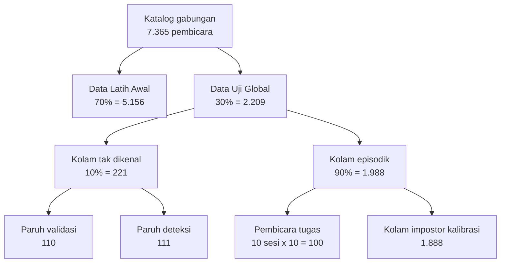

# Laporan Data Penelitian
### Sumber, Prosedur Akuisisi, dan Rancangan Pembagian Data pada Sistem Identifikasi Pembicara Open-Set Inkremental

**Penyusun:** Nilam Mufidah (24/551986/PPA/06994)
**Program:** Magister Kecerdasan Artifisial, Universitas Gadjah Mada
**Rujukan proposal:** Bab 1.3 (Batasan Penelitian), Bab 4.3 (Data Penelitian), Tabel 4.1
**Dokumen teknis pendamping:** [`docs/data.md`](data.md) — referensi ringkas berbasis tabel untuk keperluan implementasi

---

## Daftar Isi

1. [Pendahuluan](#1-pendahuluan)
2. [Dataset Penelitian](#2-dataset-penelitian)
3. [Prosedur Akuisisi Data](#3-prosedur-akuisisi-data)
4. [Rancangan Pembagian Data](#4-rancangan-pembagian-data)
5. [Hasil Pembagian Data](#5-hasil-pembagian-data)
6. [Penjaminan Validitas Data](#6-penjaminan-validitas-data)
7. [Realisasi dan Keterbatasan](#7-realisasi-dan-keterbatasan)
8. [Kesimpulan](#8-kesimpulan)
9. [Daftar Rujukan](#9-daftar-rujukan)

---

## 1. Pendahuluan

### 1.1 Latar belakang dokumen

Penelitian ini membangun sistem identifikasi pembicara yang bekerja pada tiga kondisi sekaligus: mengenali pembicara baru dari satu sampel suara (*one-shot*), membedakan pembicara terdaftar dari pembicara yang belum pernah didaftarkan (*open-set*), serta menambah pembicara baru secara bertahap tanpa pelatihan ulang menyeluruh (*incremental*). Ketiga kondisi tersebut memberi tuntutan yang tidak lazim pada rancangan data.

Pada sistem klasifikasi konvensional, pembagian data cukup dilakukan pada tingkat sampel: sebagian sampel untuk melatih, sebagian untuk menguji. Rancangan semacam itu tidak memadai di sini. Sistem yang diusulkan harus dievaluasi pada kemampuannya menghadapi **pembicara yang belum pernah dilihat sama sekali**, sehingga pembagian data wajib dilakukan pada tingkat **identitas pembicara**, bukan pada tingkat ucapan. Lebih jauh, karena sistem memiliki mekanisme penolakan yang bergantung pada ambang batas (*threshold*) yang harus dikalibrasi dan disetel, diperlukan pemisahan tambahan agar proses penyetelan tidak mencemari angka yang dilaporkan.

Dokumen ini melaporkan secara runtut bagaimana ketiga tuntutan tersebut diterjemahkan menjadi prosedur akuisisi dan skema pembagian data yang konkret, beserta bukti pelaksanaannya.

### 1.2 Tujuan

Laporan ini disusun untuk menjawab tiga pertanyaan secara berurutan:

1. **Data apa yang digunakan**, dan atas dasar apa dataset tersebut dipilih.
2. **Dari mana dan dengan cara apa data tersebut diperoleh**, mengingat dataset yang dipakai tidak terdistribusi secara bebas.
3. **Bagaimana data tersebut dibagi**, mengapa dibagi dengan cara demikian, dan sejauh mana pembagian itu dapat dipertanggungjawabkan.

### 1.3 Ruang lingkup dan sumber angka

Seluruh angka yang disajikan dalam laporan ini bersumber dari artefak yang tersimpan di dalam repositori penelitian, bukan dari catatan manual. Ketertelusuran tiap angka diringkas pada Tabel 1.1.

**Tabel 1.1** Sumber angka yang digunakan dalam laporan ini

| Kelompok angka | Berkas sumber | Dihasilkan oleh |
|---|---|---|
| Jumlah pembicara per dataset | `data/raw/metadata/vox1_meta.csv`, `vox2_meta.csv` | Unduhan resmi dari Oxford VGG |
| Jumlah pembicara tiap partisi | `data/splits/summary.md`, `data/splits/full_split.json` | `scripts/build_splits.py` |
| Komposisi VoxCeleb1/VoxCeleb2 per partisi | `experiments/exp5_leakage_audit.json` | Audit Fase 0a Experiment 5 |
| Cakupan data yang terealisasi | `experiments/exp5_official_log.txt` | `scripts/run_full_evaluation.py` |
| Hasil penyetelan hyperparameter | `experiments/exp3_validation_sweep.json`, `exp5_validation_sweep.json` | Skrip *sweep* validasi |

---

## 2. Dataset Penelitian

### 2.1 Dasar pemilihan

Sesuai Batasan Penelitian pada Bab 1.3 proposal, evaluasi dibatasi pada dua dataset publik, yaitu **VoxCeleb1** dan **VoxCeleb2**. Pemilihan tersebut didasarkan pada empat pertimbangan.

**Pertama, jumlah identitas pembicara yang memadai.** Protokol evaluasi yang digunakan menuntut ratusan pembicara yang saling terpisah untuk mengisi peran-peran yang berbeda (pelatihan, kalibrasi, pengujian bertahap, dan pengujian penolakan). Gabungan kedua dataset menyediakan lebih dari tujuh ribu identitas, jauh melampaui kebutuhan minimum tersebut.

**Kedua, kesesuaian kondisi akustik dengan lingkup penelitian.** Kedua dataset dihimpun dari rekaman wawancara di kanal YouTube, sehingga mengandung derau latar, musik, tepuk tangan, serta variasi kualitas kanal perekaman. Karakteristik ini selaras dengan lingkup penelitian yang menyasar lingkungan umum — rumah, kantor, kafe, dan ruang publik semi-terbuka — dan sekaligus menjadi alasan dataset ini tidak diklaim mewakili lingkungan industri berat atau kondisi akustik ekstrem.

**Ketiga, ketersediaan pembanding.** VoxCeleb merupakan tolok ukur baku pada bidang *speaker verification*, sehingga hasil penelitian dapat diletakkan berdampingan dengan hasil-hasil terpublikasi.

**Keempat, kejelasan status lisensi.** Kedua dataset didistribusikan di bawah lisensi Creative Commons Attribution 4.0 (CC BY 4.0), yang mengizinkan penggunaan untuk keperluan penelitian dengan kewajiban atribusi.

### 2.2 Karakteristik dataset

**Tabel 2.1** Karakteristik VoxCeleb1 dan VoxCeleb2

| Aspek | VoxCeleb1 | VoxCeleb2 |
|---|---|---|
| Jumlah pembicara (proposal, Tabel 4.1) | 1.251 | 6.112 |
| Jumlah pembicara (metadata resmi terkini) | 1.251 | **6.114** |
| Jumlah ucapan | 153.516 | 1.128.246 |
| Total durasi | ≈352 jam | ≈2.442 jam |
| Format berkas | WAV | M4A (AAC) |
| Laju cuplik | 16 kHz | 16 kHz |
| Lisensi | CC BY 4.0 | CC BY 4.0 |

Kedua dataset dirancang agar tidak memiliki irisan identitas pembicara satu sama lain, sehingga keduanya dapat digabungkan menjadi satu katalog tunggal tanpa risiko duplikasi identitas.

### 2.3 Verifikasi jumlah pembicara terhadap Tabel 4.1

Pada saat metadata resmi diunduh dan dihitung ulang, ditemukan selisih kecil terhadap angka yang dikutip pada Tabel 4.1 proposal. Berkas `vox2_meta.csv` yang berlaku saat ini memuat **6.114** pembicara, sedangkan proposal mengutip **6.112** pembicara berdasarkan publikasi Chung dkk. (2018). Dengan demikian total katalog gabungan menjadi **7.365** pembicara, bukan 7.363. Jumlah pembicara VoxCeleb1 tercatat sama persis, yaitu 1.251.

Selisih dua pembicara tersebut berasal dari pemutakhiran berkas metadata oleh penyedia dataset setelah angka publikasi asli diterbitkan. Besarnya kurang dari 0,05% dari total katalog.

Terhadap temuan ini diambil dua keputusan metodologis. **Pertama**, angka yang dilaporkan adalah jumlah aktual hasil perhitungan, bukan angka historis. Fungsi `summarize_catalog` pada modul `src/data/voxceleb.py` sengaja dirancang untuk melaporkan hitungan aktual agar selisih semacam ini tampak, bukan tersamarkan. **Kedua**, seluruh rasio pembagian (70%, 30%, 10%) dihitung terhadap jumlah pembicara aktual. Konsekuensinya, ukuran tiap partisi menyesuaikan secara otomatis dan validitas skema pembagian tidak terpengaruh oleh selisih tersebut.

---

## 3. Prosedur Akuisisi Data

### 3.1 Kendala akses

Berbeda dari metadata-nya, arsip audio VoxCeleb tidak didistribusikan secara terbuka. Oxford VGG mendistribusikannya melalui **perjanjian akses berbasis permintaan**: calon pengguna harus mengajukan permohonan dan menerima kredensial sebelum dapat mengunduh. Volume arsipnya pun besar, yaitu sekitar 40 GB untuk VoxCeleb1 dan 180 GB untuk VoxCeleb2 dalam bentuk terkompresi.

Dua kendala ini — perizinan dan volume — membentuk keseluruhan prosedur akuisisi yang dijelaskan pada subbab berikut. Prosedur tersebut dipisah menjadi tiga jalur agar pekerjaan yang tidak memerlukan audio dapat berjalan tanpa menunggu audio tersedia.

### 3.2 Jalur pertama: akuisisi metadata

Metadata pembicara bersifat terbuka dan berukuran kecil. Tiga berkas diunduh langsung dari sumber resmi sebagaimana dirinci pada Tabel 3.1.

**Tabel 3.1** Berkas metadata dan sumbernya

| Berkas | Alamat sumber | Ukuran | Isi |
|---|---|---|---|
| `vox1_meta.csv` | `https://www.robots.ox.ac.uk/~vgg/data/voxceleb/meta/vox1_meta.csv` | 41 KB | Identitas, jenis kelamin, kewarganegaraan, partisi resmi |
| `vox2_meta.csv` | `https://www.robots.ox.ac.uk/~vgg/data/voxceleb/meta/vox2_meta.csv` | 161 KB | Identitas, jenis kelamin, partisi resmi |
| `vox1_iden_split.txt` | `https://mm.kaist.ac.kr/datasets/voxceleb/meta/iden_split.txt` | 4,8 MB | Daftar ucapan VoxCeleb1 pada tingkat berkas |

Keputusan rancangan yang penting di sini adalah bahwa **seluruh skema pembagian data dapat dijalankan hanya dengan ketiga berkas ini**, tanpa satu byte audio pun. Hal tersebut dimungkinkan karena setiap fungsi pembagian bekerja murni pada daftar identitas pembicara. Manfaatnya bersifat praktis sekaligus metodologis: rancangan pembagian dapat disusun, diverifikasi, dan diuji lebih dahulu, sementara akuisisi audio berjalan sebagai pekerjaan terpisah yang memakan waktu berjam-jam.

Ketiga berkas tersebut disertakan di dalam repositori karena berukuran kecil. Dengan demikian, pembagian data dapat direproduksi sepenuhnya oleh pihak lain tanpa perlu mengunduh apa pun.

Perlu ditegaskan bahwa berkas `vox1_iden_split.txt` memuat partisi identifikasi resmi milik penyedia dataset (latih/validasi/uji). Partisi tersebut **tidak digunakan** sebagai pembagian penelitian ini; ia hanya dimanfaatkan sebagai daftar ucapan. Pembagian penelitian disusun tersendiri sebagaimana dijelaskan pada Bab 4.

### 3.3 Jalur kedua: akuisisi audio melalui kredensial resmi

Jalur resmi tetap disediakan di dalam perkakas penelitian. Setelah permohonan akses disetujui, pengguna menerima tautan unduhan beserta kredensial, lalu menjalankan skrip akuisisi dengan menyertakan tautan dan kredensial tersebut secara eksplisit.

Skrip sengaja dirancang **menolak menebak alamat arsip**: tidak ada satu pun alamat unduhan audio yang ditanam di dalam kode. Rancangan ini mencegah pengunduhan massal yang tidak disengaja terhadap korpus berukuran ratusan gigabyte, sekaligus menjamin bahwa proses akuisisi hanya berjalan atas tindakan sadar penggunanya.

### 3.4 Jalur ketiga: akuisisi audio melalui cermin terbuka

Karena kredensial resmi belum tersedia pada masa pengembangan, audio diperoleh melalui cermin (*mirror*) publik **`ProgramComputer/voxceleb`** yang tersedia di HuggingFace Hub. Cermin ini memuat ulang arsip resmi yang sama, tanpa gerbang perizinan, di bawah lisensi CC BY 4.0 yang identik dengan dataset aslinya.

**Tabel 3.2** Arsip yang diakses melalui cermin terbuka

| Arsip | Ukuran | Isi |
|---|---|---|
| `vox1/vox1_dev_wav.zip` | ≈32,6 GB | WAV, pembicara pengembangan VoxCeleb1 |
| `vox2/vox2_aac_1.zip` | ≈50,0 GB | AAC/M4A, sebagian pembicara pengembangan VoxCeleb2 |
| `vox2/vox2_aac_2.zip` | ≈27,5 GB | AAC/M4A, sisa pembicara pengembangan VoxCeleb2 |

Mengunduh ketiga arsip tersebut secara utuh berarti memindahkan lebih dari 110 GB data, padahal yang dibutuhkan hanyalah sebagian kecil ucapan dari pembicara tertentu. Untuk itu diterapkan teknik **pembacaan sebagian melalui permintaan rentang bita (*HTTP Range request*)**, dengan urutan kerja sebagai berikut:

1. Peladen cermin diperiksa dan terbukti mendukung permintaan rentang bita.
2. Bagian *central directory* arsip ZIP — yaitu daftar isi yang terletak di ujung berkas dan berukuran beberapa megabita — dibaca terlebih dahulu, lalu disimpan sebagai indeks lokal agar tidak perlu dibaca berulang kali.
3. Dari indeks tersebut, entri dikelompokkan menurut identitas pembicara.
4. Hanya rentang bita milik entri yang benar-benar dibutuhkan yang diunduh.

Dengan cara ini, arsip berukuran puluhan gigabita tidak pernah ditarik secara utuh. Pengukuran laju terhadap cermin ini menunjukkan waktu tempuh sekitar 600–650 milidetik per berkas dengan empat proses paralel; penambahan jumlah proses tidak memperbaiki laju dan justru sesekali menyebabkan waktu tunggu terlampaui, sehingga empat proses ditetapkan sebagai nilai baku.

Proses unduhan bersifat dapat dilanjutkan (*resumable*): berkas yang telah tersimpan dan tidak kosong akan dilewati. Daftar berkas hasil unduhan disusun ulang melalui pemindaian direktori pada akhir setiap sesi, sehingga daftar tersebut selalu mencerminkan keadaan sebenarnya di penyimpanan.

### 3.5 Pembatasan volume melalui pencuplikan berkuota

Meskipun teknik pembacaan sebagian telah menekan volume unduhan secara drastis, mengunduh seluruh ucapan dari 7.365 pembicara tetap tidak realistis. Oleh karena itu diterapkan **kuota jumlah ucapan per pembicara** yang besarnya disesuaikan dengan peran tiap partisi dalam evaluasi.

**Tabel 3.3** Kuota unduhan per partisi

| Partisi | Kuota ucapan per pembicara | Pertimbangan |
|---|---|---|
| Data Latih Awal | 14 | Pelatihan dasar memerlukan keragaman ucapan terbanyak; menargetkan ≈19,2 GB, sesuai anggaran penyimpanan ≈20 GB |
| Pembicara tugas | 10 | Memenuhi kebutuhan satu ucapan pendaftaran dan lima ucapan pengujian, dengan margin |
| Kolam pembicara tak dikenal | 5 | Hanya diperlukan sebagai kueri penolakan |
| Cuplikan kolam impostor (300 dari 1.888 pembicara) | 3 | Kalibrasi ambang batas menuntut keragaman identitas, bukan kedalaman ucapan |

Pencuplikan bersifat deterministik terhadap benih acak, sehingga himpunan ucapan yang terunduh dapat direproduksi. Estimasi waktu akuisisi yang tercatat adalah sekitar dua jam untuk porsi VoxCeleb1 dan lebih dari sepuluh jam untuk porsi VoxCeleb2, sehingga keduanya dijalankan sebagai pekerjaan terpisah.

---

## 4. Rancangan Pembagian Data

### 4.1 Prinsip dasar: pemisahan pada tingkat pembicara

Seluruh pembagian dilakukan pada tingkat **identitas pembicara**, bukan pada tingkat ucapan. Prinsip ini merupakan konsekuensi langsung dari sifat sistem yang diusulkan.

Apabila pembagian dilakukan pada tingkat ucapan, seorang pembicara dapat menyumbang sebagian ucapannya ke himpunan pelatihan dan sebagian lagi ke himpunan pengujian. Pada sistem klasifikasi tertutup hal itu lazim. Namun pada penelitian ini, kondisi tersebut akan meruntuhkan justru klaim yang hendak dibuktikan: sistem tidak lagi diuji pada kemampuannya mengenali **pembicara baru** dari satu sampel, melainkan pada kemampuannya mengenali kembali pembicara yang sudah pernah dipelajarinya. Demikian pula, kemampuan menolak pembicara tak dikenal tidak dapat diukur apabila pembicara yang berperan sebagai "tak dikenal" ternyata sudah berkontribusi pada pelatihan.

Karena itu setiap identitas pembicara hanya boleh menempati **satu peran** dalam keseluruhan skema.

Prinsip pendukung kedua adalah **determinisme**. Setiap fungsi pembagian menghasilkan keluaran yang sama persis untuk benih acak yang sama, dan bekerja murni pada daftar identitas tanpa membaca audio. Sebelum dilakukan pengacakan, daftar identitas selalu diurutkan lebih dahulu, sehingga hasil pembagian tidak bergantung pada urutan baris di dalam berkas metadata.

### 4.2 Tingkat pertama: pemisahan dasar

Katalog gabungan sebanyak 7.365 pembicara dibagi menurut rasio **70% : 30%**:

- **Data Latih Awal** (70%) — berperan sebagai basis pembentukan model fusi dan sebagai sumber pasangan *genuine* pada kalibrasi ambang batas.
- **Data Uji Global** (30%) — menampung seluruh peran pengujian dan tidak pernah menyentuh proses pelatihan.

Rasio ini mengikuti ketentuan DR-02 pada dokumen kebutuhan penelitian.

### 4.3 Tingkat kedua: penyisihan kolam pembicara tak dikenal

**Pokok bahasan subbab ini.** Subbab ini membahas penyisihan sekelompok pembicara — sebanyak 221 orang — yang secara sengaja **tidak pernah digunakan oleh sistem dalam bentuk apa pun**: tidak untuk melatih, tidak untuk mendaftar, dan tidak untuk mengkalibrasi ambang batas. Penyisihan tersebut dilakukan semata-mata agar penilaian open-set dapat dilaksanakan secara sah. Uraian berikut menjelaskan mengapa penyisihan itu tidak dapat dihindari.

Secara teknis, dari Data Uji Global disisihkan **10%** sebagai **kolam pembicara tak dikenal** (`reserved_unknown_pool`), sedangkan **90%** sisanya menjadi kolam episodik. Penyisihan ini dilakukan **sebelum** pembicara tugas diambil, dan urutan tersebut merupakan bagian dari rancangan, bukan kebetulan implementasi.

**Persoalan yang hendak dipecahkan.** Klaim inti penelitian ini adalah kemampuan sistem menolak pembicara yang tidak terdaftar. Untuk membuktikannya diperlukan kueri dari pembicara yang benar-benar asing bagi sistem.

Persoalannya menjadi konkret apabila jalannya evaluasi ditelusuri sesi demi sesi. Evaluasi inkremental mendaftarkan sepuluh pembicara baru pada setiap sesi, sebagaimana diilustrasikan pada Tabel 4.1.

**Tabel 4.1** Ilustrasi bertambahnya pembicara terdaftar sepanjang evaluasi inkremental

| Sesi | Pembicara didaftarkan | Kumulatif terdaftar dalam basis data |
|---|---|---|
| 1 | 10 | 10 |
| 2 | 10 | 20 |
| ⋮ | ⋮ | ⋮ |
| 10 | 10 | **100** |

Pada akhir sesi kesepuluh, seluruh 100 pembicara tugas telah terdaftar di dalam basis data sistem. Padahal pertanyaan yang justru hendak dijawab pada tahap itu adalah: *apabila masuk suara dari seseorang yang tidak termasuk dalam 100 pembicara tersebut, apakah sistem menolaknya?* Menjawab pertanyaan ini menuntut ketersediaan suara dari pihak di luar seratus pembicara itu.

Setelah seluruh pembagian disusun, ternyata tidak ada satu pun partisi lain yang dapat mengisi peran tersebut, sebagaimana dirangkum pada Tabel 4.2.

**Tabel 4.2** Alasan partisi lain tidak dapat berperan sebagai sumber kueri tak dikenal

| Partisi | Alasan tidak memenuhi syarat |
|---|---|
| Data Latih Awal | Merupakan data pelatihan sekaligus sumber pasangan *genuine* kalibrasi; sistem justru dibangun dari data ini |
| Pembicara tugas | Seluruhnya **didaftarkan secara bertahap** sepanjang sepuluh sesi inkremental; setelah sesi terakhir tidak tersisa satu pun yang berstatus tak dikenal |
| Kolam impostor kalibrasi | Sudah digunakan untuk **menetapkan** ambang batas; menggunakannya kembali untuk mengukur kinerja penolakan berarti menguji di atas data yang dipakai menyetel, sehingga hasilnya dipastikan optimistis |

Dengan demikian, kolam khusus harus disisihkan lebih dahulu dan tidak pernah disentuh oleh proses lain. **Tiga hal yang dicapai** melalui penyisihan ini adalah:

1. **Metrik penolakan menjadi sah untuk diukur.** Equal Error Rate (EER), Area Under ROC Curve (AUROC), dan True Acceptance Rate pada laju penerimaan salah tertentu (TAR@FAR) dihitung terhadap pembicara yang tidak pernah dilihat sistem dalam bentuk apa pun — tidak saat pelatihan, tidak saat pendaftaran, dan tidak saat kalibrasi.
2. **Keterpisahan terjamin sejak konstruksi, bukan melalui penyaringan susulan.** Karena kolam ini dipotong sebelum sesi episodik dibentuk, kebocoran identitas secara struktural tidak mungkin terjadi. Tidak ada langkah penyaringan tambahan yang berpotensi terlupakan.
3. **Kapabilitas yang tidak dimiliki metode pembanding menjadi terukur.** Metode pembanding closed-set tidak memiliki mekanisme penolakan sama sekali. Tanpa kolam ini, keunggulan sistem usulan pada dimensi tersebut tidak akan pernah muncul sebagai angka.

Perlu dicatat bahwa pada Experiment 1 dan 2 kolam ini belum digunakan dan berstatus cadangan. Kolam tersebut tetap disisihkan sejak awal justru agar skema pembagian **tidak perlu diubah** ketika kebutuhan pengukuran penolakan muncul pada Experiment 3. Apabila kolam baru dibentuk belakangan, seluruh hasil Experiment 1 dan 2 tidak lagi sebanding dengan hasil sesudahnya.

Ringkasnya, subbab ini membahas penyediaan **sumber kueri tak dikenal yang sah**. Tanpa penyisihan tersebut, metrik penolakan yang dilaporkan pada Experiment 3 dan 5 — Equal Error Rate sebesar 0,075 dan AUROC sebesar 0,972 pada konfigurasi terbaik — tidak akan dapat dihitung sama sekali, bukan karena hasilnya buruk, melainkan karena tidak tersedia data yang sah untuk menghitungnya. Subbab 4.6 kemudian membahas persoalan lanjutan yang berbeda, yaitu bagaimana kolam ini dijaga agar tetap sah ketika parameter sistem perlu disetel.

### 4.4 Tingkat ketiga: pembentukan sesi episodik

Dari kolam episodik diambil **100 pembicara**, yang kemudian dipotong menjadi **sepuluh sesi berisi sepuluh pembicara**. Skema ini mengadaptasi protokol *Few-Shot Class-Incremental Learning* dari Tao dkk. (2020) sebagaimana ditetapkan pada DR-04, dan mensimulasikan situasi nyata ketika pembicara baru berdatangan secara bertahap.

Sisa kolam episodik, yaitu 1.888 pembicara, menjadi **kolam impostor kalibrasi**, yang berperan sebagai sumber pasangan *impostor* dalam penetapan ambang batas.

### 4.5 Tingkat keempat: pembagian himpunan pendukung dan kueri

Di dalam setiap tugas, ucapan milik tiap pembicara dibagi menjadi dua peran:

- **Himpunan pendukung** (*support set*) — sebanyak K ucapan yang berperan sebagai data pendaftaran. Penelitian ini menetapkan **K = 1**, sesuai dengan pendekatan *one-shot* yang menjadi judul penelitian.
- **Himpunan kueri** (*query set*) — ucapan sisanya, yang berperan sebagai data pengujian. Pada eksekusi resmi digunakan lima ucapan kueri per pembicara.

Pembagian ini menolak pembicara yang memiliki kurang dari K+1 ucapan, sehingga himpunan kueri dijamin tidak pernah kosong.

Konfigurasi episodik yang dijalankan adalah sepuluh sesi berisi sepuluh pembicara, dengan satu ucapan pendaftaran dan lima ucapan kueri, diulang sebanyak lima kali dengan benih acak berbeda.

### 4.6 Pembelahan kolam tak dikenal untuk pencegahan *overfitting*

**Pokok bahasan subbab ini.** Subbab ini membahas pembelahan **satu partisi saja**, yaitu kolam pembicara tak dikenal sebanyak 221 orang yang telah disisihkan pada Subbab 4.3. Partisi lain tidak ikut dibelah, sebagaimana ditegaskan pada Tabel 4.3.

**Tabel 4.3** Partisi yang dibelah dan yang tidak dibelah pada tahap ini

| Partisi | Jumlah | Dibelah pada tahap ini? |
|---|---|---|
| Data Latih Awal | 5.156 | Tidak — tetap utuh |
| Kolam episodik | 1.988 | Tidak — tetap utuh |
| Pembicara tugas | 100 | Tidak — tetap utuh |
| Kolam impostor kalibrasi | 1.888 | Tidak — tetap utuh |
| **Kolam pembicara tak dikenal** | **221** | **Ya — menjadi 110 dan 111** |

Sejak Experiment 3, kolam pembicara tak dikenal tersebut **dibelah** menjadi dua paruh yang saling terpisah pada tingkat pembicara.

**Alasannya secara sederhana.** Kolam 221 pembicara itu dituntut memikul dua tugas yang saling bertentangan:

- **Tugas pertama**, menjadi bahan percobaan untuk menentukan nilai parameter yang paling sesuai — misalnya apakah sasaran laju penolakan salah sebaiknya ditetapkan pada 1%, 5%, 10%, atau 15%, dan apakah normalisasi skor perlu diterapkan.
- **Tugas kedua**, menjadi bahan penilaian akhir yang angkanya dilaporkan sebagai kinerja penolakan sistem.

Apabila kedua tugas tersebut dibebankan pada kelompok pembicara yang sama, hasil penilaiannya cacat. Keadaannya serupa dengan ujian yang soalnya sama persis dengan soal latihan yang telah dibahas sebelumnya: nilai tinggi yang diperoleh tidak membuktikan penguasaan materi, melainkan hanya membuktikan bahwa soalnya sudah pernah dilihat. Dalam konteks penelitian ini, parameter akan terpilih justru karena kebetulan paling cocok bagi 221 pembicara tersebut, lalu dinilai kembali menggunakan 221 pembicara yang sama.

Penyelesaiannya adalah memisahkan pembicaranya: **110 pembicara** khusus untuk percobaan penentuan parameter, dan **111 pembicara** yang tidak pernah dipakai bereksperimen sama sekali dan hanya digunakan satu kali pada akhir untuk menghitung angka yang dilaporkan. Tidak ada satu pembicara pun yang memikul kedua tugas.

**Uraian teknis persoalan.** Experiment 3 memperkenalkan sejumlah parameter yang nilainya harus dipilih, yaitu sasaran laju penolakan salah (`target_frr`), parameter normalisasi skor adaptif (ukuran kohort dan jumlah tetangga teratas), dan — sejak Experiment 5 — bobot penggabungan skor antar-*backbone*. Nilai-nilai tersebut harus ditentukan di suatu tempat, dan setiap pilihan tempat membawa konsekuensinya sendiri:

- Apabila disetel pada **pembicara tugas**, penyetelan dilakukan di atas himpunan uji yang angkanya justru dilaporkan sebagai akurasi sistem. Angka tersebut menjadi tidak sah.
- Apabila disetel pada **keseluruhan kolam tak dikenal**, penyetelan dilakukan di atas pembicara yang sama yang nantinya dipakai melaporkan metrik penolakan. Karena parameter yang disetel justru merupakan parameter yang mengatur pertukaran antara penerimaan dan penolakan, kebocorannya bersifat langsung, bukan halus.

Pembelahan kolam menyelesaikan kedua persoalan tersebut sekaligus.

**Tabel 4.4** Peran kedua paruh kolam tak dikenal

| Paruh | Jumlah pembicara | Peran |
|---|---|---|
| Paruh validasi | 110 | Membentuk tugas validasi tempat seluruh parameter disapu nilainya lalu **dikunci** |
| Paruh deteksi | 111 | **Hanya** menjadi sumber kueri tak dikenal bagi metrik penolakan yang dilaporkan; tidak pernah disentuh proses penyetelan |

**Tiga hal yang dicapai** melalui pembelahan ini adalah:

1. **Parameter dipilih dan dikunci pada data yang berbeda dari data pelaporan.** Penyapuan Experiment 3 mengunci konfigurasi normalisasi skor dan sasaran laju penolakan salah murni dari paruh validasi; penyapuan Experiment 5 mengunci bobot penggabungan dengan cara yang sama. Eksekusi resmi baru dijalankan **satu kali** untuk tiap konfigurasi setelah nilai terkunci, sehingga hasil akhir bukan hasil pemilihan dari beberapa percobaan.
2. **Metrik penolakan yang dilaporkan tetap bersih.** Prosedur evaluasi resmi secara sengaja hanya mengambil paruh deteksi, sehingga paruh validasi secara struktural tidak dapat masuk ke dalam angka akhir.
3. **Batas antar-paruh tidak dapat melenceng.** Enam pemanggil yang berbeda — meliputi seluruh skrip penyapuan, prosedur evaluasi resmi, dan berkas pengujian — memanggil **fungsi pembelah yang sama**, alih-alih menurunkan pembelahan masing-masing. Apabila tiap skrip membelah dengan caranya sendiri, satu perbedaan benih atau urutan saja sudah cukup untuk membocorkan paruh deteksi ke dalam proses penyetelan tanpa disadari.

Dengan demikian, kolam tak dikenal menjawab pertanyaan *"dari mana kueri tak dikenal yang sah diperoleh?"*, sedangkan pembelahan kolam menjawab pertanyaan *"di mana parameter boleh disetel agar kueri tersebut tetap sah?"*. Keduanya secara bersama-sama membentuk pertahanan tiga lapis: penyetelan dilakukan di paruh validasi, pelaporan akurasi di pembicara tugas, dan pelaporan penolakan di paruh deteksi — ketiganya terpisah pada tingkat pembicara.

**Harga yang harus dibayar** dicatat secara terbuka. Pembelahan memangkas tiap paruh menjadi sekitar 110 pembicara. Selain itu, karena audio kolam tak dikenal hanya diunduh lima ucapan per pembicara, tugas validasi terpaksa menggunakan empat ucapan kueri, bukan lima seperti pada eksekusi resmi. Ini merupakan satu-satunya penyimpangan protokol antara tugas validasi dan eksekusi resmi.

### 4.7 Skema kalibrasi ambang batas

**Pokok bahasan subbab ini.** Perlu ditegaskan lebih dahulu bahwa ambang batas melibatkan **tiga kegiatan yang berbeda dengan sumber data yang berbeda pula**, dan ketiganya mudah tertukar apabila tidak dipisahkan secara eksplisit. Pemetaannya disajikan pada Tabel 4.5.

**Tabel 4.5** Pemisahan kegiatan yang berkaitan dengan ambang batas

| Kegiatan | Sumber data | Keluaran |
|---|---|---|
| Menghitung nilai ambang batas | Data Latih Awal (pasangan *genuine*) + kolam impostor kalibrasi (pasangan *impostor*) | Nilai ambang, misalnya −1,5766 pada Experiment 5b |
| Memilih aturan penghitungannya | Paruh validasi (110 pembicara) | Konfigurasi terkunci, misalnya `target_frr` = 0,05 dan `top_k` = 200 |
| Menilai kinerja hasilnya | Paruh deteksi (111 pembicara) | Metrik penolakan: EER, AUROC, TAR@FAR |

Penegasan terpenting dari tabel di atas adalah bahwa **paruh deteksi tidak ikut menentukan ambang batas dalam bentuk apa pun**. Kelompok tersebut tidak menyumbang pasangan kalibrasi, tidak memengaruhi pemilihan parameter, dan hanya digunakan satu kali pada akhir sebagai bahan penilaian. Apabila kelompok tersebut ikut menentukan ambang batas, justru terjadi persis pencemaran yang hendak dicegah oleh Subbab 4.6.

Urutan pelaksanaannya adalah sebagai berikut:

1. Aturan penghitungan disapu nilainya pada paruh validasi, lalu **dikunci**.
2. Aturan yang telah terkunci diterapkan pada pasangan *genuine* dari Data Latih Awal dan pasangan *impostor* dari kolam impostor kalibrasi, sehingga menghasilkan nilai ambang batas.
3. Sistem dijalankan dengan ambang batas tersebut, kemudian dinilai menggunakan paruh deteksi.

**Penetapan sumber pasangan kalibrasi.** Peran pembicara dalam pembentukan pasangan untuk kalibrasi ditetapkan sekali di satu tempat, sebagaimana diamanatkan DR-05:

**Tabel 4.6** Sumber pembicara untuk pasangan kalibrasi

| Peran pasangan | Sumber pembicara |
|---|---|
| Pasangan *genuine* | Data Latih Awal |
| Pasangan *impostor* | Kolam impostor kalibrasi |

Penetapan keanggotaan ini dilakukan pada tahap pembagian data, terpisah dari pembentukan pasangan jarak sebenarnya yang baru dapat dilakukan setelah model tersedia. Pemisahan tersebut memastikan keputusan mengenai *pembicara mana yang boleh mengisi peran apa* dibuat sekali saja dan terbukti terpisah dari kolam tugas maupun kolam tak dikenal.

Pada eksekusi resmi Experiment 5b, kalibrasi berjalan di atas 295 pembicara impostor yang tersedia dan menghasilkan ambang batas −1,5766, sementara penilaian penolakan dilakukan terhadap 530 kueri dari 106 pembicara paruh deteksi — dua kegiatan yang tercatat terpisah pada berkas log eksekusi.

### 4.8 Ringkasan urutan dan determinisme

**Tabel 4.7** Urutan tahap pembagian dan aliran acak yang digunakan

| Tahap | Keluaran | Aliran acak |
|---|---|---|
| 1 | Data Latih Awal / Data Uji Global | Benih |
| 2 | Kolam tak dikenal / kolam episodik | Benih + 1 |
| 3 | Pembicara tugas / kolam impostor kalibrasi | Benih + 2 |
| 4 | Himpunan pendukung / himpunan kueri | Benih + 3 |
| 5 | Paruh validasi / paruh deteksi | Benih + 3 |

Setiap tahap menggunakan aliran bilangan acak yang berbeda melalui penggeseran benih, agar hasil antar-tahap tidak berkorelasi. **Benih yang digunakan pada seluruh eksperimen adalah 0**, dan tidak pernah diubah sejak Experiment 1 hingga Experiment 5.

---

## 5. Hasil Pembagian Data

### 5.1 Struktur hierarki

### 5.2 Jumlah pembicara tiap partisi

**Tabel 5.1** Hasil pembagian data pada benih 0

| Partisi | Jumlah pembicara | Peran |
|---|---|---|
| Katalog gabungan | 7.365 | 1.251 VoxCeleb1 + 6.114 VoxCeleb2 |
| Data Latih Awal | 5.156 | Pelatihan model fusi, pasangan *genuine* kalibrasi, kohort normalisasi skor |
| Data Uji Global | 2.209 | Induk seluruh partisi pengujian |
| — Kolam tak dikenal | 221 | Sumber kueri penolakan (sejak Experiment 3) |
| — Kolam episodik | 1.988 | Induk pembicara tugas dan kolam impostor |
| —— Pembicara tugas | 100 | Evaluasi inkremental sepuluh sesi |
| —— Kolam impostor kalibrasi | 1.888 | Pasangan *impostor* kalibrasi ambang batas |

### 5.3 Komposisi menurut dataset asal

**Tabel 5.2** Komposisi tiap partisi menurut dataset asal

| Partisi | VoxCeleb1 | VoxCeleb2 (dev) | VoxCeleb2 (test) | Jumlah |
|---|---|---|---|---|
| Data Latih Awal | 868 | 4.196 | 92 | 5.156 |
| Pembicara tugas | 19 | 80 | 1 | 100 |
| Kolam tak dikenal | 41 | 173 | 7 | 221 |
| Kolam impostor kalibrasi | 323 | 1.545 | 20 | 1.888 |

Perlu ditegaskan bahwa **pembagian ini berlaku sama untuk seluruh eksperimen (1 sampai 5)**. Tidak ada satu eksperimen pun yang menggunakan pembagian data berbeda. Berkas sumber Tabel 5.2 kebetulan dihasilkan pada tahap awal Experiment 5, namun berkas tersebut hanya **membaca** pembagian yang sudah ada dan tidak membentuk pembagian baru. Yang berubah antar-eksperimen adalah *pemanfaatan* partisi — kolam tak dikenal menganggur pada Experiment 1 dan 2, lalu dibelah dan digunakan sejak Experiment 3 — bukan pembagiannya.

### 5.4 Kesesuaian terhadap kebutuhan data

**Tabel 5.3** Kesesuaian hasil terhadap ketentuan DR-01 sampai DR-06

| Ketentuan | Isi ketentuan | Realisasi | Status |
|---|---|---|---|
| DR-01 | VoxCeleb1 + VoxCeleb2, saling terpisah | 1.251 + 6.114 = 7.365; keterpisahan diverifikasi program | Terpenuhi |
| DR-02 | 70% latih awal / 30% uji global | 5.156 / 2.209 | Terpenuhi |
| DR-03 | 10% Data Uji Global sebagai kolam simpanan | 221 dari 2.209 | Terpenuhi |
| DR-04 | 10 sesi × 10-way × K=1 | 100 pembicara tugas, sepuluh sesi | Terpenuhi |
| DR-05 | Pasangan kalibrasi terpisah tegas dari data uji | Ditetapkan pada tahap pembagian; keterpisahan diverifikasi | Terpenuhi |
| DR-06 | Support 1–5 sampel; query campuran | K = 1, lima ucapan kueri | Terpenuhi |

Proposal memperkirakan Data Latih Awal berisi sekitar 5.154 pembicara; realisasinya 5.156 pembicara, sebagai konsekuensi langsung dari selisih dua pembicara pada metadata yang dijelaskan pada Subbab 2.3.

---

## 6. Penjaminan Validitas Data

Dua bentuk kebocoran yang berbeda diperiksa dalam penelitian ini. Keduanya perlu dibedakan secara tegas karena memiliki sifat, dampak, dan penanganan yang berlainan.

### 6.1 Kebocoran antar-partisi

Bentuk kebocoran pertama adalah munculnya satu identitas pembicara pada lebih dari satu partisi. Kebocoran semacam ini bersifat fatal karena meruntuhkan seluruh dasar pengukuran, namun sepenuhnya berada dalam kendali peneliti.

Tiga lapis penjagaan diterapkan:

1. **Penolakan pada tahap pembentukan katalog.** Penggabungan metadata VoxCeleb1 dan VoxCeleb2 akan ditolak apabila ditemukan identitas yang muncul pada kedua dataset, atau apabila terdapat baris ganda dalam katalog gabungan.
2. **Pemeriksaan wajib sebelum hasil pembagian dikembalikan.** Prosedur pembagian memeriksa setiap pasangan partisi dan menghentikan eksekusi dengan galat apabila ditemukan irisan.
3. **Pengujian otomatis yang bersifat memblokir.** Berkas pengujian memverifikasi ulang kedua jaminan di atas, dan kegagalannya menghentikan rangkaian pengujian.

Yang perlu digarisbawahi secara metodologis adalah bahwa ketiga lapis tersebut memakai **satu definisi tunggal** mengenai apa yang dihitung sebagai kebocoran. Definisi itu tidak diturunkan ulang secara terpisah di masing-masing tempat, sehingga tidak mungkin terjadi perbedaan tafsir antara kode pelaksana dan kode penguji. Berdasarkan pemeriksaan tersebut, kebocoran antar-partisi pada penelitian ini **nihil**.

### 6.2 Kebocoran pada tahap pralatih *backbone*

Bentuk kebocoran kedua bersifat berbeda dan tidak sepenuhnya dapat dihindari. Sistem yang diusulkan memanfaatkan *backbone* pralatih dalam keadaan beku, dan hampir seluruh model pengekstrak ciri pembicara yang tersedia secara publik dilatih pada partisi pengembangan VoxCeleb2. Karena mayoritas pembicara evaluasi pada penelitian ini juga berasal dari VoxCeleb2, terdapat kemungkinan nyata bahwa *backbone* telah melihat sebagian pembicara evaluasi pada saat pralatih.

Audit dilakukan dengan mencocokkan seluruh daftar identitas pada tiap partisi terhadap metadata resmi partisi pengembangan dan pengujian VoxCeleb2. Hasilnya disajikan pada Tabel 6.1.

**Tabel 6.1** Hasil audit irisan terhadap partisi pengembangan VoxCeleb2

| Partisi | Jumlah | Terdapat pada VoxCeleb2-dev | Proporsi |
|---|---|---|---|
| Pembicara tugas | 100 | 80 | 80,0% |
| Kolam tak dikenal | 221 | 173 | 78,3% |
| Kolam impostor kalibrasi | 1.888 | 1.545 | 81,8% |
| Data Latih Awal | 5.156 | 4.196 | 81,4% |

Terhadap temuan ini diambil tiga sikap.

**Pertama**, angka akurasi mutlak yang dilaporkan **tidak diklaim** sebagai kemampuan generalisasi terhadap pembicara yang benar-benar belum pernah dilihat model mana pun. Terdapat kemungkinan bias optimistis yang berasal dari tahap pralatih, dan kemungkinan itu dinyatakan secara terbuka.

**Kedua**, **perbandingan antar-konfigurasi tetap sahih**. Seluruh konfigurasi yang dibandingkan — sistem usulan, varian ablasinya, dan seluruh metode pembanding — mengalami kondisi irisan yang sama. Karena itu selisih antar-konfigurasi, yang justru merupakan temuan utama penelitian, tidak terpengaruh oleh temuan ini.

**Ketiga**, sebuah kandidat *backbone* yang bebas dari persoalan ini, yaitu model swa-selia yang dipralatih tanpa VoxCeleb, sempat dipertimbangkan sebagai pilihan utama justru demi ketahanan argumentasi. Kandidat tersebut gagal memenuhi ambang kinerja minimum karena arsitekturnya menuntut kepala klasifikasi terlatih, sedangkan batasan penelitian ini mengharuskan *backbone* digunakan dalam keadaan beku. Kegagalan tersebut didokumentasikan sebagai hasil negatif, bukan disembunyikan.

Audit ini dilaporkan secara utuh karena kejujuran mengenai batas keberlakuan hasil merupakan bagian dari mutu penelitian itu sendiri.

---

## 7. Realisasi dan Keterbatasan

### 7.1 Cakupan yang terealisasi

Skema pembagian pada Bab 4 disusun di atas keseluruhan 7.365 pembicara. Namun cakupan audio yang benar-benar tersedia pada eksekusi resmi lebih kecil, sebagaimana disajikan pada Tabel 7.1. Prosedur evaluasi hanya menggunakan ucapan yang telah tersedia representasi terhitungnya, dan hanya pembicara yang memiliki cukup ucapan untuk mengisi himpunan pendukung sekaligus himpunan kueri.

**Tabel 7.1** Cakupan data pada eksekusi resmi

| Aspek | Nilai terealisasi |
|---|---|
| Data Latih Awal yang terpakai | 71 pembicara, 993 ucapan |
| Pembicara tugas beraudio | 99 dari 100, tersebar pada sepuluh dari sepuluh sesi |
| Kolam impostor tersedia | 295 pembicara |
| Kueri tak dikenal | 106 pembicara, 530 ucapan |
| Jumlah pengulangan | 5 (sasaran proposal: 10) |

### 7.2 Pembahasan keterbatasan

Selisih antara 5.156 pembicara yang didefinisikan dan 71 pembicara yang terpakai pada pelatihan dasar merupakan **keterbatasan paling substansial** pada penelitian ini, dan dinyatakan secara eksplisit di setiap dokumen eksperimen. Selisih tersebut berasal dari kombinasi anggaran waktu akuisisi dan waktu penghitungan representasi, keduanya berskala jam hingga belasan jam.

Yang perlu dibedakan adalah bahwa **yang berkurang adalah cakupan, bukan keabsahan jalur eksekusi**. Seluruh mekanisme — kalibrasi ambang batas, prosedur evaluasi inkremental sepuluh sesi, perhitungan metrik penolakan, serta pengujian signifikansi statistik — berjalan sepenuhnya di atas audio VoxCeleb nyata, bukan data pengganti atau data sintetis.

Keterbatasan ini bahkan memiliki nilai penjelas. Temuan Experiment 1 — bahwa penalaan episodik justru merusak kualitas representasi pralatih — merupakan konsekuensi langsung dari skala pelatihan dasar yang kecil, dan temuan tersebut mengarahkan seluruh rangkaian eksperimen berikutnya menuju pendekatan *backbone* beku yang akhirnya memberikan hasil terbaik.

**Tabel 7.2** Ringkasan keterbatasan data

| No. | Keterbatasan | Dampak | Penanganan |
|---|---|---|---|
| 1 | Pelatihan dasar hanya mencakup 71 dari 5.156 pembicara | Akurasi mutlak dan kesimpulan mengenai penalaan episodik terikat pada skala kecil | Dinyatakan eksplisit di seluruh dokumen eksperimen |
| 2 | Sekitar 80% pembicara evaluasi beririsan dengan data pralatih *backbone* | Kemungkinan bias optimistis pada angka mutlak | Diaudit dan dilaporkan; perbandingan antar-konfigurasi tetap sahih |
| 3 | Pengulangan lima kali, bukan sepuluh | Selang kepercayaan lebih lebar | Dicatat; pengujian signifikansi tetap dijalankan dengan koreksi Bonferroni |
| 4 | Tugas validasi memakai empat ucapan kueri, bukan lima | Penyimpangan protokol minor | Dicatat terbuka; konsekuensi kuota lima ucapan pada kolam tak dikenal |
| 5 | Satu dari 100 pembicara tugas tanpa audio | Cakupan evaluasi 99 dari 100 | Dilaporkan pada tiap eksekusi |
| 6 | Audio diperoleh melalui cermin pihak ketiga | Integritas bergantung pada cermin | Cermin memuat ulang arsip resmi yang sama dengan lisensi identik |

---

## 8. Kesimpulan

Laporan ini memaparkan rancangan dan pelaksanaan pengelolaan data pada penelitian sistem identifikasi pembicara open-set inkremental. Empat hal dapat disimpulkan.

**Pertama**, dataset yang digunakan adalah VoxCeleb1 dan VoxCeleb2 dengan total 7.365 pembicara. Selisih dua pembicara terhadap Tabel 4.1 proposal berasal dari pemutakhiran metadata oleh penyedia dataset, telah diverifikasi, dan tidak memengaruhi validitas skema karena seluruh rasio dihitung terhadap jumlah aktual.

**Kedua**, akuisisi data ditempuh melalui tiga jalur yang terpisah sesuai sifat kendala masing-masing. Metadata diperoleh secara terbuka dan cukup untuk menjalankan seluruh skema pembagian tanpa audio. Audio diperoleh melalui cermin terbuka dengan teknik pembacaan sebagian berbasis permintaan rentang bita, sehingga arsip berukuran lebih dari 110 GB tidak pernah diunduh utuh, dan dibatasi lebih lanjut melalui kuota ucapan per pembicara yang disesuaikan dengan peran tiap partisi.

**Ketiga**, pembagian data dilakukan pada tingkat identitas pembicara melalui lima tahap berjenjang yang bersifat deterministik terhadap benih acak. Dua tahap di antaranya — penyisihan kolam pembicara tak dikenal dan pembelahannya menjadi paruh validasi dan paruh deteksi — dirancang khusus untuk menjawab tuntutan protokol open-set: yang pertama menyediakan sumber kueri penolakan yang sah, dan yang kedua memastikan penyetelan parameter tidak mencemari metrik yang dilaporkan. Keduanya bersama-sama membentuk pemisahan tiga lapis antara penyetelan, pelaporan akurasi, dan pelaporan penolakan.

**Keempat**, validitas data dijaga melalui pemeriksaan otomatis yang bersifat memblokir untuk kebocoran antar-partisi, yang hasilnya nihil, serta melalui audit terbuka atas irisan antara pembicara evaluasi dan data pralatih *backbone*, yang hasilnya menunjukkan irisan sekitar 80% dan dilaporkan apa adanya beserta batas keberlakuan yang menyertainya.

Keterbatasan cakupan audio yang terealisasi diakui sebagai keterbatasan utama penelitian ini dan dinyatakan secara terbuka, dengan penegasan bahwa yang berkurang adalah cakupan data, bukan keabsahan prosedur yang dijalankan di atasnya.

---

## 9. Daftar Rujukan

1. Nagrani, A., Chung, J. S., & Zisserman, A. (2017). VoxCeleb: A large-scale speaker identification dataset. *Proceedings of Interspeech 2017*.
2. Chung, J. S., Nagrani, A., & Zisserman, A. (2018). VoxCeleb2: Deep speaker recognition. *Proceedings of Interspeech 2018*.
3. Tao, X., Hong, X., Chang, X., Dong, S., Wei, X., & Gong, Y. (2020). Few-shot class-incremental learning. *Proceedings of the IEEE/CVF Conference on Computer Vision and Pattern Recognition (CVPR) 2020*.
4. Desplanques, B., Thienpondt, J., & Demuynck, K. (2020). ECAPA-TDNN: Emphasized channel attention, propagation and aggregation in TDNN based speaker verification. *Proceedings of Interspeech 2020*.

Rujukan lengkap mengenai kandidat *backbone* dan dasar literatur pemilihannya disajikan pada [`docs/experiment-5.md`](experiment-5.md).

---

## Lampiran: Berkas Terkait

**Tabel L.1** Berkas implementasi dan artefak yang mendasari laporan ini

| Berkas | Peran |
|---|---|
| `src/data/voxceleb.py` | Pembacaan metadata resmi dan pembentukan katalog gabungan |
| `src/data/splits.py` | Seluruh logika pembagian data pada kelima tahap |
| `src/data/remote_zip_audio.py` | Akuisisi audio berkuota melalui permintaan rentang bita |
| `scripts/download_voxceleb.py` | Akuisisi metadata dan audio jalur resmi |
| `scripts/build_splits.py` | Pelaksanaan dan penyimpanan hasil pembagian |
| `scripts/fetch_capped_base_train_audio.py`, `scripts/fetch_capped_eval_audio.py` | Akuisisi audio berkuota per partisi |
| `data/splits/full_split.json` | Definisi lengkap pembagian dalam bentuk daftar identitas |
| `data/splits/summary.md` | Ringkasan hasil pembagian |
| `experiments/exp5_leakage_audit.json` | Hasil audit irisan terhadap VoxCeleb2 |
| `tests/test_data_splits.py` | Pengujian memblokir untuk jaminan keterpisahan |
