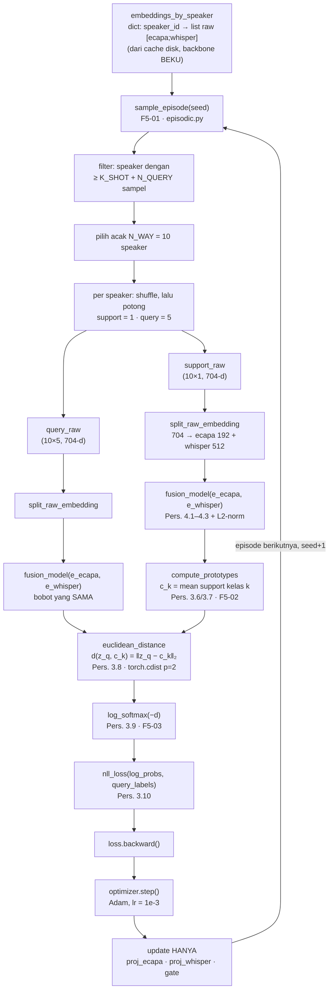
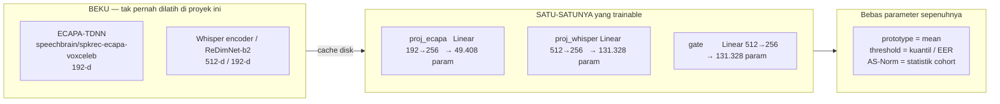
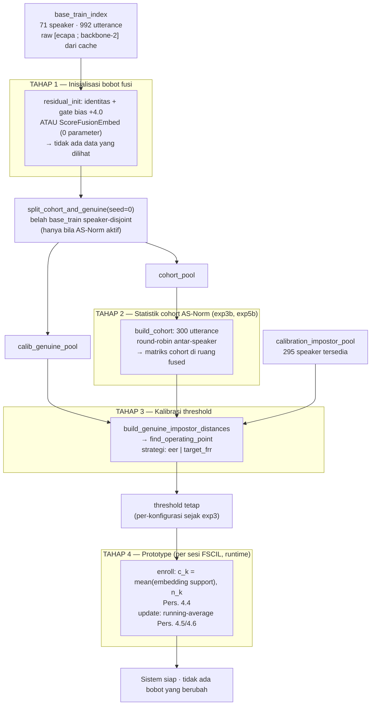
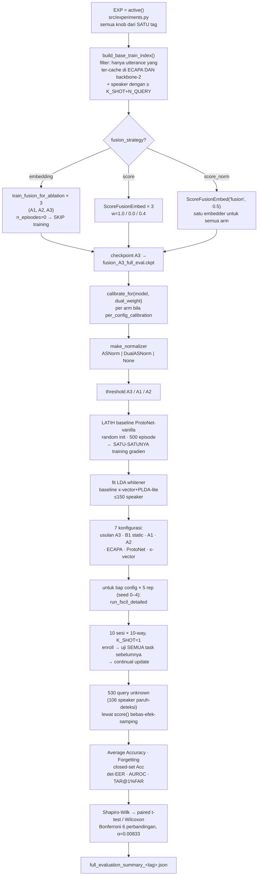
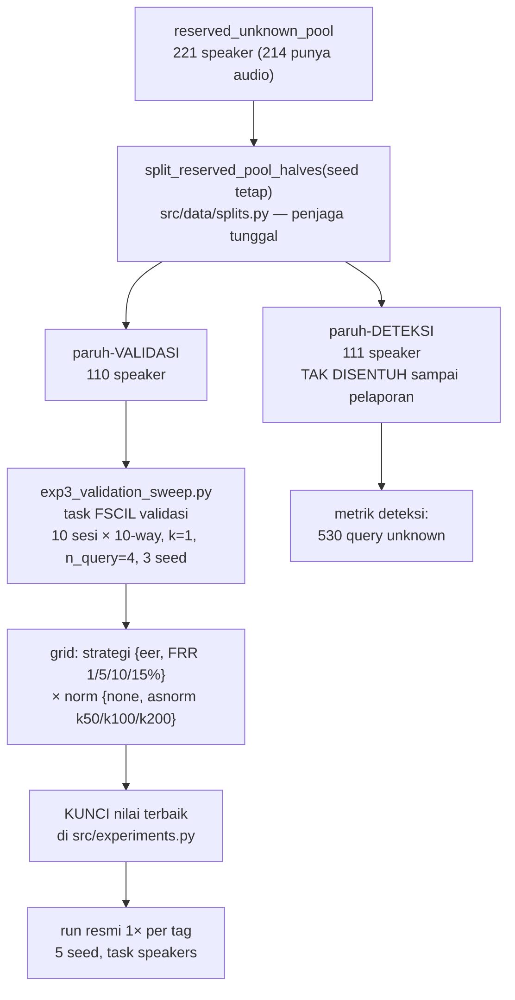

# Proses Training Model — Experiment 1–5

**Cakupan:** seluruh proses "pembelajaran" sistem dari Experiment 1 sampai 5 — apa yang dilatih, apa yang dibekukan, apa yang menggantikan training, dan bagaimana arsitektur alirannya.
**Dokumen terkait:** [experiment-1.md](experiment-1.md) · [experiment-2.md](experiment-2.md) · [experiment-3.md](experiment-3.md) · [experiment-4.md](experiment-4.md) · [experiment-5.md](experiment-5.md) · [README.md](README.md)
**Modul inti:** `src/prototypical/train.py` · `src/evaluation/ablation.py` · `src/models/fusion.py` · `src/experiments.py` · `scripts/run_full_evaluation.py`

---

## 0. Ringkasan Eksekutif — jawaban singkat

> **Experiment 1–5 adalah sistem BEBAS-PELATIHAN (training-free).** Tidak ada satu pun parameter yang dilatih dengan gradien pada konfigurasi mana pun yang dilaporkan. `n_train_episodes = 0` di semua tag dari `exp1_frozen_residual` sampai `exp5b_redimnet_fusion`.

Loop training gradien **ada, lengkap, dan berfungsi** di `src/prototypical/train.py::train_episodic` — tapi hanya dieksekusi oleh dua hal:

1. **`baseline_v0`** (Experiment 0) — 500 episode, hasilnya 0.235 (gagal), dipertahankan sebagai regresi acuan.
2. **Baseline `ProtoNet_vanilla`** — dilatih 500 episode dari init acak di **setiap** run, sengaja dipertahankan lemah sebagai titik pembanding naif.

| Tag | `residual_init` | `n_train_episodes` | Param trainable | Akurasi usulan |
|---|---|---|---|---|
| `baseline_v0` | False | **500** | 312.064 (dilatih) | 0.235 |
| `exp1_frozen_residual` | True | **0** | 312.064 (dibekukan) | 0.731 |
| `exp2a_scorefusion_L4` | True | **0** | **0** (bebas-parameter) | 0.733 |
| `exp3a_lowfrr` | True | **0** | 312.064 (dibekukan) | 0.732 |
| `exp3b_asnorm` / `exp3c` | True | **0** | 312.064 (dibekukan) | **0.865** |
| Experiment 4 | — | — | — | *(analisis, tanpa tag)* |
| `exp5b_redimnet_fusion` | True | **0** | **0** (bebas-parameter) | **0.908** |

Jadi pertanyaan "bagaimana arsitektur training model-nya" punya dua jawaban yang harus dipisahkan tegas, dan itulah struktur dokumen ini:

- **§2–§4** — arsitektur training gradien yang **dirancang** (dan kenapa ditinggalkan).
- **§5–§7** — empat tahap *parameter fitting* yang **menggantikannya**, yaitu yang sebenarnya berjalan di Experiment 1–5.

---

## 1. Dua Pengertian "Training" yang Harus Dipisahkan

Kebingungan paling umum di proyek ini muncul karena kata "training" dipakai untuk dua hal yang sangat berbeda.

| | **Training gradien** (episodic fine-tuning) | **Parameter fitting** (tanpa gradien) |
|---|---|---|
| Apa yang berubah | bobot `nn.Linear` (W, b) | prototype, threshold, statistik cohort |
| Mekanisme | backprop + Adam | rata-rata, kuantil, z-score |
| Butuh loss? | ya (NLL, Pers. 3.10) | tidak |
| Butuh label? | ya | hanya untuk prototype (identitas support) |
| Bisa overfit? | **ya — inilah yang terjadi** | tidak (tak ada kapasitas untuk dihafal) |
| Status exp1–5 | **DIMATIKAN** | **AKTIF — ini yang berjalan** |
| Modul | `src/prototypical/train.py` | `prototype.py`, `calibration.py`, `score_norm.py` |

Sistem tetap **belajar** dalam pengertian continual learning — ia mendaftarkan speaker baru dan memperbarui representasinya sepanjang 10 sesi. Yang tidak dilakukan adalah menyesuaikan bobot jaringan lewat gradien.

---

## 2. Arsitektur Training Gradien — Prototypical Network Episodik

Ini rancangan aslinya, sesuai proposal Bab 3.6–3.7 dan Bab 4.6 (F5-01 s.d. F5-05). Kodenya utuh dan lolos unit test; hanya tidak dipakai pada konfigurasi final.

### 2.1 Aliran satu episode



Perhatikan tiga hal pada diagram:

- **Gradien hanya mengalir ke lapisan fusi.** Backbone tidak ikut — embedding-nya dibaca dari cache sebagai array NumPy, tidak pernah dihitung ulang dengan gradien. Docstring `train.py` menyatakannya eksplisit: *"only `fusion_model`'s parameters receive gradient updates."*
- **Support dan query melewati modul fusi yang sama.** Satu himpunan bobot, dua jalur. Inilah yang membuat prototype dan query hidup di ruang yang sama.
- **Prototype dihitung di dalam graf komputasi.** `compute_prototypes` adalah operasi `mean` biasa yang differentiable, jadi gradien dari loss ikut mengalir lewat prototype ke bobot fusi.

### 2.2 Yang dilatih dan tidak dilatih



Total kapasitas trainable: **312.064 parameter**. Itu seluruh "model" yang bisa dilatih di sistem ini — sangat kecil, dan justru itu bagian dari masalahnya (§4).

### 2.3 Hyperparameter training (dari `ExperimentConfig`)

| Hyperparameter | Nilai | Field |
|---|---|---|
| N-way | 10 | `n_way` |
| K-shot (support) | 1 | `k_shot` |
| N-query | 5 | `n_query` |
| Optimizer | Adam | hardcoded `train_episodic` |
| Learning rate | 1e-3 | `lr` |
| Episode | **0** (exp1–5) / 500 (`baseline_v0`) | `n_train_episodes` |
| Seed training | 0 | argumen `seed` |
| Data | `base_train` (71 speaker, 992 utterance ter-cache) | — |

Tidak ada learning-rate scheduler, tidak ada early stopping, tidak ada weight decay, tidak ada validation split untuk training. Ini disengaja: begitu sweep menunjukkan degradasi monoton (§4), menambah mesin regularisasi tidak menjawab masalah yang sebenarnya.

### 2.4 Gerbang masuk training

Satu baris di `src/evaluation/ablation.py::train_fusion_for_ablation` yang mengendalikan seluruh keputusan:

```python
model = GatedAttentionFusion(ECAPA_DIM, second_dim, FUSION_DIM,
                             mode=mode, residual_init=residual_init)
if n_episodes > 0:
    train_episodic(model, embeddings_by_speaker, n_way, k_shot, n_query,
                   n_episodes, seed=seed, lr=lr, device=device)
model.to(device)
return model
```

`n_episodes = 0` → `train_episodic` **tidak pernah dipanggil**. Model langsung dikembalikan pada nilai inisialisasinya, lalu di-checkpoint. Itulah seluruh "training" Experiment 1.

---

## 3. Inisialisasi Residual — Pengganti Training di Experiment 1

Kalau tidak dilatih, dari mana nilai 312.064 parameter itu? Dari inisialisasi yang dirancang khusus, bukan dari sampel acak.

`GatedAttentionFusion._apply_residual_init` — dihias `@torch.no_grad()`:

```python
d = min(ecapa_dim, fusion_dim)          # 192
self.proj_ecapa.weight.zero_()
self.proj_ecapa.weight[:d, :d] = torch.eye(d)   # identitas parsial
self.proj_ecapa.bias.zero_()
self.gate.weight.zero_()                # gate input-independent
self.gate.bias.fill_(4.0)               # g = sigmoid(4) ≈ 0.982
# proj_whisper DIBIARKAN random (tetap "trainable", A2 tak terpengaruh)
```

Efek matematisnya, disubstitusi ke Pers. 4.3:

```
e'_1     = [ECAPA(192) ; 0(64)]         identitas, tanpa distorsi
g        ≈ 0.982 konstan
e_fusion ≈ 0.982 · ECAPA + 0.018 · (proyeksi acak Whisper)
```

Praktis = ECAPA mentah + gangguan 1,8%. Diverifikasi: fusi residual-init **tanpa training sama sekali** = 0.783 closed-set, setara baseline ECAPA.

**Perannya dalam kerangka training:** ini pengganti fungsional dari training. Alih-alih "mulai acak lalu belajar mendekati baik", strateginya "mulai dari yang sudah baik, jangan rusak". Kualitas ECAPA pretrained menjadi **batas bawah yang dijamin secara arsitektural**, bukan sesuatu yang dipertaruhkan pada konvergensi optimizer.

---

## 4. Kenapa Training Dimatikan — Bukti Sweep

Ini pembenaran empirisnya, bukan asumsi. `scripts/sweep_training.py`, mode `fusion`, residual-init, threshold **dikalibrasi ulang di tiap titik** supaya perbandingannya adil:

| Episode / LR | closed-set | open-set |
|---|---|---|
| **0 (beku)** | **0.783** | **0.734** |
| 300 / 1e-4 | 0.713 | 0.666 |
| 50 / 1e-3 | 0.668 | 0.547 |
| 500 / 1e-4 | 0.624 | 0.482 |
| 150 / 1e-3 | 0.538 | 0.379 |
| 500 / 1e-3 | 0.276 | 0.187 |

**Monoton menurun.** Bukan "belum konvergen", bukan "learning rate salah" — dua learning rate diuji, keduanya turun, dan urutan degradasinya konsisten dengan banyaknya update yang diterapkan.

Diagnosis akarnya (`scripts/diagnose_accuracy_gap.py`): dekomposisi error `baseline_v0` menunjukkan **confusion 66,9%** (prototype terdekat = speaker lain) vs **false-reject 16,4%**. Yang dominan adalah kualitas embedding, bukan penalti open-set. Dan proyeksi acak yang under-trained memang merusaknya: A1 kolaps ke ~16% padahal ECAPA mentah ~79%.

**Sebabnya struktural:** 71 speaker base training melawan ECAPA yang sudah dilatih penuh pada ribuan speaker VoxCeleb1+2. Tidak ada sinyal baru yang bisa diekstrak dari 71 speaker untuk memperbaiki representasi itu — yang ada hanya kapasitas untuk menghafalnya. Setiap langkah Adam menggeser bobot menjauh dari struktur yang sudah benar.

Konsekuensi desain untuk seluruh Experiment 2–5: **batasan bebas-pelatihan menjadi permanen**, dicatat di header setiap dokumen eksperimen sebagai *"Batasan tetap: strict 1-shot (K_SHOT = 1), bebas-pelatihan"*. Ini juga yang mendiskualifikasi kandidat backbone WavLM di Experiment 5 — SSL beku butuh head terlatih untuk berguna (skor terbaiknya 0.2925), dan melatih head akan melanggar batasan ini.

---

## 5. Apa yang Sebenarnya "Di-fit" di Experiment 1–5

Empat tahap. Semuanya deterministik, semuanya tanpa gradien, semuanya seed-fixed.



### Tahap 1 — Inisialisasi bobot fusi

Tidak melihat data sama sekali. Dua kemungkinan tergantung `fusion_strategy`:

| `fusion_strategy` | Modul | Parameter | Dipakai |
|---|---|---|---|
| `"embedding"` | `GatedAttentionFusion` + `residual_init` | 312.064, dibekukan | exp1, exp3a/3b/3c |
| `"score"` | `ScoreFusionEmbed(w=0.4)` | **0** | exp2a |
| `"score_norm"` | `ScoreFusionEmbed(w=0.5)` + `DualASNorm` | **0** | exp5b |

Detail yang mudah terlewat pada exp5b: embedder-nya **satu** untuk semua arm ablasi (`ScoreFusionEmbed("fusion", weight=0.5)`), dan ablasinya terjadi murni di bobot normalizer — A3 = w, A1 = 1.0, A2 = 0.0. Skala konstan per-paruh `sqrt(0.5)` batal sendiri di z-score, jadi angka 0.5 itu tidak berpengaruh (diverifikasi `tests/test_experiment5.py`).

### Tahap 2 — Statistik cohort AS-Norm

Aktif hanya bila `score_norm="asnorm"` (exp3b, exp3c, exp5b). 300 utterance dari `base_train`, sampling round-robin antar-speaker supaya tidak ada satu speaker yang mendominasi. Yang di-"fit" hanya μ dan σ dari top-K jarak terkecil — **statistik deskriptif, bukan parameter terlatih**.

Cohort dibangun **per model fusi**, karena cohort hidup di ruang embedding fused; tiap arm ablasi butuh matriks cohort-nya sendiri.

Penjaga leakage: `split_cohort_and_genuine(seed=0)` membelah `base_train` jadi dua paruh speaker-disjoint sebelum cohort dan trial genuine ditarik. Tanpa ini, speaker genuine hampir pasti jadi anggota cohort-nya sendiri (jarak ~nol masuk top-K) → μ_q tertarik turun → threshold ter-bias.

### Tahap 3 — Kalibrasi threshold

Sudah dibahas panjang di dokumen eksperimen. Ringkasnya, di sinilah **satu-satunya angka yang "dipelajari" dari data pada level sistem**:

| Tag | Strategi | Threshold | Ruang skor |
|---|---|---|---|
| `exp1_frozen_residual` | EER | 0.9266 | jarak Euclidean mentah |
| `exp2a_scorefusion_L4` | EER | 0.5967 | jarak mentah (concat berbobot) |
| `exp3a_lowfrr` | target-FRR 1% | 1.0826 | jarak mentah |
| `exp3b_asnorm` / `exp3c` | target-FRR 5% | −1.5270 | **AS-Norm (satuan sigma)** |
| `exp5b_redimnet_fusion` | target-FRR 5% | −1.5766 | **DualASNorm dua-ruang** |

Sejak exp3, `per_config_calibration=True` — tiap arm A1/A2/A3 dapat cohort + threshold sendiri (perbaikan bug P4).

### Tahap 4 — Prototype

Ini yang paling dekat dengan "belajar" pada saat runtime, dan sepenuhnya bebas gradien:

```
enroll:  c_k(0) = (1/m) Σ f(x_i),  n_k(0) = m              (Pers. 4.4)
update:  n_k(t) = n_k(t−1) + m                              (Pers. 4.5)
         c_k(t) = [n_k(t−1)·c_k(t−1) + m·z̄_new] / n_k(t)     (Pers. 4.6)
```

Running-average berbobot **tak-bias** — bukan EMA, jadi tanpa hyperparameter decay. Secara matematis identik dengan menghitung ulang rata-rata dari seluruh riwayat sampel (diuji: `test_update_prototype_matches_recompute_from_scratch`). Hanya `(c_k, n_k)` yang disimpan; embedding mentah tidak pernah ditahan.

---

## 6. Alur Lengkap Satu Run Resmi

Urutan eksekusi `scripts/run_full_evaluation.py`, apa adanya.



### Catatan penting pada diagram ini

**Kotak `train_fusion_for_ablation` tetap dipanggil** meski `n_episodes=0`. Yang dilewati adalah loop di dalamnya. Log run resmi tetap mencetak `training A3_fusion (mode=fusion)...` — pesan yang menyesatkan kalau dibaca tanpa konteks; yang terjadi hanyalah konstruksi + residual-init.

**Kotak `ProtoNet-vanilla` adalah satu-satunya training gradien nyata di setiap run resmi.** Komentar kodenya menjelaskan alasannya:

> *"ProtoNet-vanilla baseline is a genuinely-trained prototypical net from a RANDOM init (no residual/ECAPA-preservation) — it must stay a separate, weaker reference point, so it trains its own model rather than reusing the frozen A1 (which would collapse it into the strong ECAPA baseline)."*

Jadi baseline ini **sengaja dilatih supaya lemah**, memakai konfigurasi yang persis terbukti merusak di §4 (random init + 500 episode). Skornya konsisten 0.405 di semua eksperimen. Ini bukan kelalaian — ini titik pembanding yang menunjukkan apa yang terjadi kalau pendekatan naif diambil.

**Kotak LDA whitener** juga bentuk fitting tanpa gradien: satu transformasi linear yang di-fit di atas x-vector `base_train` (dibatasi 150 speaker demi waktu), dipakai baseline x-vector+PLDA-lite. Skornya 0.264.

---

## 7. Evolusi per Eksperimen — Apa yang Berubah di Jalur Pembelajaran

Yang berubah dari eksperimen ke eksperimen **bukan** cara melatih, melainkan tahap fitting mana yang aktif dan di ruang skor apa keputusan diambil.

```mermaid
flowchart LR
    E0["Exp 0 baseline_v0<br/>init acak<br/>+ 500 episode gradien<br/>—<br/>0.235"]
    E1["Exp 1<br/>residual-init<br/>+ 0 episode<br/>threshold EER<br/>—<br/>0.731"]
    E2["Exp 2a<br/>0 parameter<br/>score-fusion w=0.4<br/>Whisper L4<br/>threshold EER<br/>—<br/>0.733"]
    E3A["Exp 3a<br/>= exp1<br/>+ target-FRR 1%<br/>+ kalibrasi per-config<br/>—<br/>0.732"]
    E3B["Exp 3b/3c<br/>+ AS-Norm c300/k200<br/>+ target-FRR 5%<br/>—<br/>0.865"]
    E4["Exp 4<br/>analisis gerbang<br/>tanpa tag baru<br/>fusi Whisper DITUTUP"]
    E5["Exp 5b<br/>ReDimNet-b2<br/>DualASNorm w=0.3<br/>0 parameter<br/>—<br/>0.908"]

    E0 -->|"sweep: training merusak<br/>→ BEKUKAN"| E1
    E1 -->|"gate ≈ 0.98, A3 ≡ A1<br/>→ pindah ke level skor"| E2
    E2 -->|"Whisper tak menambah<br/>→ threshold tersangka"| E3A
    E3A -->|"low-FRR sendirian tak cukup<br/>+ drift P5 terungkap"| E3B
    E3B -->|"plafon fusi diuji formal"| E4
    E4 -->|"G4.2 gagal<br/>→ ganti backbone kedua"| E5
```



### Rincian per eksperimen

| Eksperimen | Tahap 1 (init) | Tahap 2 (cohort) | Tahap 3 (threshold) | Tahap 4 (prototype) |
|---|---|---|---|---|
| `baseline_v0` | acak → **dilatih 500 ep** | — | EER | running-average |
| Exp 1 | residual-init, beku | — | EER, global | running-average |
| Exp 2a | bebas-parameter, w=0.4 | — | EER, global *(bug P4)* | running-average |
| Exp 3a | residual-init, beku | — | target-FRR 1%, **per-config** | running-average |
| Exp 3b/3c | residual-init, beku | **AS-Norm c300/k200** | target-FRR 5%, per-config | running-average |
| Exp 5b | bebas-parameter | **DualASNorm c300/k200, w=0.3** | target-FRR 5%, per-config | running-average |

**Experiment 1 → 2a:** kapasitas trainable turun dari 312.064 ke **nol**. `ScoreFusionEmbed` bebas parameter sepenuhnya — hanya satu `nn.Parameter(torch.zeros(1), requires_grad=False)` sebagai anchor teknis supaya `.parameters()` tidak kosong dan `.to(device)` tetap bekerja. Ini kemunduran kapasitas yang disengaja, dan hasilnya netral (0.733 ≈ 0.731) — membuktikan kapasitas trainable memang bukan faktor pembatas.

**Experiment 2a → 3:** tidak ada perubahan pada init maupun training. Yang berubah tahap 3 (titik operasi + ruang skor) dan tahap 2 (cohort baru). Lompatan 0.733 → 0.865 sepenuhnya dari sini.

Temuan §6.1 exp3 penting untuk dipahami sebagai pengganti training: AS-Norm memberi +0.13 **bukan** lewat penolakan, melainkan lewat **identifikasi**. Term sisi-prototype mengoreksi bias per-kelas (efek *hubness* di ruang dimensi tinggi 1-shot) sehingga `argmin` berubah dan top-1 membaik. Ini persis jenis perbaikan yang biasanya diharapkan dari fine-tuning — dicapai dengan statistik deskriptif, tanpa satu langkah gradien.

**Experiment 3 → 5b:** backbone kedua diganti (Whisper → ReDimNet-b2), dan fusi pindah ke level z-score dua-ruang. Kenapa harus di level skor, bukan trik konkatenasi berbobot exp2: statistik AS-Norm bergantung pada baris query/prototype, jadi ekuivalensi Euclidean-vs-cosine yang dipakai exp2 tidak lagi berlaku (temuan Experiment 4). Di sinilah untuk pertama kali A3 > A1 signifikan (0.908 vs 0.866, p=0.0041).

---

## 8. Apa yang Menggantikan Peran Validation Set

Tanpa training gradien, tidak ada loss curve, tidak ada early stopping, tidak ada risiko overfit bobot. Tapi tetap ada hyperparameter yang harus dipilih: `target_frr`, `asnorm_cohort_size`, `asnorm_top_k`, `score_fusion_weight`. Memilihnya di task speaker = overfit pada test set.

Disiplinnya, dari exp3 §4:



Hasil sweep yang mengunci nilai exp3 (val open-set acc, 3 seed):

| Normalisasi | @EER | FRR 1% | FRR 5% | FRR 10% | FRR 15% |
|---|---|---|---|---|---|
| none | 0.7492 | **0.7550** | 0.7533 | 0.7483 | 0.7492 |
| asnorm c300 k50 | 0.8767 | 0.8725 | 0.8658 | 0.8667 | 0.8658 |
| asnorm c300 k100 | 0.8758 | 0.8733 | 0.8758 | 0.8750 | 0.8750 |
| asnorm c300 k200 | 0.8842 | 0.8858 | **0.8867** | 0.8858 | 0.8858 |

Dikunci: exp3a → `target_frr=0.01`; exp3b/3c → `asnorm c300/k200 + target_frr=0.05`. Experiment 5b memakai prosedur yang sama untuk mengunci `w=0.3` (val 0.9183 vs ECAPA-only 0.8875, konsisten 3/3 seed).

**Deviasi jujur:** task validasi memakai `n_query=4` bukan 5, karena speaker reserved pool hanya punya 5 utterance. Hanya untuk pemilihan hyperparameter; run resmi tetap `n_query=5`.

---

## 9. Peta Data — Kolam Mana untuk Apa

| Kolam | Jumlah (definisi) | Tersedia di run | Peran dalam pembelajaran |
|---|---|---|---|
| `base_train` | 5.156 speaker | 71 speaker, 992 utt | training gradien *(bila aktif)*; genuine kalibrasi; cohort AS-Norm; fit LDA whitener |
| `calibration_impostor_pool` | 1.888 speaker | 295 speaker | impostor kalibrasi threshold |
| `task_speakers` | 100 speaker | 99 di 10 sesi | evaluasi FSCIL — **tidak pernah** untuk fitting apa pun |
| `reserved_unknown_pool` → paruh-validasi | 110 speaker | 108 usable | sweep hyperparameter |
| `reserved_unknown_pool` → paruh-deteksi | 111 speaker | 106 speaker, 530 query | metrik deteksi unknown |

Disjointness ditegakkan programatik (`src/data/splits.py::run_full_split`, `raise SpeakerOverlapError`) dengan `seed split = 0`, diverifikasi ulang `tests/test_data_splits.py`.

Aturan yang dipegang konsisten: **kolam yang dipakai untuk menetapkan sesuatu tidak boleh dipakai untuk mengukurnya**. Karena `calibration_impostor_pool` menetapkan threshold, metrik penolakan tidak diukur di sana — dipakai paruh-deteksi yang terpisah.

---

## 10. Reproduksi

```powershell
# ---- run resmi per tag (semua bebas-pelatihan) ----
$env:ACTIVE_EXPERIMENT = "exp1_frozen_residual"; .venv\Scripts\python.exe scripts\run_full_evaluation.py
$env:ACTIVE_EXPERIMENT = "exp2a_scorefusion_L4"; .venv\Scripts\python.exe scripts\run_full_evaluation.py
$env:ACTIVE_EXPERIMENT = "exp3a_lowfrr";         .venv\Scripts\python.exe scripts\run_full_evaluation.py
$env:ACTIVE_EXPERIMENT = "exp3b_asnorm";         .venv\Scripts\python.exe scripts\run_full_evaluation.py
$env:ACTIVE_EXPERIMENT = "exp5b_redimnet_fusion"; .venv\Scripts\python.exe scripts\run_full_evaluation.py

# ---- konfigurasi YANG DILATIH (regresi acuan Experiment 0) ----
$env:ACTIVE_EXPERIMENT = "baseline_v0";          .venv\Scripts\python.exe scripts\run_full_evaluation.py

# ---- bukti kunci: sweep jumlah training ----
.venv\Scripts\python.exe scripts\sweep_training.py

# ---- diagnostik yang mengungkap kerusakan embedding ----
.venv\Scripts\python.exe scripts\diagnose_accuracy_gap.py

# ---- sweep validasi pemilihan hyperparameter (anti-overfit) ----
.venv\Scripts\python.exe scripts\exp3_validation_sweep.py

# ---- unit test jalur fusi & training ----
.venv\Scripts\python.exe -m pytest tests\test_fusion.py tests\test_experiment3.py -q
```

---

## 11. Batasan & Catatan Jujur

**Klaim tesis tidak boleh menyebut sistem ini "dilatih".** Yang tepat: *bebas-pelatihan, backbone beku, strict 1-shot*. Sistem usulan final (exp5b) efektif = ECAPA + ReDimNet beku → prototypical nearest-prototype → DualASNorm → threshold target-FRR → continual update running-average. Tidak ada parameter yang dioptimalkan dengan gradien.

**Loop training tetap dipertahankan di kode, bukan dihapus.** Alasannya defensibility: `baseline_v0` harus tetap reproduksibel supaya regresi yang memotivasi Experiment 1 bisa ditunjukkan, bukan hanya diklaim. Dan baseline ProtoNet-vanilla membutuhkannya di setiap run.

**Skala base training adalah keterbatasan nyata, bukan pilihan metodologis.** 71 speaker ter-cache dari 5.156 yang didefinisikan. Kesimpulan "training merusak" berlaku **pada skala ini**; pada VoxCeleb2 penuh (ratusan–ribuan speaker) fine-tuning episodik bisa saja membantu. Ini harus disebut sebagai batasan, bukan sebagai temuan universal.

**Log run resmi mencetak `"training A1/A2/A3..."` padahal tidak melatih.** Pesan ini menyesatkan bila kutipan log dimasukkan ke tesis tanpa penjelasan. Yang terjadi hanya konstruksi model + residual-init.

**N_REPS = 5, bukan 10 seperti target proposal.** Deviasi functional-scale yang seragam sejak Experiment 0. Semua angka genuine, dihitung di atas audio VoxCeleb nyata — hanya dengan anggaran komputasi lebih kecil.

**Leakage backbone diungkap, tidak disembunyikan.** ReDimNet-b2 dilatih pada VoxCeleb2-dev dan 80/100 task speaker berada di vox2-dev (`exp5_leakage_audit.json`). ECAPA SpeechBrain juga dilatih VoxCeleb1+2, sehingga perbandingan internal tetap apel-ke-apel — tapi angka absolutnya optimistis dan itu harus dinyatakan.

---

*Dokumen proses training model, Experiment 1–5. Kode terkait: `src/prototypical/train.py` · `src/prototypical/episodic.py` · `src/prototypical/classifier.py` · `src/prototypical/prototype.py` · `src/evaluation/ablation.py` · `src/models/fusion.py` · `src/experiments.py` · `scripts/run_full_evaluation.py` · `scripts/sweep_training.py`.*
